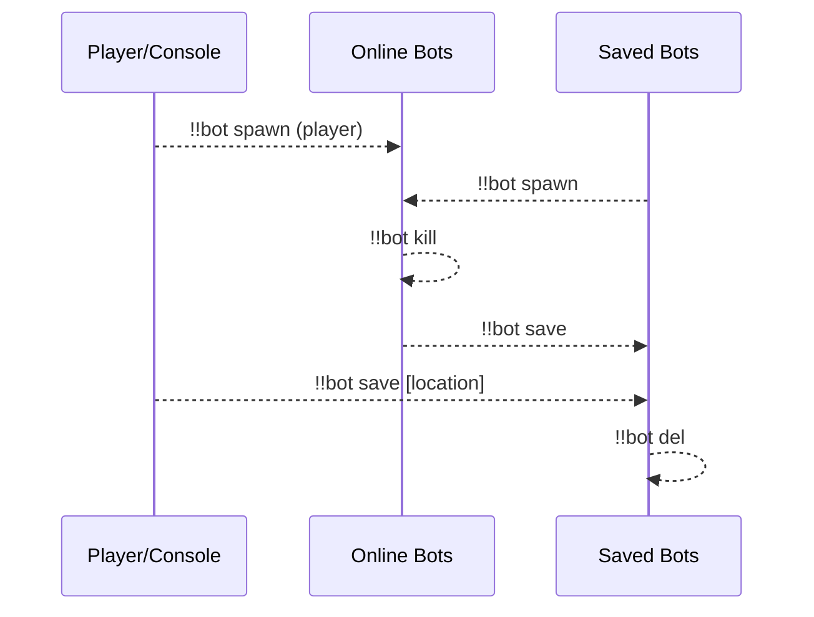
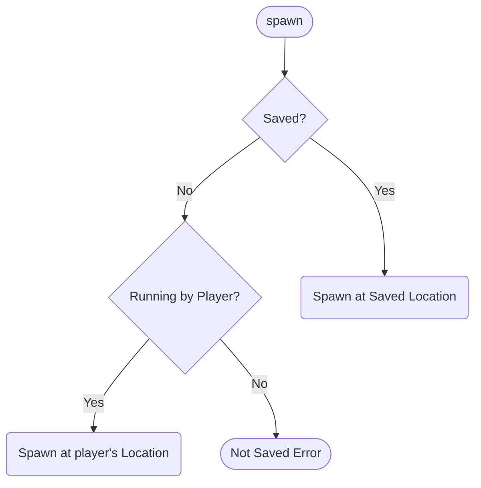
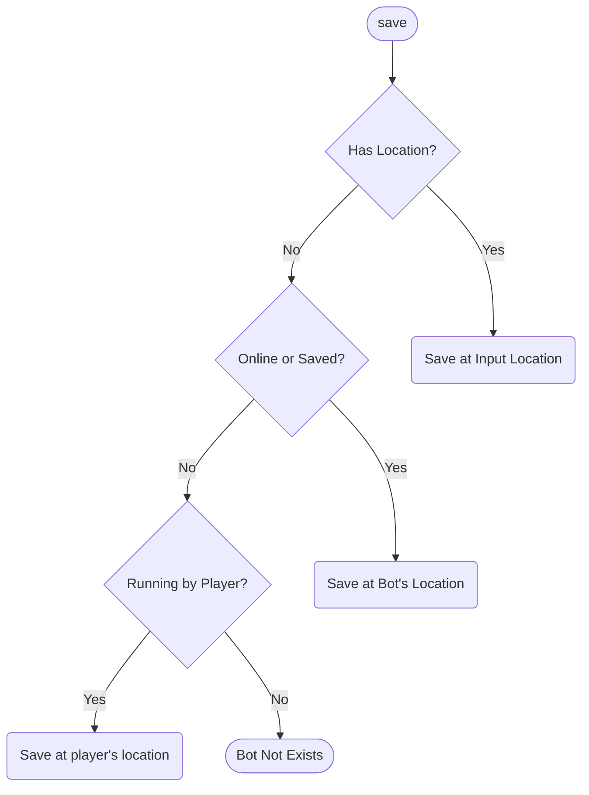
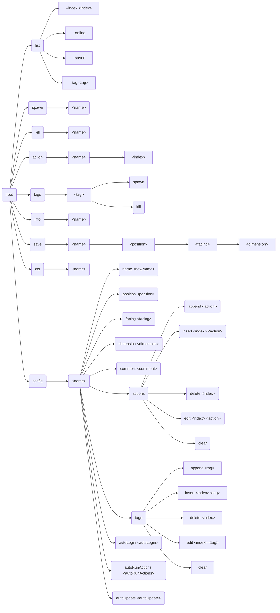
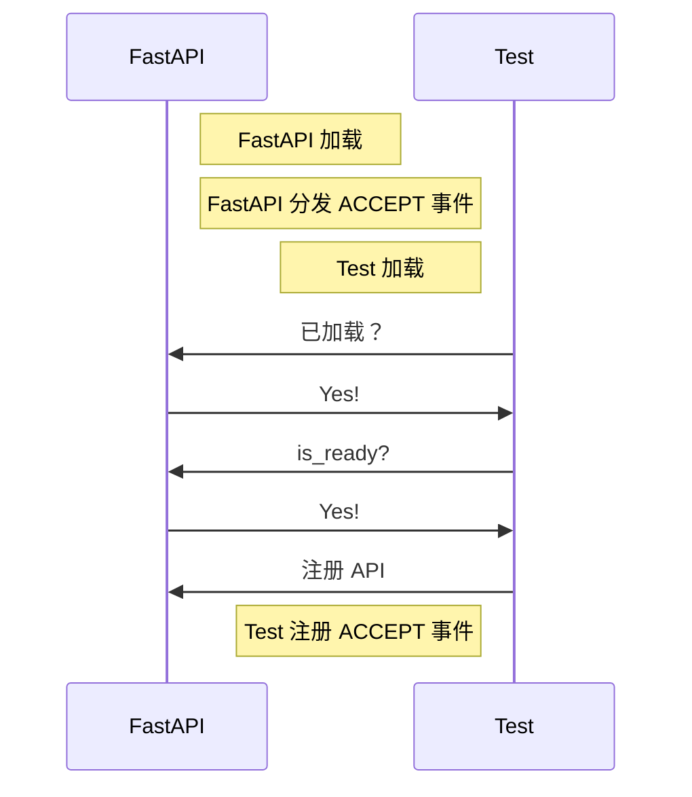
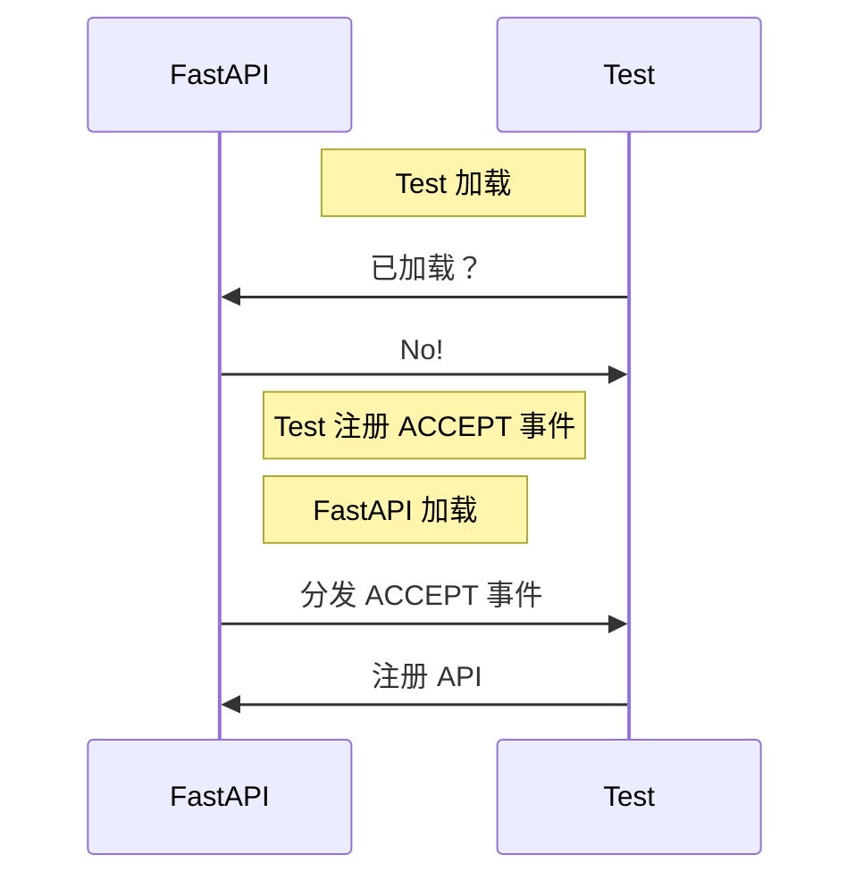
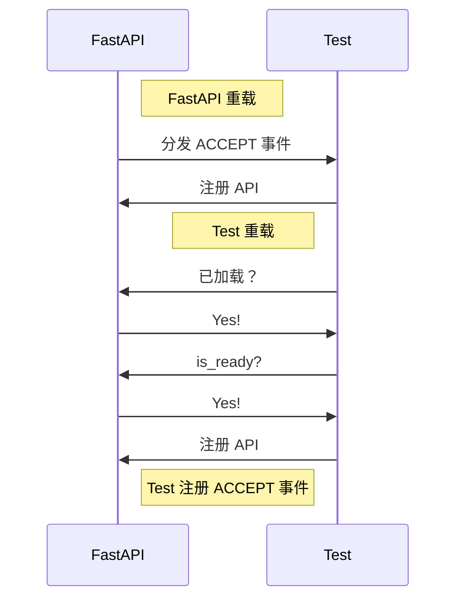
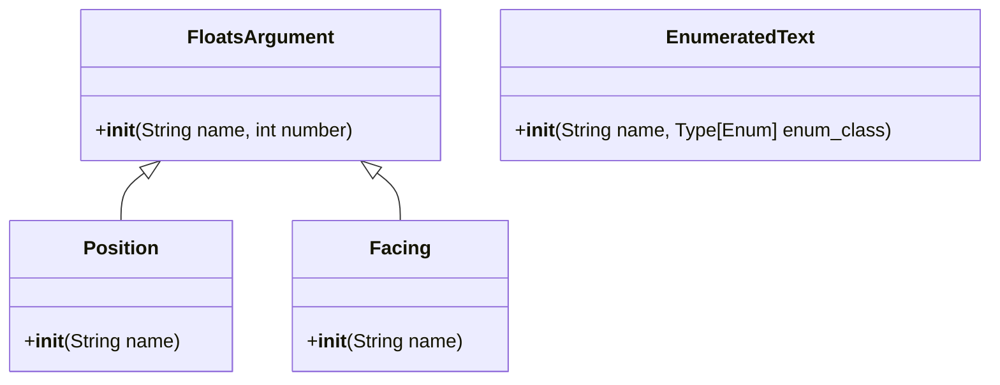

[English](full.md) | **中文**

\>\>\> [回到索引](/readme-zh_cn.md)

# 全插件信息集合

使用 `ctrl-f` 来进行页面中全文搜索，从而找到你感兴趣的东西

## advanced_calculator

### 基本信息

- 插件 ID: `advanced_calculator`
- 版本: *数据拉取失败*
- 总下载量: N/A
- 作者: [Andy Zhang](https://github.com/AnzhiZhang)
- 仓库: https://github.com/AnzhiZhang/MCDReforgedPlugins
- 仓库插件页: https://github.com/AnzhiZhang/MCDReforgedPlugins/tree/master/src/advanced_calculator
- 标签: [`工具`](/labels/tool/readme-zh_cn.md)
- 描述: *数据拉取失败*

### 插件依赖

*数据拉取失败*

### 包依赖

*数据拉取失败*

### 介绍

# AdvancedCalculator

> 提供游戏内多种便捷计算

## 使用

您可以使用 `=<expression>` 直接计算表达式，或使用 `==<count/expression>` 将物品数转换堆叠数。

| 指令 | 用途 | 示例 | 结果 |
| - | - | - | - |
| !!calc \<expression> | 计算表达式 | !!calc 1+1 | 1+1=2 |
| !!calc item \<count/expression> | 物品数转换堆叠数 | !!calc item 1794 | 1794个物品为1盒2组3个 |
| !!calc item \<box> \<stack> \<single> | 堆叠数转换物品数 | !!calc item 1 10 32 | 1盒10组32个为2400个物品 |
| !!calc color \<red> \<green> \<blue> | 10进制RGB转16进制 | !!calc color 255 0 255 | (255, 0, 255) -> #FF00FF |
| !!calc color \<#HEX> | 16十进制RGB转10进制 | !!calc color #00FF00 | #00FF00 -> (0, 255, 0) |

### 下载

> [!IMPORTANT]
> 使用插件之前，先阅读仓库中的 README。

*数据拉取失败*

## advanced_whitelist_r

### 基本信息

- 插件 ID: `advanced_whitelist_r`
- 版本: *数据拉取失败*
- 总下载量: N/A
- 作者: [noionion](https://github.com/2X-ercha), [GamerNoTitle](https://github.com/GamerNoTitle)
- 仓库: https://github.com/EMUnion/AdvancedWhitelistR
- 仓库插件页: https://github.com/EMUnion/AdvancedWhitelistR/tree/master
- 标签: [`管理`](/labels/management/readme-zh_cn.md)
- 描述: *数据拉取失败*

### 插件依赖

*数据拉取失败*

### 包依赖

*数据拉取失败*

### 介绍

离线服务器白名单管理

### 下载

> [!IMPORTANT]
> 使用插件之前，先阅读仓库中的 README。

*数据拉取失败*

## allow_suicide

### 基本信息

- 插件 ID: `allow_suicide`
- 版本: *数据拉取失败*
- 总下载量: N/A
- 作者: [JAs0n](https://github.com/JAs0n319)
- 仓库: https://github.com/JAs0n319/allow_suicide
- 仓库插件页: https://github.com/JAs0n319/allow_suicide/tree/master
- 标签: [`工具`](/labels/tool/readme-zh_cn.md)
- 描述: *数据拉取失败*

### 插件依赖

*数据拉取失败*

### 包依赖

*数据拉取失败*

### 介绍

允许没有op权限的玩家自杀

### 下载

> [!IMPORTANT]
> 使用插件之前，先阅读仓库中的 README。

*数据拉取失败*

## auto_backup

### 基本信息

- 插件 ID: `auto_backup`
- 版本: *数据拉取失败*
- 总下载量: N/A
- 作者: [Kongtu5i](https://github.com/Kongtu5i)
- 仓库: https://github.com/Kongtu5i/AutoBackup
- 仓库插件页: https://github.com/Kongtu5i/AutoBackup/tree/main
- 标签: [`管理`](/labels/management/readme-zh_cn.md)
- 描述: *数据拉取失败*

### 插件依赖

*数据拉取失败*

### 包依赖

*数据拉取失败*

### 介绍

当名单中的玩家加入我的世界服务器时进行自动备份

### 下载

> [!IMPORTANT]
> 使用插件之前，先阅读仓库中的 README。

*数据拉取失败*

## auto_command

### 基本信息

- 插件 ID: `auto_command`
- 版本: *数据拉取失败*
- 总下载量: N/A
- 作者: [bzyyyyyyyy](https://github.com/bzyyyyyyyy)
- 仓库: https://github.com/bzyyyyyyyy/MCDR-AutoCommand
- 仓库插件页: https://github.com/bzyyyyyyyy/MCDR-AutoCommand/tree/master
- 标签: [`工具`](/labels/tool/readme-zh_cn.md)
- 描述: *数据拉取失败*

### 插件依赖

*数据拉取失败*

### 包依赖

*数据拉取失败*

### 介绍

编辑/发送指令堆&自动发送指令
### 下载

> [!IMPORTANT]
> 使用插件之前，先阅读仓库中的 README。

*数据拉取失败*

## auto_execute

### 基本信息

- 插件 ID: `auto_execute`
- 版本: *数据拉取失败*
- 总下载量: N/A
- 作者: [FRUITS-CANDY](https://github.com/FRUITS-CANDY)
- 仓库: https://github.com/Passion-Never-Dissipate/Auto-Execute
- 仓库插件页: https://github.com/Passion-Never-Dissipate/Auto-Execute/tree/master
- 标签: [`工具`](/labels/tool/readme-zh_cn.md)
- 描述: *数据拉取失败*

### 插件依赖

*数据拉取失败*

### 包依赖

*数据拉取失败*

### 介绍

一个以脚本为单位存储各类指令多模式执行的MCDR插件

### 下载

> [!IMPORTANT]
> 使用插件之前，先阅读仓库中的 README。

*数据拉取失败*

## auto_msg_title

### 基本信息

- 插件 ID: `auto_msg_title`
- 版本: *数据拉取失败*
- 总下载量: N/A
- 作者: [zhongbai233](https://github.com/zhongbai2333)
- 仓库: https://github.com/zhongbai2333/AutoMsgTitle
- 仓库插件页: https://github.com/zhongbai2333/AutoMsgTitle/tree/master
- 标签: [`信息`](/labels/information/readme-zh_cn.md)
- 描述: *数据拉取失败*

### 插件依赖

*数据拉取失败*

### 包依赖

*数据拉取失败*

### 介绍

此插件可以为玩家自动弹出标题或消息，如同插件服进入主城后的标题

同时此插件可为一块区域提供自动的说明，如服务器被参观时，参观者进入某区域、机器之后自动弹出此区域、机器的制造者、名字、功能之类的；在玩家进入某一机器时自动为玩家弹出机器说明书……

### 下载

> [!IMPORTANT]
> 使用插件之前，先阅读仓库中的 README。

*数据拉取失败*

## auto_plugin_reloader

### 基本信息

- 插件 ID: `auto_plugin_reloader`
- 版本: *数据拉取失败*
- 总下载量: N/A
- 作者: [Fallen_Breath](https://github.com/Fallen-Breath)
- 仓库: https://github.com/TISUnion/AutoPluginReloader
- 仓库插件页: https://github.com/TISUnion/AutoPluginReloader/tree/master
- 标签: [`管理`](/labels/management/readme-zh_cn.md)
- 描述: *数据拉取失败*

### 插件依赖

*数据拉取失败*

### 包依赖

*数据拉取失败*

### 介绍

它是一个可以自动检测 MCDR 插件文件夹中发生的变更并触发插件重载的插件

它是厌倦了插件文件更新后需要手动执行插件重载的懒人的救星！

### 下载

> [!IMPORTANT]
> 使用插件之前，先阅读仓库中的 README。

*数据拉取失败*

## battery_saver

### 基本信息

- 插件 ID: `battery_saver`
- 版本: *数据拉取失败*
- 总下载量: N/A
- 作者: [Mooling0602](https://github.com/Mooling0602)
- 仓库: https://github.com/Mooling0602/BatterySaver-MCDR
- 仓库插件页: https://github.com/Mooling0602/BatterySaver-MCDR/tree/main
- 标签: [`工具`](/labels/tool/readme-zh_cn.md), [`信息`](/labels/information/readme-zh_cn.md)
- 描述: *数据拉取失败*

### 插件依赖

*数据拉取失败*

### 包依赖

*数据拉取失败*

### 介绍

检查主机的电量并在其低位时自动关闭服务器。

### 下载

> [!IMPORTANT]
> 使用插件之前，先阅读仓库中的 README。

*数据拉取失败*

## beep

### 基本信息

- 插件 ID: `beep`
- 版本: *数据拉取失败*
- 总下载量: N/A
- 作者: [Fallen_Breath](https://github.com/Fallen-Breath), [LucunJi](https://github.com/LucunJi)
- 仓库: https://github.com/TISUnion/Beep
- 仓库插件页: https://github.com/TISUnion/Beep/tree/master
- 标签: [`工具`](/labels/tool/readme-zh_cn.md)
- 描述: *数据拉取失败*

### 插件依赖

*数据拉取失败*

### 包依赖

*数据拉取失败*

### 介绍

*Data fetching failed*
### 下载

> [!IMPORTANT]
> 使用插件之前，先阅读仓库中的 README。

*数据拉取失败*

## better_backup

### 基本信息

- 插件 ID: `better_backup`
- 版本: *数据拉取失败*
- 总下载量: N/A
- 作者: [z0z0r4](https://github.com/z0z0r4)
- 仓库: https://github.com/z0z0r4/better_backup
- 仓库插件页: https://github.com/z0z0r4/better_backup/tree/master
- 标签: [`管理`](/labels/management/readme-zh_cn.md)
- 描述: *数据拉取失败*

### 插件依赖

*数据拉取失败*

### 包依赖

*数据拉取失败*

### 介绍

⚠️ **已停止维护**：建议用 PrimeBackup 替代

支持文件去重的高效备份/回档插件

一些特性：

- 带注释的备份
- 所有文件只留一份不重复，节省硬盘空间
- 备份大小显示，信息清晰
- 理论上无限制的备份点，只取决于存档改动
### 下载

> [!IMPORTANT]
> 使用插件之前，先阅读仓库中的 README。

*数据拉取失败*

## bili_live_helper

### 基本信息

- 插件 ID: `bili_live_helper`
- 版本: *数据拉取失败*
- 总下载量: N/A
- 作者: [Aimerny](https://github.com/Aimerny)
- 仓库: https://github.com/Aimerny/MCDRPlugins
- 仓库插件页: https://github.com/Aimerny/MCDRPlugins/tree/main/src/bili_live_helper
- 标签: [`信息`](/labels/information/readme-zh_cn.md)
- 描述: *数据拉取失败*

### 插件依赖

*数据拉取失败*

### 包依赖

*数据拉取失败*

### 介绍

# BiliLiveHelper | B站直播助手-弹幕姬

---

支持将b站直播间的弹幕同步到mc中

> [!important]
> 此插件仅用于学习交流,请勿用于违法犯罪或其他不良用途.

# :sparkles: 功能

**BiliLiveHelper**是一款~~功能丰富的~~MCDR插件,能够实现将[bilibili](https://bilibili.com)(以下简称"B站)
直播间中的弹幕信息实时同步到MC聊天板中.

- [x] 全异步拉取B站弹幕
- [x] 支持多个玩家订阅各自的直播间,弹幕消息单独发送,互不干扰
- [x] 玩家可以随时启停弹幕姬
- [ ] 支持查询订阅的直播间的状态
- [ ] admin轻松管理所有玩家的订阅信息
- [ ] 游戏内通过直播姬账号发送弹幕,即时回应

# :robot: 指令
```
 ---------- BiliLiveHelper ----------
 >> !!blh [help] - | - 获取帮助
 >> !!blh bind <rid> - | - 绑定直播间id
 >> !!blh on - | - 启动直播弹幕姬
 >> !!blh off - | - 停止直播弹幕姬
 >> !!blh info - | - 查看我的直播间信息
 ------- Authored by Aimerny --------
```

# :pushpin: 依赖

| python依赖项           | 版本      |
| ------------------- | ------- |
| mcdreforged         | ^2.12.0 |
| bilibili-python-api | ^16.2.0 |

| mcdr依赖项     | 版本      |
| ----------- | ------- |
| mcdreforged | ^2.12.0 |

# :wrench: 配置
```json5
{
    "enable": true,
    "data_file_path": "data.json",
    "console_output": true,
    "account": {
        "uid": 3546688564234249,
        "sessdata": "",
        "bili_jct": "",
        "buvid3": "",
        "ac_time_value": ""
    }
}
```
## 配置说明

1. `data_file_path`: 数据文件的路径.持久化的信息会保存到这个文件
2. `console_output`: 是否将接收到的弹幕输出到服务器控制台,如果设为false则需要在debug模式才能看到
3. `account`: 使用此插件需要一个真实的B站账号.`account`中是一些鉴权信息
   1. `uid`: 你的B站账号UID
   2. 其他: 参考 [获取 Credential 类所需信息](https://nemo2011.github.io/bilibili-api/#/get-credential)

> [!note]
> B站的账号如果没有在其他地方登录基本不会过期,建议开一个小号做这件事情

# :art: 功能预览


### 下载

> [!IMPORTANT]
> 使用插件之前，先阅读仓库中的 README。

*数据拉取失败*

## bingo

### 基本信息

- 插件 ID: `bingo`
- 版本: *数据拉取失败*
- 总下载量: N/A
- 作者: [Andy Zhang](https://github.com/AnzhiZhang)
- 仓库: https://github.com/AnzhiZhang/MCDReforgedPlugins
- 仓库插件页: https://github.com/AnzhiZhang/MCDReforgedPlugins/tree/master/src/bingo
- 标签: [`工具`](/labels/tool/readme-zh_cn.md)
- 描述: *数据拉取失败*

### 插件依赖

*数据拉取失败*

### 包依赖

*数据拉取失败*

### 介绍

# Bingo

> [Bingo](https://www.flytre.net/bingo) 游戏实用工具

## 使用

| 指令 | 用途 |
| - | - |
| !!bingo team \<num> | 随机分组 |
| !!bingo end | 结束游戏 |

### 下载

> [!IMPORTANT]
> 使用插件之前，先阅读仓库中的 README。

*数据拉取失败*

## bot

### 基本信息

- 插件 ID: `bot`
- 版本: *数据拉取失败*
- 总下载量: N/A
- 作者: [Andy Zhang](https://github.com/AnzhiZhang)
- 仓库: https://github.com/AnzhiZhang/MCDReforgedPlugins
- 仓库插件页: https://github.com/AnzhiZhang/MCDReforgedPlugins/tree/master/src/bot
- 标签: [`工具`](/labels/tool/readme-zh_cn.md), [`管理`](/labels/management/readme-zh_cn.md)
- 描述: *数据拉取失败*

### 插件依赖

*数据拉取失败*

### 包依赖

*数据拉取失败*

### 介绍

# Bot

[English](https://github.com/AnzhiZhang/MCDReforgedPlugins/tree/master/src/bot/readme.md)

> 最好用的地毯模组假人管理器！

## 依赖

- [MinecraftDataAPI](https://github.com/MCDReforged/MinecraftDataAPI)
- [MoreCommandNodes](https://github.com/AnzhiZhang/MCDReforgedPlugins/tree/master/src/bot/../more_command_nodes)

## 使用方法

`!!bot` 查看帮助

`!!bot list [--index <index>] [filters]` 显示假人列表

`!!bot spawn <name>` 上线假人

`!!bot kill <name>` 下线假人

`!!bot action <name> [index]` 执行假人动作

`!!bot tags` 查看可用标签

`!!bot tags <tag> spawn/kill` 上线/下线带有标签的假人

`!!bot info <name>` 查看假人信息

`!!bot save <name> [position] [facing] [dimension]` 保存假人

`!!bot del <name>` 删除保存的假人

`!!bot config <name> <option> <value>` 配置假人

### 工作流



### list

**--index \<index\>**：页码，例如 `--index 1`，默认为 0

**--online**：显示在线假人

**--saved**：显示保存的假人

**--tag \<tag\>**：按标签过滤

### spawn

上线假人



### kill

下线假人

### action

执行假人动作

当指定 `index` 时，执行特定动作而不是全部动作

### tags

查看可用标签和上线/下线带有标签的假人

`!!bot tags` 查看可用标签

`!!bot tags <tag> spawn` 上线带有标签的假人

`!!bot tags <tag> kill` 下线带有标签的假人

### info

查看假人信息

### save

保存假人



### del

删除保存的假人

### config

配置假人

### 完整指令树



## 配置

### gamemode

默认值: `survival`

生成假人的游戏模式

### force_gamemode

默认值: `false`

是否强制所有假人使用 `gamemode` 配置的游戏模式，如果为 `false`，只有已保存的假人会使用 `gamemode` 配置的游戏模式。

### name_prefix

默认值: `bot_`

假人名称前缀

### name_suffix

默认值: 无

假人名称后缀

### permissions

使用对应指令的最低权限

## FastAPI MCDR

该插件支持 [FastAPI MCDR](https://github.com/AnzhiZhang/MCDReforgedPlugins/tree/master/src/bot/../fastapi_mcdr) 插件，当安转 FastAPI MCDR 插件后，该插件会自动注册端点，您可以通过 FastAPI 查看接口定义。

Python 包要求：

```text
pydantic>=2.0
```

您可以利用该功能实现外部控制，例如一个管理假人的网页：


### 下载

> [!IMPORTANT]
> 使用插件之前，先阅读仓库中的 README。

*数据拉取失败*

## bot_plugin

### 基本信息

- 插件 ID: `bot_plugin`
- 版本: *数据拉取失败*
- 总下载量: N/A
- 作者: [DancingSnow0517](https://github.com/DancingSnow0517)
- 仓库: https://github.com/DancingSnow0517/Bot_Manager
- 仓库插件页: https://github.com/DancingSnow0517/Bot_Manager/tree/master
- 标签: [`管理`](/labels/management/readme-zh_cn.md), [`工具`](/labels/tool/readme-zh_cn.md)
- 描述: *数据拉取失败*

### 插件依赖

*数据拉取失败*

### 包依赖

*数据拉取失败*

### 介绍

# 一个 MCDR bot管理器。

:warning: **务必在使用前阅读仓库中的 README！**

### 下载

> [!IMPORTANT]
> 使用插件之前，先阅读仓库中的 README。

*数据拉取失败*

## carpet_bot_manager

### 基本信息

- 插件 ID: `carpet_bot_manager`
- 版本: *数据拉取失败*
- 总下载量: N/A
- 作者: [YehowahLiu](https://github.com/YehowahLiu)
- 仓库: https://github.com/FAS-Server/CarpetBotManager
- 仓库插件页: https://github.com/FAS-Server/CarpetBotManager/tree/main
- 标签: [`工具`](/labels/tool/readme-zh_cn.md)
- 描述: *数据拉取失败*

### 插件依赖

*数据拉取失败*

### 包依赖

*数据拉取失败*

### 介绍

一个地毯端 bot 管理插件，可以点击召唤 bot 并让其执行系列动作

### 下载

> [!IMPORTANT]
> 使用插件之前，先阅读仓库中的 README。

*数据拉取失败*

## carpet_tick

### 基本信息

- 插件 ID: `carpet_tick`
- 版本: *数据拉取失败*
- 总下载量: N/A
- 作者: [Ivan1F](https://github.com/Ivan-1F)
- 仓库: https://github.com/Ivan-1F/CarpetTick
- 仓库插件页: https://github.com/Ivan-1F/CarpetTick/tree/master
- 标签: [`信息`](/labels/information/readme-zh_cn.md)
- 描述: *数据拉取失败*

### 插件依赖

*数据拉取失败*

### 包依赖

*数据拉取失败*

### 介绍

*Data fetching failed*
### 下载

> [!IMPORTANT]
> 使用插件之前，先阅读仓库中的 README。

*数据拉取失败*

## carpetbotlist

### 基本信息

- 插件 ID: `carpetbotlist`
- 版本: *数据拉取失败*
- 总下载量: N/A
- 作者: [ZeroKelvin](https://github.com/BelowZeroKelvin)
- 仓库: https://github.com/BelowZeroKelvin/MCDR-CarpetBotList
- 仓库插件页: https://github.com/BelowZeroKelvin/MCDR-CarpetBotList/tree/MCDR-2.x
- 标签: [`工具`](/labels/tool/readme-zh_cn.md)
- 描述: *数据拉取失败*

### 插件依赖

*数据拉取失败*

### 包依赖

*数据拉取失败*

### 介绍

帮助你管理地毯端的假人

### 下载

> [!IMPORTANT]
> 使用插件之前，先阅读仓库中的 README。

*数据拉取失败*

## cato

### 基本信息

- 插件 ID: `cato`
- 版本: *数据拉取失败*
- 总下载量: N/A
- 作者: [Harry-zklcdc](https://github.com/Harry-zklcdc)
- 仓库: https://github.com/Harry-zklcdc/MCDR-Cato
- 仓库插件页: https://github.com/Harry-zklcdc/MCDR-Cato/tree/main
- 标签: [`工具`](/labels/tool/readme-zh_cn.md)
- 描述: *数据拉取失败*

### 插件依赖

*数据拉取失败*

### 包依赖

*数据拉取失败*

### 介绍

使服务器启动时, 自动使用 cato (P2P 连接工具)进行端口映射, 并支持生成 HMCL 联机码

# 特性:

- Cato 官方支持
- 无感 P2P 连接
- HMCl 多人游戏支持
- Cato 崩溃/临时 ID 到期自动重启
- API 接口获取 Cato 连接 ID、HMCL 联机码
- Cato Token 动态更换
- 游戏内获取 Cato 连接 ID、HMCL 联机码

### 下载

> [!IMPORTANT]
> 使用插件之前，先阅读仓库中的 README。

*数据拉取失败*

## chatbridge

### 基本信息

- 插件 ID: `chatbridge`
- 版本: *数据拉取失败*
- 总下载量: N/A
- 作者: [Fallen_Breath](https://github.com/Fallen-Breath)
- 仓库: https://github.com/TISUnion/ChatBridge
- 仓库插件页: https://github.com/TISUnion/ChatBridge/tree/master
- 标签: [`工具`](/labels/tool/readme-zh_cn.md)
- 描述: *数据拉取失败*

### 插件依赖

*数据拉取失败*

### 包依赖

*数据拉取失败*

### 介绍

跨服聊天 v2

### 下载

> [!IMPORTANT]
> 使用插件之前，先阅读仓库中的 README。

*数据拉取失败*

## chatbridgereforged_mc

### 基本信息

- 插件 ID: `chatbridgereforged_mc`
- 版本: *数据拉取失败*
- 总下载量: N/A
- 作者: [Ricky](https://github.com/R1ckyH)
- 仓库: https://github.com/R1ckyH/ChatBridgeReforged
- 仓库插件页: https://github.com/R1ckyH/ChatBridgeReforged/tree/master/./ChatBridgeReforged_MC
- 标签: [`工具`](/labels/tool/readme-zh_cn.md)
- 描述: *数据拉取失败*

### 插件依赖

*数据拉取失败*

### 包依赖

*数据拉取失败*

### 介绍

ChatBridge 重制, 用于各个客户端（服务器或者其他bot）之间的交互桥梁，多物互联（不是）

### 下载

> [!IMPORTANT]
> 使用插件之前，先阅读仓库中的 README。

*数据拉取失败*

## colored_chat

### 基本信息

- 插件 ID: `colored_chat`
- 版本: *数据拉取失败*
- 总下载量: N/A
- 作者: [Andy Zhang](https://github.com/AnzhiZhang)
- 仓库: https://github.com/AnzhiZhang/MCDReforgedPlugins
- 仓库插件页: https://github.com/AnzhiZhang/MCDReforgedPlugins/tree/master/src/.archived/ColoredChat
- 标签: [`工具`](/labels/tool/readme-zh_cn.md)
- 描述: *数据拉取失败*

### 插件依赖

*数据拉取失败*

### 包依赖

*数据拉取失败*

### 介绍

# ColoredChat

> 支持原版显示 [格式化代码](https://minecraft.fandom.com/zh/wiki/%E6%A0%BC%E5%BC%8F%E5%8C%96%E4%BB%A3%E7%A0%81)

## 使用

与正常聊天没有区别, 需要格式化时使用 `&` 符号

## 配置

`force_refresh`

是否刷新聊天栏的所有内容, 某些无法被记录的信息可能会被覆盖

默认值: `True`

## API

可以使用 `append_msg(msg)` 方法来插件的广播消息

### 下载

> [!IMPORTANT]
> 使用插件之前，先阅读仓库中的 README。

*数据拉取失败*

## colorful_id

### 基本信息

- 插件 ID: `colorful_id`
- 版本: *数据拉取失败*
- 总下载量: N/A
- 作者: [Apricityx_](https://github.com/Apricityx)
- 仓库: https://github.com/Apricityx/ColorfulID
- 仓库插件页: https://github.com/Apricityx/ColorfulID/tree/master
- 标签: [`工具`](/labels/tool/readme-zh_cn.md)
- 描述: *数据拉取失败*

### 插件依赖

*数据拉取失败*

### 包依赖

*数据拉取失败*

### 介绍

### 这是一个简单的插件，可以让玩家通过以下命令来选择自己的名字颜色：

## 注意：此插件原理是通过让玩家加入不同颜色的队伍来实现，请注意你的服务器是否依赖/team命令。

## 在启用插件后需要执行以下命令来初始化：

```
!!color install
```

这会新增若干个队伍，通过加入队伍来调整名字的颜色。

当不在需要此插件时，执行以下命令来删除队伍：

```
!!color uninstall
```

### 下载

> [!IMPORTANT]
> 使用插件之前，先阅读仓库中的 README。

*数据拉取失败*

## command_aliases

### 基本信息

- 插件 ID: `command_aliases`
- 版本: *数据拉取失败*
- 总下载量: N/A
- 作者: [Andy Zhang](https://github.com/AnzhiZhang)
- 仓库: https://github.com/AnzhiZhang/MCDReforgedPlugins
- 仓库插件页: https://github.com/AnzhiZhang/MCDReforgedPlugins/tree/master/src/command_aliases
- 标签: [`工具`](/labels/tool/readme-zh_cn.md)
- 描述: *数据拉取失败*

### 插件依赖

*数据拉取失败*

### 包依赖

*数据拉取失败*

### 介绍

# Command Aliases

> 根据配置文件为命令添加别名

## 使用

您需要在配置文件中添加所有您想要别名的命令，其中键是别名，值是原始命令。

```json
{
  "alias": {
    "!!mcdr": "!!MCDR"
  }
}
```

现在您可以使用 `!!mcdr` 作为 `!!MCDR` 的别名。

> [!NOTE]
> 命令别名不会有自动补全。如果您需要使用自动补全，您需要使用原始命令。在有自动补全的环境中使用别名是没有意义的。

### 下载

> [!IMPORTANT]
> 使用插件之前，先阅读仓库中的 README。

*数据拉取失败*

## command_exporter

### 基本信息

- 插件 ID: `command_exporter`
- 版本: *数据拉取失败*
- 总下载量: N/A
- 作者: [DancingSnow](https://github.com/DancingSnow0517)
- 仓库: https://github.com/DancingSnow0517/MCDR-Command-Exporter
- 仓库插件页: https://github.com/DancingSnow0517/MCDR-Command-Exporter/tree/master/command_exporter
- 标签: [`工具`](/labels/tool/readme-zh_cn.md)
- 描述: *数据拉取失败*

### 插件依赖

*数据拉取失败*

### 包依赖

*数据拉取失败*

### 介绍

[English](https://github.com/DancingSnow0517/MCDR-Command-Exporter/tree/master/command_exporter/README.MD) | 中文

# MCDR Command Exporter

一个插件用于导出 MCDR 命令树。

与 mod [MCDR-Completion](https://github.com/DancingSnow0517/MCDR-Completion) 配合使用获得游戏内 MCDR 命令补全。

## 用法
1. 去 [release page](https://github.com/DancingSnow0517/MCDR-Command-Exporter/releases) 下载 `MCDRCommandExporter-vX.X.X.mcdr` 插件

   将插件放入 MCDR 的插件文件夹中并重新加载

2. 下载 fabric mod [MCDR-Completion](https://github.com/DancingSnow0517/MCDR-Completion/releases) 并且安装到 `服务端` 和 `客户端` 上

   这个 mod 依赖 [fabric-api](https://modrinth.com/mod/fabric-api)

3. 加入到服务器中并享受它！

### 下载

> [!IMPORTANT]
> 使用插件之前，先阅读仓库中的 README。

*数据拉取失败*

## cpu_temp

### 基本信息

- 插件 ID: `cpu_temp`
- 版本: *数据拉取失败*
- 总下载量: N/A
- 作者: [Ricky](https://github.com/R1ckyH)
- 仓库: https://github.com/R1ckyH/cpu_temp
- 仓库插件页: https://github.com/R1ckyH/cpu_temp/tree/master
- 标签: [`信息`](/labels/information/readme-zh_cn.md)
- 描述: *数据拉取失败*

### 插件依赖

*数据拉取失败*

### 包依赖

*数据拉取失败*

### 介绍

服务器温度警报插件。

### 下载

> [!IMPORTANT]
> 使用插件之前，先阅读仓库中的 README。

*数据拉取失败*

## cq_qq_api

### 基本信息

- 插件 ID: `cq_qq_api`
- 版本: *数据拉取失败*
- 总下载量: N/A
- 作者: [XueK66](https://github.com/XueK66), [LoosePrince](https://github.com/LoosePrince)
- 仓库: https://github.com/XueK66/PF-cq_qq_api
- 仓库插件页: https://github.com/XueK66/PF-cq_qq_api/tree/master/src
- 标签: [`API`](/labels/api/readme-zh_cn.md)
- 描述: *数据拉取失败*

### 插件依赖

*数据拉取失败*

### 包依赖

*数据拉取失败*

### 介绍


# PF-cq_qq_api

[](https://github.com/XueK66/PF-cq_qq_api/tree/master/src//)
[](https://github.com/XueK66/PF-cq_qq_api/releases/latest/download/YourRepoName.mcdr)
[](https://github.com/XueK66/PF-cq_qq_api/issues)
[](https://github.com/XueK66/PF-cq_qq_api/issues?q=is%3Aissue+is%3Aclosed)
[](https://github.com/XueK66/PF-cq_qq_api/releases)
[](https://github.com/XueK66/PF-cq_qq_api/releases/latest)


> PFingan服务器MCDRQQ机器人插件
> 
> 基于CQ码的QQ连接机器人
> 
> 提供MCDR机器人插件接口，方便聊天类机器人的构建

技术支持：XueK__ [前往主页](https://github.com/XueK66)

使用方式：
* 将Release里面的cq_qq_api.mcdr放入`/plugins`
* 加载后，在`/config/cq_qq_api/config.yml`中配置机器人

## 依赖
#### Python
- [Python™](https://www.python.org/)
#### Python模块
- 已存储在插件对应的文件夹内的 [requirements.txt](https://github.com/XueK66/PF-cq_qq_api/tree/master/src/requirements.txt) 中, 可以使用 `pip install -r requirements.txt` 安装

基本功能：聊天互相转发

## 使用方式
#### 调用机器人
```
bot = server.get_plugin_instance("cq_qq_api").get_bot()
```

#### 调用例子 - 发送群聊消息
更多接口详情可查看`bot.py`或查看[Onebot_11_API_标准](https://github.com/botuniverse/onebot-11/blob/master/api/public.md)
```
bot = server.get_plugin_instance("cq_qq_api").get_bot()
bot.send_group_msg(group_id, message)
```


## 配置

#### 服务端配置 - Server
- config.json

> | 配置项 | 默认值 | 说明 |
> | - | - | - |
> | host | `127.0.0.1` | 接收数据上报的地址 |
> | port | `8080` | 对应数据上报的端口 | 
> | post_path | "" | 对应数据上报的终点名 |
> | token | "" | 对应数据上报的token，用于加密信息 |

```
{
    "host": "127.0.0.1",
    "port": 8080,
    "post_path": "",
    "token": ""
}
```

最终websocket url为：
```
ws://host:port/post_path/
```
#### QQ机器人配置
**以下为必要配置！**
> | 配置项 | 默认值 | 说明 |
> | - | - | - |
> | 正向websocket服务端口 | `8080` | 接收数据上报的端口 |
> | 消息上报格式 | CQ码 | 机器人基于CQ码进行解析 |

# 有BUG或是新的IDEA
如果需要更多联动或提交想法和问题请提交 [issues](https://github.com/LoosePrince/PF-GUGUBot/issues) 或 QQ [1377820366](http://wpa.qq.com/msgrd?v=3&uin=1377820366&site=qq&menu=yes) 提交！ <br />
视情况添加，请勿联系他人（开发者：[雪开](https://github.com/XueK66)）

### 下载

> [!IMPORTANT]
> 使用插件之前，先阅读仓库中的 README。

*数据拉取失败*

## crash_restart

### 基本信息

- 插件 ID: `crash_restart`
- 版本: *数据拉取失败*
- 总下载量: N/A
- 作者: [Fallen_Breath](https://github.com/Fallen-Breath)
- 仓库: https://github.com/TISUnion/CrashRestart
- 仓库插件页: https://github.com/TISUnion/CrashRestart/tree/master
- 标签: [`工具`](/labels/tool/readme-zh_cn.md)
- 描述: *数据拉取失败*

### 插件依赖

*数据拉取失败*

### 包依赖

*数据拉取失败*

### 介绍

*Data fetching failed*
### 下载

> [!IMPORTANT]
> 使用插件之前，先阅读仓库中的 README。

*数据拉取失败*

## database_api

### 基本信息

- 插件 ID: `database_api`
- 版本: *数据拉取失败*
- 总下载量: N/A
- 作者: [Andy Zhang](https://github.com/AnzhiZhang)
- 仓库: https://github.com/AnzhiZhang/MCDReforgedPlugins
- 仓库插件页: https://github.com/AnzhiZhang/MCDReforgedPlugins/tree/master/src/database_api
- 标签: [`API`](/labels/api/readme-zh_cn.md)
- 描述: *数据拉取失败*

### 插件依赖

*数据拉取失败*

### 包依赖

*数据拉取失败*

### 介绍

# DatabaseAPI

> 数据库API
> 
> 提供了数据库操作的便捷API

## 环境要求

### Python包

- sqlalchemy

## 开发文档

查看 [Valut](https://github.com/AnzhiZhang/MCDReforgedPlugins/tree/master/src/database_api/../.archived/vault/vault.py) 参考使用方法

提供了以下两个类:

- TableBase
- DataManager

### TableBase

一个数据库表的基类, 写一个你的数据库表并继承这个类来创建一张表

### DataManager

使用本API需要自行实例化这个类

实例化: `__init__(self, file_path: str)`

#### get_session

获取一个数据库会话的上下文管理器, 更多信息请自行查找资料

### 下载

> [!IMPORTANT]
> 使用插件之前，先阅读仓库中的 README。

*数据拉取失败*

## daycount_nbt

### 基本信息

- 插件 ID: `daycount_nbt`
- 版本: *数据拉取失败*
- 总下载量: N/A
- 作者: [Alex3236](https://github.com/alex3236)
- 仓库: https://github.com/alex3236/daycount-NBT
- 仓库插件页: https://github.com/alex3236/daycount-NBT/tree/main/src
- 标签: [`信息`](/labels/information/readme-zh_cn.md), [`API`](/labels/api/readme-zh_cn.md)
- 描述: *数据拉取失败*

### 插件依赖

*数据拉取失败*

### 包依赖

*数据拉取失败*

### 介绍

获取和输出服务器开服时间。

特色功能：
- NBT 模式

:warning: **务必在使用前阅读仓库中的 README！**

### 下载

> [!IMPORTANT]
> 使用插件之前，先阅读仓库中的 README。

*数据拉取失败*

## daytime

### 基本信息

- 插件 ID: `daytime`
- 版本: *数据拉取失败*
- 总下载量: N/A
- 作者: [ZeroKelvin](https://github.com/BelowZeroKelvin)
- 仓库: https://github.com/BelowZeroKelvin/MCDR-Daytime
- 仓库插件页: https://github.com/BelowZeroKelvin/MCDR-Daytime/tree/MCDR-2.x
- 标签: [`工具`](/labels/tool/readme-zh_cn.md)
- 描述: *数据拉取失败*

### 插件依赖

*数据拉取失败*

### 包依赖

*数据拉取失败*

### 介绍

查看游戏中的时间

### 下载

> [!IMPORTANT]
> 使用插件之前，先阅读仓库中的 README。

*数据拉取失败*

## delayexe

### 基本信息

- 插件 ID: `delayexe`
- 版本: *数据拉取失败*
- 总下载量: N/A
- 作者: [zyxkad](https://github.com/zyxkad)
- 仓库: https://github.com/kmcsr/delayexe_mcdr
- 仓库插件页: https://github.com/kmcsr/delayexe_mcdr/tree/master
- 标签: [`工具`](/labels/tool/readme-zh_cn.md), [`API`](/labels/api/readme-zh_cn.md)
- 描述: *数据拉取失败*

### 插件依赖

*数据拉取失败*

### 包依赖

*数据拉取失败*

### 介绍

*数据拉取失败*
### 下载

> [!IMPORTANT]
> 使用插件之前，先阅读仓库中的 README。

*数据拉取失败*

## diamond_calc

### 基本信息

- 插件 ID: `diamond_calc`
- 版本: *数据拉取失败*
- 总下载量: N/A
- 作者: [Huaji_MUR233](https://github.com/HuajiMUR233)
- 仓库: https://github.com/HuajiMUR233/DiamondCalc
- 仓库插件页: https://github.com/HuajiMUR233/DiamondCalc/tree/master
- 标签: [`工具`](/labels/tool/readme-zh_cn.md)
- 描述: *数据拉取失败*

### 插件依赖

*数据拉取失败*

### 包依赖

*数据拉取失败*

### 介绍

*Data fetching failed*
### 下载

> [!IMPORTANT]
> 使用插件之前，先阅读仓库中的 README。

*数据拉取失败*

## dict_command_registration

### 基本信息

- 插件 ID: `dict_command_registration`
- 版本: *数据拉取失败*
- 总下载量: N/A
- 作者: [Andy Zhang](https://github.com/AnzhiZhang)
- 仓库: https://github.com/AnzhiZhang/MCDReforgedPlugins
- 仓库插件页: https://github.com/AnzhiZhang/MCDReforgedPlugins/tree/master/src/dict_command_registration
- 标签: [`API`](/labels/api/readme-zh_cn.md)
- 描述: *数据拉取失败*

### 插件依赖

*数据拉取失败*

### 包依赖

*数据拉取失败*

### 介绍

# Dict Command Registration

> Register your command with a python dict.

MCDReforged implements a command system like [brigadier](https://github.com/Mojang/brigadier), but it is too difficult to use and not intuitive enough. When the tree becomes large, maintainability and readability become extremely poor. Then you have to split it into multiple child nodes, but when the child nodes become large you need to keep splitting them and end up in an infinite loop.

This plugin provides an API that allows you to register MCDR command trees with python dict, which is also a tree structure - a more intuitive structure, isn't it? It takes the python dict you provide, generates the MCDR Command Node, then register it. You do not have to bother with the huge code tree, just maintain your dict tree.

Incidentally, it can register the [help message](https://mcdreforged.readthedocs.io/en/latest/code_references/PluginServerInterface.html#mcdreforged.plugin.server_interface.PluginServerInterface.register_help_message) for you.

## Quick Start

Let's register this example command in MCDR doc:

```text
Literal('!!email'). \
then(Literal('list')). \
then(Literal('remove'). \
    then(Integer('email_id'))
). \
then(Literal('send'). \
    then(Text('player'). \
        then(GreedyText('message'))
    )
)
```

Write the command dict and call register method.

```python
from dict_command_registration import NodeType, register

command = {
    "name": "!!email",
    "children": [
        {
            "name": "list"
        },
        {
            "name": "remove",
            "children": [
                {
                    "name": "email_id",
                    "type": NodeType.INTEGER
                }
            ]
        },
        {
            "name": "send",
            "children": [
                {
                    "name": "player",
                    "type": NodeType.TEXT,
                    "children": [
                        {
                            "name": "email_id",
                            "type": NodeType.GREEDY_TEXT
                        }
                    ]
                }
            ]
        }
    ]
}

def on_load(server, prev_module):
    register(server, command)
```

All done!

If you want register help message together:

```python
register(server, command, "Email command")
```

## Concepts

### Node

In this plugin, `Node` means a dict which contains data of a MCDR
command node.

See also: [Node](#node-dict)

## API Reference

### Exceptions

#### MissingRequiredAttribute

Raise when missing required attribute in [Node](#node-dict).

### NodeType

MCDR Origin Command Nodes.

| Key | Class |
| - | - |
| LITERAL | [Literal](https://mcdreforged.readthedocs.io/en/latest/code_references/command.html#mcdreforged.command.builder.nodes.basic.Literal) |
| NUMBER | [Number](https://mcdreforged.readthedocs.io/en/latest/code_references/command.html#mcdreforged.command.builder.nodes.arguments.Number) |
| INTEGER | [Integer](https://mcdreforged.readthedocs.io/en/latest/code_references/command.html#mcdreforged.command.builder.nodes.arguments.Integer) |
| FLOAT | [Float](https://mcdreforged.readthedocs.io/en/latest/code_references/command.html#mcdreforged.command.builder.nodes.arguments.Float) |
| TEXT | [Text](https://mcdreforged.readthedocs.io/en/latest/code_references/command.html#mcdreforged.command.builder.nodes.arguments.Text) |
| QUOTABLE_TEXT | [QuotableText](https://mcdreforged.readthedocs.io/en/latest/code_references/command.html#mcdreforged.command.builder.nodes.arguments.QuotableText) |
| GREEDY_TEXT | [GreedyText](https://mcdreforged.readthedocs.io/en/latest/code_references/command.html#mcdreforged.command.builder.nodes.arguments.GreedyText) |
| BOOLEAN | [Boolean](https://mcdreforged.readthedocs.io/en/latest/code_references/command.html#mcdreforged.command.builder.nodes.arguments.Boolean) |
| ENUMERATION | [Enumeration](https://mcdreforged.readthedocs.io/en/latest/code_references/command.html#mcdreforged.command.builder.nodes.arguments.Enumeration) |

### Node (class)

Parse a [Node (dict)](#node-dict), and can cast to MCDR node.

#### __init__(data: Dict[str, Any])

Accept a dict.

#### literal: Union[str, Iterable[str]]

Get literal string or Iterable.

#### to_mcdr_node() -> Union[Literal, ArgumentNode]

To MCDR Node.

### Node (dict)

#### name

> Name of the node.

- Type: `str`

This value is required.

#### node

> MCDR node if you want use exist node.

- Type: [Literal](https://mcdreforged.readthedocs.io/en/latest/code_references/command.html#mcdreforged.command.builder.nodes.basic.Literal) or [ArgumentNode](https://mcdreforged.readthedocs.io/en/latest/code_references/command.html#mcdreforged.command.builder.nodes.basic.ArgumentNode)

#### literal

> Text of a literal node.

- Type: `str` or `Iterable[str]`
- Default: [name](#name) value

You have to set this value if you want use multiple literals (Iterable).

#### type

> Type of this node.

- Type: [NodeType](#nodetype) or [ArgumentNode](https://mcdreforged.readthedocs.io/en/latest/code_references/command.html#mcdreforged.command.builder.nodes.basic.ArgumentNode)
- Default: [NodeType.LITERAL](#literal)

#### enumeration

> Value of [Enumeration](https://mcdreforged.readthedocs.io/en/latest/code_references/command.html#mcdreforged.command.builder.nodes.arguments.Enumeration) node.

- Type: `Dict[str, Any]`
- Default: `[]`

#### args

> Args to create Node if using customize node.

- Type: `List[Any]`
- Default: `[]`

#### kwargs

> Kwargs to create Node if using customize node.

- Type: `Dict[str, Any]`
- Default: `{}`

#### runs

> Set the callback function of this node.

- Type: `Callable`

See also: [AbstractNode.runs()](https://mcdreforged.readthedocs.io/en/latest/code_references/command.html#mcdreforged.command.builder.nodes.basic.AbstractNode.runs).

#### requires

> Set the requirement tester callback of the node.

- Type: `Union[Callable, List[Callable]]`

See also: [AbstractNode.requires()](https://mcdreforged.readthedocs.io/en/latest/code_references/command.html#mcdreforged.command.builder.nodes.basic.AbstractNode.requires).

#### redirects

> Redirect all further child nodes command parsing to another given node.

- Type: [AbstractNode](https://mcdreforged.readthedocs.io/en/latest/code_references/command.html#mcdreforged.command.builder.nodes.basic.AbstractNode)

See also: [AbstractNode.redirects()](https://mcdreforged.readthedocs.io/en/latest/code_references/command.html#mcdreforged.command.builder.nodes.basic.AbstractNode.redirects).

#### suggests

> Set the provider for command suggestions of this node.

- Type: `Callable`

See also: [AbstractNode.suggests()](https://mcdreforged.readthedocs.io/en/latest/code_references/command.html#mcdreforged.command.builder.nodes.basic.AbstractNode.suggests).

#### on_error

> When a command error occurs, the given will invoke the given handler to handle with the error.

- Type: `Dict[str, Any]`

See also: [AbstractNode.on_error()](https://mcdreforged.readthedocs.io/en/latest/code_references/command.html#mcdreforged.command.builder.nodes.basic.AbstractNode.on_error).

Accept three keys in the dict, which are three arguments listed in the doc.

#### on_child_error

> Similar to `on_error()`, but it gets triggered only when the node receives a command error from one of the node’s direct or indirect child.

- Type: `Dict[str, Any]`

See also: [AbstractNode.on_child_error()](https://mcdreforged.readthedocs.io/en/latest/code_references/command.html#mcdreforged.command.builder.nodes.basic.AbstractNode.on_child_error).

Accept three keys in the dict, which are three arguments listed in the doc.

#### children

> Children of this node.

- Type: `List[Dict[str, Any]]`
- Default: `[]`

You can put node in the array to add a child node.

### register

Method to register command.

Params:

- PluginServerInterface server: the PluginServerInterface instance of your plugin, to ensure that this command is registered by your plugin.
- dict command: Command, please find more information in the document.
- str help_message: Provide a string value if you want register
- int help_message_permission: The minimum permission level to see this help message. See also in MCDReforged document.

### 下载

> [!IMPORTANT]
> 使用插件之前，先阅读仓库中的 README。

*数据拉取失败*

## easy_bot_manager

### 基本信息

- 插件 ID: `easy_bot_manager`
- 版本: *数据拉取失败*
- 总下载量: N/A
- 作者: [LiuTed](https://github.com/LiuTed)
- 仓库: https://github.com/LiuTed/EasyBotManager
- 仓库插件页: https://github.com/LiuTed/EasyBotManager/tree/main
- 标签: [`工具`](/labels/tool/readme-zh_cn.md)
- 描述: *数据拉取失败*

### 插件依赖

*数据拉取失败*

### 包依赖

*数据拉取失败*

### 介绍

*Data fetching failed*
### 下载

> [!IMPORTANT]
> 使用插件之前，先阅读仓库中的 README。

*数据拉取失败*

## eulagree

### 基本信息

- 插件 ID: `eulagree`
- 版本: *数据拉取失败*
- 总下载量: N/A
- 作者: [Huaji_MUR233](https://github.com/HuajiMUR233)
- 仓库: https://github.com/HuajiMURsMC/EULAgree
- 仓库插件页: https://github.com/HuajiMURsMC/EULAgree/tree/main
- 标签: [`工具`](/labels/tool/readme-zh_cn.md)
- 描述: *数据拉取失败*

### 插件依赖

*数据拉取失败*

### 包依赖

*数据拉取失败*

### 介绍

我总是同意EULA，不要问我
### 下载

> [!IMPORTANT]
> 使用插件之前，先阅读仓库中的 README。

*数据拉取失败*

## fastapi_mcdr

### 基本信息

- 插件 ID: `fastapi_mcdr`
- 版本: *数据拉取失败*
- 总下载量: N/A
- 作者: [Andy Zhang](https://github.com/AnzhiZhang)
- 仓库: https://github.com/AnzhiZhang/MCDReforgedPlugins
- 仓库插件页: https://github.com/AnzhiZhang/MCDReforgedPlugins/tree/master/src/fastapi_mcdr
- 标签: [`API`](/labels/api/readme-zh_cn.md)
- 描述: *数据拉取失败*

### 插件依赖

*数据拉取失败*

### 包依赖

*数据拉取失败*

### 介绍

# FastAPI

[English](https://github.com/AnzhiZhang/MCDReforgedPlugins/tree/master/src/fastapi_mcdr/readme.md)

> 提供 HTTP API

## 快速开始

总地来说，您需要在您的插件中做两件事：

1. 加载时检查 FastAPI 状态，如已可以接受注册，则直接注册 API。
1. 直接注册 ACCEPT 事件的监听器，以便可以注册时注册 API。

具体地说，您需要添加以下代码：

```python
def on_load(server, prev_module):
    # register if fastapi_mcdr is ready
    fastapi_mcdr = server.get_plugin_instance('fastapi_mcdr')
    if fastapi_mcdr is not None and fastapi_mcdr.is_ready():
        register_apis(server)

    # register event listener
    server.register_event_listener(
        "fastapi_mcdr.accept",
        register_apis
    )

def register_apis(server):
    # save plugin id and fastapi_mcdr instance
    id_ = server.get_self_metadata().id
    fastapi_mcdr = server.get_plugin_instance('fastapi_mcdr')

    # register api
    fastapi_mcdr.add_api_route(
        id_,
        path="/test",
        endpoint=test,
        response_model=Dict[str, str],
        methods=["GET"],
    )

async def test():
    return "Hello, world!"
```

访问 <http://localhost:8080/docs> 即可查看 API 文档。

## 技术细节

### 加载

理论上来说，对外提供 HTTP API 应当是一种软依赖，这便是需要检查 FastAPI 状态并同时注册 ACCEPT 事件监听器的原因。下图展示了 FastAPI 插件和自定义插件先后加载的流程图：

先加载 FastAPI，再加载自定义插件：



先加载自定义插件，再加载 FastAPI：



通过这个设计，即可实现插件的软依赖，且无需考虑插件加载顺序的问题。下图展示了任意插件重载的情况：



## 标准

### ACCEPT 事件

事件名：`fastapi_mcdr.accept`

该事件的 `PluginEvent` 实例也会以 `ACCEPT_EVENT` 名公开。

### 公开函数

#### is_ready

插件可以接受注册的状态，如强行注册则会抛出一个 `RuntimeError`。

#### add_api_route

接受的参数几乎与 fastapi 库的 `add_api_route` 函数相同，但是第一个参数 `plugin_id` 应当传入插件的 id，以便注册路径时以插件 id 为前缀。

也就是说，如果 id 参数为 `test`，path 参数为 `/test`，则注册的路径为 `/test/test`。

### 下载

> [!IMPORTANT]
> 使用插件之前，先阅读仓库中的 README。

*数据拉取失败*

## faster_transfer

### 基本信息

- 插件 ID: `faster_transfer`
- 版本: *数据拉取失败*
- 总下载量: N/A
- 作者: [Alex3236](https://github.com/alex3236)
- 仓库: https://github.com/alex3236/FasterTransfer
- 仓库插件页: https://github.com/alex3236/FasterTransfer/tree/master/src
- 标签: [`工具`](/labels/tool/readme-zh_cn.md), [`API`](/labels/api/readme-zh_cn.md)
- 描述: *数据拉取失败*

### 插件依赖

*数据拉取失败*

### 包依赖

*数据拉取失败*

### 介绍

让 **任何 MCDR 插件**，比如 QuickBackupM 的网络文件传输更迅速！

:warning: **务必在使用前阅读仓库中的 README！**

### 下载

> [!IMPORTANT]
> 使用插件之前，先阅读仓库中的 README。

*数据拉取失败*

## fbs_plugin

### 基本信息

- 插件 ID: `fbs_plugin`
- 版本: *数据拉取失败*
- 总下载量: N/A
- 作者: [WalkerTian](https://github.com/Walkersifolia)
- 仓库: https://github.com/Walkersifolia/FastBotSpawn
- 仓库插件页: https://github.com/Walkersifolia/FastBotSpawn/tree/master
- 标签: [`工具`](/labels/tool/readme-zh_cn.md)
- 描述: *数据拉取失败*

### 插件依赖

*数据拉取失败*

### 包依赖

*数据拉取失败*

### 介绍

*Data fetching failed*
### 下载

> [!IMPORTANT]
> 使用插件之前，先阅读仓库中的 README。

*数据拉取失败*

## g15t

### 基本信息

- 插件 ID: `g15t`
- 版本: *数据拉取失败*
- 总下载量: N/A
- 作者: [Jel1ySpot](https://github.com/Jel1ySpot)
- 仓库: https://github.com/Jel1ySpot/MCDReforgedPlugins
- 仓库插件页: https://github.com/Jel1ySpot/MCDReforgedPlugins/tree/main/src/G15T
- 标签: [`工具`](/labels/tool/readme-zh_cn.md)
- 描述: *数据拉取失败*

### 插件依赖

*数据拉取失败*

### 包依赖

*数据拉取失败*

### 介绍

# Get Back on Your Feet!

> *從哪裏跌倒，就從那裏站起來*

## 前置插件

- [MinecraftDataAPI](https://github.com/MCDReforged/MinecraftDataAPI)

## 食用方法

### 指令

`!!getback/!!b` 返回死亡地點

### 權限

`user` 以上可用

### 下载

> [!IMPORTANT]
> 使用插件之前，先阅读仓库中的 README。

*数据拉取失败*

## gamemode

### 基本信息

- 插件 ID: `gamemode`
- 版本: *数据拉取失败*
- 总下载量: N/A
- 作者: [Andy Zhang](https://github.com/AnzhiZhang)
- 仓库: https://github.com/AnzhiZhang/MCDReforgedPlugins
- 仓库插件页: https://github.com/AnzhiZhang/MCDReforgedPlugins/tree/master/src/gamemode
- 标签: [`工具`](/labels/tool/readme-zh_cn.md)
- 描述: *数据拉取失败*

### 插件依赖

*数据拉取失败*

### 包依赖

*数据拉取失败*

### 介绍

# Gamemode

> 高级版灵魂出窍(切旁观, 切回生存传送回原位置)

感谢 [方块君](https://github.com/Squaregentleman) 的 [gamemode](https://github.com/Squaregentleman/MCDR-plugins) 插件

## 前置插件

- [MinecraftDataAPI](https://github.com/MCDReforged/MinecraftDataAPI)

## 使用

`!!spec` / `!s` 旁观/生存切换

`!!tp <dimension> [position]` 传送至指定地点

`!!back` 返回上个地点

## 配置

### short_command

默认值: `True`

是否启用短命令

### 其他数字配置是权限

`spec`

默认值: `1`

使用 `!!spec` 的最低权限

`spec_other`

默认值: `2`

使用 `!!spec <player` 的最低权限

`tp`

默认值: `1`

使用 `!!tp <dimension> [position]` 的最低权限

`back`

默认值: `1`

使用 `!!back` 的最低权限

### 下载

> [!IMPORTANT]
> 使用插件之前，先阅读仓库中的 README。

*数据拉取失败*

## gugubot

### 基本信息

- 插件 ID: `gugubot`
- 版本: *数据拉取失败*
- 总下载量: N/A
- 作者: [雪开](https://github.com/XueK66), [树梢](https://github.com/LoosePrince)
- 仓库: https://github.com/LoosePrince/PF-GUGUBot
- 仓库插件页: https://github.com/LoosePrince/PF-GUGUBot/tree/main/GUGUbot
- 标签: [`信息`](/labels/information/readme-zh_cn.md), [`管理`](/labels/management/readme-zh_cn.md)
- 描述: *数据拉取失败*

### 插件依赖

*数据拉取失败*

### 包依赖

*数据拉取失败*

### 介绍

[](https://github.com/LoosePrince/PF-GUGUBot)
# PF-QQchat
> PFingan服务器MCDRQQ机器人插件

[](https://github.com/LoosePrince/PF-GUGUBot/tree/main/GUGUbot//) 
[](https://github.com/LoosePrince/PF-GUGUBot/tree/main/GUGUbot//)
[](https://github.com/LoosePrince/PF-GUGUBot/tree/main/GUGUbot//) 
[](https://github.com/LoosePrince/PF-GUGUBot/releases/latest/download/GUGUbot.mcdr)
[](https://github.com/LoosePrince/PF-GUGUBot/issues) 
[](https://github.com/LoosePrince/PF-GUGUBot/issues?q=is%3Aissue+is%3Aclosed)
[](https://github.com/LoosePrince/PF-GUGUBot/releases)
[](https://github.com/LoosePrince/PF-GUGUBot/releases/latest)

本插件修改自： 
[QQChat新版 - 修改自它的旧版](https://github.com/AnzhiZhang/MCDReforgedPlugins/tree/master/src/qq_chat) | [原作者：AnzhiZhang](https://github.com/AnzhiZhang) <br>
技术支持：XueK__ [前往主页](https://github.com/XueK66)
<br></br>

> #### 这是基于原插件的修改版本，但是由于经过多次修改和重构，我们并不确定是否仍存在原本的代码


使用方式-MCDR快捷安装：
* MCDR服务端输入 `!!MCDR plugin install gugubot`
* 加载后，在`/config/cq_qq_api/config.json`中配置接收api
* 加载后，在`/config/GUGUbot/config.yml`中配置机器人
* 重载 cq_qq_api: `!!MCDR plugin reload cq_qq_api`

使用方式-github下载安装：
* 下载[PF-cq_qq_api前置插件](https://github.com/XueK66/PF-cq_qq_api/releases)并放入`/plugins`
* 将[Release](https://github.com/LoosePrince/PF-GUGUBot/releases)里面的GUGUbot.mcdr放入`/plugins`
* 加载后，在`/config/cq_qq_api/config.json`中配置服务
* 加载后，在`/config/GUGUbot/config.yml`中配置机器人
* 重载 cq_qq_api: `!!MCDR plugin reload cq_qq_api`

  注：如果您在安装完成后启动提示没有配置文件请下载[config_default.yml](https://github.com/LoosePrince/PF-GUGUBot/blob/main/config_default.yml)重名名为`config.yml`放入`/config/GUGUbot/config.yml`再运行

## 目录
- [PF-QQchat](#pf-qqchat)
  - [目录](#目录)
  - [依赖](#依赖)
    - [Python包](#python包)
    - [Python模块](#python模块)
    - [前置插件](#前置插件)
  - [功能列表](#功能列表)
    - [基本功能：聊天互相转发](#基本功能聊天互相转发)
    - [群聊功能](#群聊功能)
    - [管理功能](#管理功能)
  - [配置](#配置)
    - [前置cq\_qq\_api配置](#前置cq_qq_api配置)
    - [GUGUbot机器人配置](#gugubot机器人配置)
- [有BUG或是新的IDEA](#有bug或是新的idea)
- [TODO](#todo)

## 依赖
#### Python包
- [Python™](https://www.python.org/)
#### Python模块
- 已存储在插件对应的文件夹内的 [requirements.txt](https://github.com/LoosePrince/PF-GUGUBot/tree/main/GUGUbot/requirements.txt) 中, 可以使用 `pip install -r requirements.txt` 安装
#### 前置插件
- [cq_qq_api](https://github.com/XueK66/PF-cq_qq_api/releases)

## 功能列表
> QQ部分帮助，向QQ机器人发送，可以私聊也可以群聊发送 `#帮助`

### 基本功能：聊天互相转发

### 群聊功能

<details>
  <summary>群聊功能帮助</summary>

```
命令帮助如下:
#玩家                -> 获取在线玩家列表
#假人                -> 获取在线假人列表
#服务器              -> 同时获取在线玩家和假人列表
#绑定 <游戏ID>       -> 绑定你的游戏ID
#mc <消息>           -> 向游戏内发送消息（可以触发游戏内关键词）
#风格                -> 机器人风格帮助
#游戏关键词 列表     -> 显示现有游戏内关键词列表
#删除假人 <假人名字> -> 删除游戏内指定假人

关键词相关：
#添加 <关键词> <回复> -> 添加游戏内关键词回复
#添加图片 <关键词>    -> 添加关键词图片
#删除 <关键词>        -> 删除关键词
#列表                 -> 获取关键词回复列表
#帮助                 -> 查看关键词相关帮助
```

> <details>
>  <summary>机器人回复风格</summary>
> 
> 机器人回复风格切换 `#风格`
> ```
> #风格 列表   -> 风格列表
> #风格 <风格> -> 切换至指定风格
> ```
> 内置模式：`正常` `傲娇`
> AI生成后内置的模式：`雌小鬼` `御姐` `萝莉` `波奇酱` `病娇` `中二病`
> 
> </details>

</details>

### 管理功能
<details>
  <summary>群聊功能帮助</summary>

```
管理员命令帮助如下
#绑定   -> 查看绑定相关帮助
#白名单 -> 查看白名单相关帮助
#启动指令 -> 查看启动指令相关帮助
#违禁词 -> 查看违禁词相关帮助
#关键词 -> 查看关键词相关帮助
#游戏内关键词 -> 查看游戏内关键词相关帮助
#uuid   -> 查看uuid 匹配相关帮助
#名字   -> 查看机器人名字相关帮助
#审核   -> 协助审核功能
```

> <details>
>  <summary>绑定详细指令</summary>
> 
> ```
> #绑定 列表            -> 查看绑定列表
> #绑定 查询 <QQ号>     -> 查询绑定ID
> #绑定 解绑 <QQ号>     -> 解除绑定
> #绑定 <QQ号> <游戏ID> -> 绑定新ID
> ```
> </details>

> <details>
>  <summary>白名单详细指令</summary>
> 
> ```
> #白名单 添加 <target> -> 添加白名单成员
> #白名单 列表 -> 列出白名单成员
> #白名单 关   -> 关闭白名单
> #白名单 开   -> 开启白名单
> #白名单 重载 -> 重载白名单
> #白名单 删除 <target> -> 删除白名单成员 <target> 可以是玩家名/目标选择器/UUID
> ```
> </details>

> <details>
>  <summary>启动指令详细指令</summary>
> 
> ```
> #启动指令 添加 <名称> <指令> -> 添加启动指令
> #启动指令 删除 <名称>        -> 删除指定启动指令
> #启动指令 列表 -> 查看现有启动指令
> #启动指令 开   -> 开启开服指令
> #启动指令 关   -> 关闭开服指令
> #启动指令 执行 -> 执行一遍开服指令
> #启动指令 重载 -> 重载开服指令
> ```
> </details>

> <details>
>  <summary>违禁词详细指令</summary>
> 
> ```
> #违禁词 添加 <违禁词> <违禁理由> -> 添加违禁词
> #违禁词 列表 -> 显示违禁词列表及理由
> #违禁词 删除 <违禁词> -> 删除指定违禁词
> #违禁词 开   -> 开启违禁词
> #违禁词 关   -> 关闭违禁词
> #违禁词 重载 -> 重载违禁词
> ```
> </details>

> <details>
>  <summary>关键词详细指令</summary>
> 
> ```
> #关键词 开   -> 开启关键词
> #关键词 关   -> 关闭关键词
> #关键词 重载 -> 重载关键词
> #关键词 列表 -> 显示关键词列表
> #添加 <关键词> <回复> -> 添加关键词
> #删除 <关键词> -> 删除指定关键词
> ```
> </details>

> <details>
>  <summary>游戏内关键词详细指令</summary>
> 
> ```
> #游戏关键词 开   -> 开启游戏内关键词
> #游戏关键词 关   -> 关闭游戏内关键词
> #游戏关键词 重载 -> 重载游戏内关键词
> #游戏关键词 列表 -> 显示游戏内关键词列表
> #游戏关键词添加 <关键词> <回复> -> 添加游戏内关键词
> #游戏关键词删除 <关键词> -> 删除指定游戏内关键词
> ```
> </details>

> <details>
>  <summary>风格详细指令</summary>
> 
> ```
> #风格        -> 风格帮助
> #风格 列表   -> 风格列表
> #风格 <风格> -> 切换至指定风格
> ```
> </details>

> <details>
>  <summary>uuid匹配详细指令</summary>
> 
> ```
> #uuid        -> 查看uuid相关帮助
> #uuid 列表   -> 查看uuid绑定表
> #uuid 重载 -> 重新匹配uuid
> #uuid 更新 <老ID> <新ID> -> 改白名单的名字
> ```
> </details>

> <details>
>  <summary>机器人名字详细指令</summary>
> 
> ```
> #名字 -> 查看名字相关帮助
> #名字 开 -> 机器人名字显示为在线人数
> #名字 关 -> 机器人名字为特殊空白名字
> ```
> </details>

> <details>
>  <summary>审核名单详细指令</summary>
> 
> ```
> #审核 开 -> 开启自动审核
> #审核 关 -> 关闭自动审核
> #审核 添加 <QQ号> <别名> -> 添加审核员的别名(匹配用)
> #审核 删除 <QQ号> -> 删除审核员
> #审核 列表 -> 审核员列表
> ```
> </details>

</details>

<details>
  <summary>详细功能说明</summary>

> <details>
>  <summary>绑定 功能说明</summary>
> 记录玩家mc内ID,转发到游戏内会显示绑定时的ID
> 
> 在群聊中使用 `#绑定 xxx` 来绑定
> 在管理员/管理群中,可以对玩家绑定进行 增删查改 操作
> </details>

> <details>
>  <summary>白名单 功能说明</summary>
> 管理员权限专属,可以通过此功能 增删查改 服务器白名单
> </details>

> <details>
>  <summary>启动指令 功能说明</summary>
> 有些指令想服务器启动时自动执行? 添加启动指令!
> 
> 机器人会在服务器启动时,自动指令添加的指令.
> </details>

> <details>
>  <summary>违禁词 功能说明</summary>
> 熊孩子多?容易吵架?腐竹天天被催女装?
> 
> 聊天中出现违禁词(句中一部分也算),机器人自动撤回 + 提示
> 注: 需要机器人有群管理员权限
> </details>

> <details>
>  <summary>关键词 功能说明</summary>
> 想要复读机?关键信息记录(服务器种子)?
> 
> 添加关键词! 发送绑定的关键词就会回复记录的内容.
> 支持图片,请使用 `#添加图片 <关键词>` 进行添加
> </details>

> <details>
>  <summary>游戏内关键词 功能说明</summary>
> MC游戏内可触发的关键词
> 
> 记录坐标小帮手
> </details>

> <details>
>  <summary>风格 功能说明</summary>
> 机器人回复风格
> 
> 可以给机器人换一个性格
> 
> 支持自定义风格:
> * 在`./config/GUGUbot/` 中创建 `extra_style.json`
> * 在`./config/GUGUbot/config.yml` 中设定上一步的路径 `extra_style_path`
> * 重载gugubot `!!MCDR plugin reload gugubot`
>   开始切换叭!
> 
> <details>
>  <summary>自定义说明</summary>
> 
> **{} 的数量需要一致**
> 
> **缺少的回复会自动使用正常格式回复**
> ```  
> {
>  '正常' : {
>    'add_existed': '已存在该关键词~',
>    'add_image_instruction': '请发送要添加的图片~',
>    'add_image_fail': '图片保存失败~',
>    'add_image_previous_no_done': '上一个关键词还未绑定，添加哒咩！',
>    'add_success':'添加成功！',
>    'authorization_pass': '已通过{}的申请awa',
>    'authorization_reject': '已拒绝{}的申请awa',
>    'authorization_request': '{} 申请进群, 请审核',
>    'ban_word_find':'回复包含违禁词请修改后重发，维护和谐游戏人人有责。\n违禁理由：{}',
>    'bound_add_whitelist': '已将您添加到服务器白名单',
>    'bound_exist': '您已绑定ID: {}, 请联系管理员修改',
>    'bound_success': '已成功绑定',
>    'command_success' : '指令执行成功',
>    'delete_success':'删除成功！',
>    'del_no_exist': '该关键词不存在',
>    'del_whitelist_when_quit': '{}已退群，白名单同步删除',
>    'key_word_exist': '已有指定关键词,请删除(#删除 <关键词>)后重试 awa',
>    'lack_parameter': '缺少参数，请参考 #帮助 里的说明',
>    'list': '列表如下: \n{}',
>    'no_player_ingame': f"现在没人游玩服务器",
>    'no_word': '列表空空的',
>    'player_api_fail': '未能捕获服务器日志（推荐开启rcon精准获取玩家信息）',
>    'player_list':'在线玩家共{}人，{}列表: {}',
>    'reload_success': '重载成功',
>    'server_start':'服务器已启动',
>  }
> }
> ```
> 
> </details>
> 
> </details>

> <details>
>  <summary>uuid匹配 功能说明</summary>
> 在白名单开启时,自动使用更新的mc名称进行转发
> </details>

> <details>
>  <summary>机器人名字 功能说明</summary>
> 机器人群内名字自动显示服务器内人数
> 
> 仅限单服使用,多服会随机显示其中一个服务器的人数
> </details>

> <details>
>  <summary>审核名单 功能说明</summary>
> 敬请期待(才不是咕咕咕)
> </details>

</details>


## 配置
### 前置cq_qq_api配置
> [cq_qq_api](https://github.com/XueK66/PF-cq_qq_api)是前置插件不可忽略

<details>
  <summary>cq_qq_api服务端配置</summary>  

- config.json

> | 配置项 | 默认值 | 说明 |
> | - | - | - |
> | host | `127.0.0.1` | 接收数据上报的地址 |
> | port | `8080` | 对应数据上报的端口 | 
> | post_path | "" | 对应数据上报的终点名 |
> | token | "" | 对应数据上报的token，用于加密信息 |

```
{
    "host": "127.0.0.1",
    "port": 8080,
    "post_path": "",
    "token": ""
}
```

最终websocket url为：
```
ws://host:port/post_path/
```
</details>

<details>
<summary>QQ机器人配置</summary>

**以下为必要配置！**
> | 配置项 | 默认值 | 说明 |
> | - | - | - |
> | 正向websocket服务端口 | `8080` | 接收数据上报的端口 |
> | 消息上报格式 | CQ码 | 机器人基于CQ码进行解析 |
</details>


### GUGUbot机器人配置
> 非常建议看看[默认的配置文件](https://github.com/LoosePrince/PF-GUGUBot/blob/main/config_default.yml) [点击查看配置文件说明](https://github.com/LoosePrince/PF-GUGUBot/blob/main/config_default.yml)

<details>
 <summary>必要项</summary>

> <details>
> <summary>QQ相关设置</summary>
> 
> - admin_id: 管理员QQ号 默认拥有GUGUbot管理员权限(仅私聊)
> - group_id: 聊天转发的群
> 
> </details>

</details>

<details>
 <summary>可选项</summary>

> <details>
> <summary>QQ相关设置</summary>
> 
> - admin_group_id: 管理群群号,群内所有人都有管理权限(仅限该群内)
> - is_main_server: 是否为主服务器,分服请设置成`false`
> - server_name: 服务器名称前缀, mc转发到QQ时显示
> 
> </details>

> <details>
> <summary>指令开关</summary>
> 
> - bound_notice: 是否进行绑定提示
> - ban_word: 违禁词撤回开关
> - ingame_key_word: 游戏内关键词开关
> - key_word: 群聊关键词开关
> - list: 玩家列表查询开关
> - mc: #mc指令开关(非转发开关)
> - name: 机器人名字显示为服务器在线人数开关
> - qq: !!qq指令开关(非转发开关)
> - start_command: 启动指令系统开关
> - whitelist: 白名单开关
> - shenhe: 审核功能开关(咕咕咕)
> - mc_to_qq: MC转发到QQ开关
> - qq_to_mc: QQ转发到mc开关
> - whitelist_add_with_bound: 绑定时是否自动添加白名单
> - whitelist_remove_with_leave: 退群时是否自动移除白名单
> 
> </details>

> <details>
> <summary>路径</summary>
> 
> - command_prefix: 群聊指令前缀识别
> 
> **在dict_address底下**
> **都是路径,不要跟上面的搞混了**
> 
> - ban_word_dict: 违禁词储存路径
> - bound_image_path: 绑定图片储存路径
> - extra_style_path: 自定义风格储存路径
> - font_path: 字体储存路径
> - key_word_dict: 群聊关键词储存路径
> - key_word_ingame_dict: 游戏内关键词储存路径
> - shenhe_log: 审核日志储存路径
> - shenheman: 审核管理员储存路径
> - start_command_dict: 启动指令储存路径
> - uuid_qqid: uuid储存路径
> - whitelist: 服务器白名单路径
> 
> </details>

> <details>
> <summary>其他设置</summary>
> 
> - font_limit: 文字超长转图片 （默认大于150字转图片, 设置-1关闭）
> - style: （可选）机器人回复风格 #风格 查看风格帮助
> 
> </details>

</details>


# 有BUG或是新的IDEA
如果需要更多联动或提交想法和问题请提交 [issues](https://github.com/LoosePrince/PF-GUGUBot/issues) 或 QQ [1377820366](http://wpa.qq.com/msgrd?v=3&uin=1377820366&site=qq&menu=yes) 提交！ <br />
视情况添加，请勿联系他人（开发者：[雪开](https://github.com/XueK66)）

# TODO
- [ ] ~~更多的rcon功能接入~~
- [ ] [#45](https://github.com/LoosePrince/PF-GUGUBot/issues/45)


### 下载

> [!IMPORTANT]
> 使用插件之前，先阅读仓库中的 README。

*数据拉取失败*

## hat

### 基本信息

- 插件 ID: `hat`
- 版本: *数据拉取失败*
- 总下载量: N/A
- 作者: [shuangshun](https://github.com/shuangshun)
- 仓库: https://github.com/shuangshun/Hat
- 仓库插件页: https://github.com/shuangshun/Hat/tree/main
- 标签: [`工具`](/labels/tool/readme-zh_cn.md)
- 描述: *数据拉取失败*

### 插件依赖

*数据拉取失败*

### 包依赖

*数据拉取失败*

### 介绍

[](https://github.com/shuangshun/Hat)

# Hat

[](https://github.com/shuangshun/Hat/releases)
[](https://github.com/MrXiaoM/shuangshun/Hat)
[](https://github.com/shuangshun/Hat)

提供一个命令 `!!hat` , 允许玩家将手上的物品戴到头上

------

## 使用

- 安装前置 [Minecraft Data API](https://github.com/Fallen-Breath/MinecraftDataAPI)

- 安装 [Releases](https://github.com/shuangshun/Hat/releases/latest) 中的最新发布版

- 重启服务器或使用 `!!MCDR plugin reloadall` 命令重载所有插件

- 在游戏内拿着任意物品输入 `!!hat` 命令

## 配置说明

- `permission` 设置能够使用 `!!hat` 命令的最低权限等级
> 仅允许输入一个整数值, 详细请看 [权限概览](https://docs.mcdreforged.com/zh-cn/latest/permission.html#overview)

```json5
{
    "permission": 1 // 默认为 1 , 即普通玩家
}
```

------

> [!Note]
> 注意! 本插件暂不兼容1.21之后的版本 (以后可能会考虑兼容)

### 下载

> [!IMPORTANT]
> 使用插件之前，先阅读仓库中的 README。

*数据拉取失败*

## here

### 基本信息

- 插件 ID: `here`
- 版本: *数据拉取失败*
- 总下载量: N/A
- 作者: [Fallen_Breath](https://github.com/Fallen-Breath), [nathan21hz](https://github.com/nathan21hz), [Ra1ny_Yuki](https://github.com/Ra1ny-Yuki)
- 仓库: https://github.com/TISUnion/Here
- 仓库插件页: https://github.com/TISUnion/Here/tree/master
- 标签: [`信息`](/labels/information/readme-zh_cn.md)
- 描述: *数据拉取失败*

### 插件依赖

*数据拉取失败*

### 包依赖

*数据拉取失败*

### 介绍

*Data fetching failed*
### 下载

> [!IMPORTANT]
> 使用插件之前，先阅读仓库中的 README。

*数据拉取失败*

## hibernate_r

### 基本信息

- 插件 ID: `hibernate_r`
- 版本: *数据拉取失败*
- 总下载量: N/A
- 作者: [HIM049](https://github.com/HIM049), [sout_Nantang](https://github.com/sout233)
- 仓库: https://github.com/HIM049/MCDR_HibernateR
- 仓库插件页: https://github.com/HIM049/MCDR_HibernateR/tree/master
- 标签: [`管理`](/labels/management/readme-zh_cn.md)
- 描述: *数据拉取失败*

### 插件依赖

*数据拉取失败*

### 包依赖

*数据拉取失败*

### 介绍

在服务器没有人的时候让服务器休眠，有人连接时开启

### 下载

> [!IMPORTANT]
> 使用插件之前，先阅读仓库中的 README。

*数据拉取失败*

## homo_calculator

### 基本信息

- 插件 ID: `homo_calculator`
- 版本: *数据拉取失败*
- 总下载量: N/A
- 作者: [meng877](https://github.com/meng877)
- 仓库: https://github.com/meng877/homo_calculator
- 仓库插件页: https://github.com/meng877/homo_calculator/tree/master
- 标签: [`工具`](/labels/tool/readme-zh_cn.md)
- 描述: *数据拉取失败*

### 插件依赖

*数据拉取失败*

### 包依赖

*数据拉取失败*

### 介绍

*Data fetching failed*
### 下载

> [!IMPORTANT]
> 使用插件之前，先阅读仓库中的 README。

*数据拉取失败*

## hooks

### 基本信息

- 插件 ID: `hooks`
- 版本: *数据拉取失败*
- 总下载量: N/A
- 作者: [OptiJava](https://github.com/OptiJava)
- 仓库: https://github.com/OptiJava/hooks
- 仓库插件页: https://github.com/OptiJava/hooks/tree/master
- 标签: [`管理`](/labels/management/readme-zh_cn.md)
- 描述: *数据拉取失败*

### 插件依赖

*数据拉取失败*

### 包依赖

*数据拉取失败*

### 介绍

为各种脚本提供了一些触发器和接口，让mcdr自动根据某些条件触发脚本，更方便的使用全自动化管理脚本去做各种事情。

追求服务器管理、维护全自动化！

### 下载

> [!IMPORTANT]
> 使用插件之前，先阅读仓库中的 README。

*数据拉取失败*

## info

### 基本信息

- 插件 ID: `info`
- 版本: *数据拉取失败*
- 总下载量: N/A
- 作者: [Andy Zhang](https://github.com/AnzhiZhang)
- 仓库: https://github.com/AnzhiZhang/MCDReforgedPlugins
- 仓库插件页: https://github.com/AnzhiZhang/MCDReforgedPlugins/tree/master/src/info
- 标签: [`信息`](/labels/information/readme-zh_cn.md)
- 描述: *数据拉取失败*

### 插件依赖

*数据拉取失败*

### 包依赖

*数据拉取失败*

### 介绍

# Info

获取服务器信息

## 支持功能

- 系统版本
- Python版本
- CPU利用率
- 内存使用量
- 存档大小

需要显示更多内容发 Issue

## 使用

使用 `!!info` 获取

## 配置

### world_names

参与存档大小计算的文件夹名

默认值:

```json
[
    "world"
]
```

### 下载

> [!IMPORTANT]
> 使用插件之前，先阅读仓库中的 README。

*数据拉取失败*

## ipanel_mcdreforged

### 基本信息

- 插件 ID: `ipanel_mcdreforged`
- 版本: *数据拉取失败*
- 总下载量: N/A
- 作者: [Zaitonn](https://github.com/Zaitonn)
- 仓库: https://github.com/iPanelDev/iPanel-MCDReforged
- 仓库插件页: https://github.com/iPanelDev/iPanel-MCDReforged/tree/master
- 标签: [`管理`](/labels/management/readme-zh_cn.md)
- 描述: *数据拉取失败*

### 插件依赖

*数据拉取失败*

### 包依赖

*数据拉取失败*

### 介绍


适用于MCDReforged的[iPanel](https://ipanel.serein.cc)实例插件，搭配iPanel Host使用可为用户提供网页版控制台

### ⚠ Warning

- 需要搭配[iPanel Host](https://github.com/iPanelDev/iPanel-Host)使用
- 使用前务必阅读[文档](https://ipanel.serein.cc/)

### 下载

> [!IMPORTANT]
> 使用插件之前，先阅读仓库中的 README。

*数据拉取失败*

## join_motd

### 基本信息

- 插件 ID: `join_motd`
- 版本: *数据拉取失败*
- 总下载量: N/A
- 作者: [Fallen_Breath](https://github.com/Fallen-Breath)
- 仓库: https://github.com/TISUnion/joinMOTD
- 仓库插件页: https://github.com/TISUnion/joinMOTD/tree/master
- 标签: [`信息`](/labels/information/readme-zh_cn.md)
- 描述: *数据拉取失败*

### 插件依赖

*数据拉取失败*

### 包依赖

*数据拉取失败*

### 介绍

*Data fetching failed*
### 下载

> [!IMPORTANT]
> 使用插件之前，先阅读仓库中的 README。

*数据拉取失败*

## join_motd_next

### 基本信息

- 插件 ID: `join_motd_next`
- 版本: *数据拉取失败*
- 总下载量: N/A
- 作者: [JOZA_ORANGE](https://github.com/JOZA-ORANGE)
- 仓库: https://github.com/JOZA-ORANGE/MCDR-joinMOTDnext
- 仓库插件页: https://github.com/JOZA-ORANGE/MCDR-joinMOTDnext/tree/master
- 标签: [`信息`](/labels/information/readme-zh_cn.md)
- 描述: *数据拉取失败*

### 插件依赖

*数据拉取失败*

### 包依赖

*数据拉取失败*

### 介绍

*Data fetching failed*
### 下载

> [!IMPORTANT]
> 使用插件之前，先阅读仓库中的 README。

*数据拉取失败*

## joinmotd_reforged

### 基本信息

- 插件 ID: `joinmotd_reforged`
- 版本: *数据拉取失败*
- 总下载量: N/A
- 作者: [iXOR Technology](https://github.com/iXORTech/), [Cubik65536](https://github.com/Cubik65536/)
- 仓库: https://github.com/iXORTech/joinMOTD-Reforged
- 仓库插件页: https://github.com/iXORTech/joinMOTD-Reforged/tree/main
- 标签: [`信息`](/labels/information/readme-zh_cn.md)
- 描述: *数据拉取失败*

### 插件依赖

*数据拉取失败*

### 包依赖

*数据拉取失败*

### 介绍

又一个 MCDR 的 MOTD 插件，为 MCDR 2.10+ 构建。基于 [joinMOTD++](https://github.com/alex3236/joinMOTD_Plus) 重置。

特性包括：

- 可自定义的欢迎信息
- 从 DayCount NBT 插件获取服务器天数
- 设置命令执行权限

### 下载

> [!IMPORTANT]
> 使用插件之前，先阅读仓库中的 README。

*数据拉取失败*

## jrrp

### 基本信息

- 插件 ID: `jrrp`
- 版本: *数据拉取失败*
- 总下载量: N/A
- 作者: [Huaji_MUR233](https://github.com/HuajiMUR233)
- 仓库: https://github.com/HuajiMURsMC/jrrp
- 仓库插件页: https://github.com/HuajiMURsMC/jrrp/tree/master
- 标签: [`工具`](/labels/tool/readme-zh_cn.md)
- 描述: *数据拉取失败*

### 插件依赖

*数据拉取失败*

### 包依赖

*数据拉取失败*

### 介绍

不基于 `random.randint(0, 100)` 的今日人品

### 下载

> [!IMPORTANT]
> 使用插件之前，先阅读仓库中的 README。

*数据拉取失败*

## jrrps

### 基本信息

- 插件 ID: `jrrps`
- 版本: *数据拉取失败*
- 总下载量: N/A
- 作者: [SkyDynamic](https://github.com/SkyDynamic)
- 仓库: https://github.com/SkyDynamic/jrrps
- 仓库插件页: https://github.com/SkyDynamic/jrrps/tree/master
- 标签: [`工具`](/labels/tool/readme-zh_cn.md)
- 描述: *数据拉取失败*

### 插件依赖

*数据拉取失败*

### 包依赖

*数据拉取失败*

### 介绍

基于`random.randint(0, 100)`的今日运势

### 下载

> [!IMPORTANT]
> 使用插件之前，先阅读仓库中的 README。

*数据拉取失败*

## just_kill_it

### 基本信息

- 插件 ID: `just_kill_it`
- 版本: *数据拉取失败*
- 总下载量: N/A
- 作者: [alex3236](https://github.com/alex3236)
- 仓库: https://github.com/alex3236/just_kill_it
- 仓库插件页: https://github.com/alex3236/just_kill_it/tree/main
- 标签: [`管理`](/labels/management/readme-zh_cn.md)
- 描述: *数据拉取失败*

### 插件依赖

*数据拉取失败*

### 包依赖

*数据拉取失败*

### 介绍

Just Kill It
-----

一个 [MCDReforged](https://github.com/Fallen-Breath/MCDReforged) 插件

在服务端长时间无法停止时，强制结束服务端

## 配置

配置文件：`config/just_kill_it/config.json`

```json5
{
    "stopping_pattern": "Stopping the server", // 正则表达式（完全匹配）用于判断服务端是否停止
    "save_timeout": 120, // 存档完毕前等待时间，超时结束服务端
    "saved_pattern": ".*All dimensions are saved", // 正则表达式（完全匹配）用于判断服务端是否存档完毕
    "exit_timeout": 10 // 存档完毕后等待时间，超时结束服务端
}
```

### 下载

> [!IMPORTANT]
> 使用插件之前，先阅读仓库中的 README。

*数据拉取失败*

## kook_api

### 基本信息

- 插件 ID: `kook_api`
- 版本: *数据拉取失败*
- 总下载量: N/A
- 作者: [Aimerny](https://github.com/Aimerny)
- 仓库: https://github.com/Aimerny/MCDRPlugins
- 仓库插件页: https://github.com/Aimerny/MCDRPlugins/tree/main/src/kook_api
- 标签: [`API`](/labels/api/readme-zh_cn.md)
- 描述: *数据拉取失败*

### 插件依赖

*数据拉取失败*

### 包依赖

*数据拉取失败*

### 介绍

# KookAPI
> 一个连接Kook和MCDR的API插件,通过Kook机器人事件代理服务将Kook服务器(频道)的事件接入MCDR

## 功能介绍
1. 实现了Kook文本事件的解析与转发.下游插件通过订阅该插件事件进行处理.(参考插件 -> [KookIn](https://github.com/Aimerny/KookIn))
2. 实现发送频道消息的api,进行MC与Kook双向通信

## 如何开始
1. 启动Kook机器人事件代理服务[Elix](https://github.com/Aimerny/Elix)
2. MCDR服务器启动并加载本插件
3. 修改配置文件以连接到Elix服务

## 配置项
`$MCDR/config/kook_api/conf.json`

| 配置项       | 配置说明            | 示例        |
| --------- | --------------- | --------- |
| kook_host | kook机器人代理地址     | 127.0.0.1 |
| kook_port | kook机器人代理ws端口   | 9000      |
| api_port  | kook机器人代理http端口 | 9001      |

## 接入方式
下游插件通过订阅 `kook_api.on_message`接收事件, 得到对应的 `message` 字面内容 + 完整的`event`数据


### 示例代码:
```python
def on_load(server: PluginServerInterface, old_plg):
    server.register_event_listener('kook_api.on_message', on_message)

def on_message(server: PluginServerInterface, raw_content: str, event: Event):
    server.logger.info(f"kook message event received: {raw_content}, event: {event}")
```

### 下载

> [!IMPORTANT]
> 使用插件之前，先阅读仓库中的 README。

*数据拉取失败*

## kookin

### 基本信息

- 插件 ID: `kookin`
- 版本: *数据拉取失败*
- 总下载量: N/A
- 作者: [Aimerny](https://github.com/Aimerny)
- 仓库: https://github.com/Aimerny/MCDRPlugins
- 仓库插件页: https://github.com/Aimerny/MCDRPlugins/tree/main/src/kookin
- 标签: [`信息`](/labels/information/readme-zh_cn.md), [`管理`](/labels/management/readme-zh_cn.md)
- 描述: *数据拉取失败*

### 插件依赖

*数据拉取失败*

### 包依赖

*数据拉取失败*

### 介绍

# KookIn

使用[KookAPI](https://github.com/Aimerny/KookAPI)实现的MCDR服务器管理插件

> 该插件的功能移植自[QQ Chat](https://github.com/AnzhiZhang/MCDReforgedPlugins/tree/master/src/qq_chat)插件

## 功能介绍

### MCDR端

1. 发送消息到指定Kook频道组
2. 将所有MC的聊天消息同步到指定Kook频道组中

### Kook端

1. 查看MC服务器中在线玩家列表
2. 离线时向服务器中发送消息
3. ~~管理服务器白名单(可直接通过cmd进行管理)~~
4. 远程执行服务端指令(仅管理员可用)
5. 远程执行MCDR指令(仅管理员可用)

## 开始
由于Kook没有对频道的唯一ID显式提供, 我们需要经过一些准备工作才能拿到对应的频道ID
1. 启动MCDR服务器并加载插件
2. 调用`!!kkchans <关键字>`指令获取机器人加入的所有频道名称与频道ID
3. 根据频道ID配置插件频道信息,重新加载配置

## 配置项

`$MCDR/config/kookin/conf.json`

| 配置项               | 配置说明       | 类型                 | 示例               |
| ----------------- | ---------- | ------------------ | ---------------- |
| admin_channel     | 服务器管理频道    | Array[channelInfo] | -                |
| public_channel    | 服务器公共频道    | Array[channelInfo] | -                |
| sync_chat_channel | 服务器消息同步频道  | Array[channelInfo] | -                |
| channel_name      | 频道名称备注     | string             | 频道A              |
| channel_id        | 频道ID       | string             | 获取方式见上           |
| admins            | 管理员        | Array[string]      | ["Aimerny#0476"] |
| server_name       | Kook展示服务器名 | string             | Survival         |

> 1. 只有使用`!!kk` 指令的消息才会被发送到服务器公共频道中
> 2. 在服务器公共频道中的消息只有使用/mc指令的消息才会发送到服务器中
> 3. 所有游戏内消息都会被发送至消息同步频道中,在消息同步频道中发送任何消息也会同步到游戏中
> 4. 在admins列表中的管理员发送离线消息时,游戏内为绿色,普通用户为灰色

## 指令预览

### MCDR端指令

```
!!kk <msg> #发送消息到指定Kook服务器
!!kkchans <search_key> #搜索当前机器人加入的频道Id,search_key为名称过滤
```

```
# kkchans 返回格式说明
[${服务器名称}]=>[${频道名称}]=>[${频道id}]
```

### Kook端指令

```
/help      =>   查询指令
/bind      =>   成员绑定
/whitelist =>   白名单管理
/list      =>   在线玩家列表
```

#### 绑定相关

```
/bind <mc_id>         => 绑定MC
/bind clear @Kook成员 => 清除指定用户绑定信息(管理员可用)
/bind list            => 查看已绑定列表(管理员可用)
```

#### 离线消息

```
/mc <msg> => 发送消息到服务器(需要先绑定账号)
```

#### 执行服务器指令

```
/cmd <command> => 执行服务器指令(管理员可用) # 例如: /cmd ban Aimerny | /cmd whitelist add Aimerny
/mcdr <mcdr_cmd> => 执行mcdr指令(管理员可用) # 例如: /mcdr !!kk 这是通过kook令服务器发送的消息 | /mcdr !!pb make 存档
```

### 下载

> [!IMPORTANT]
> 使用插件之前，先阅读仓库中的 README。

*数据拉取失败*

## kpi

### 基本信息

- 插件 ID: `kpi`
- 版本: *数据拉取失败*
- 总下载量: N/A
- 作者: [zyxkad](https://github.com/zyxkad)
- 仓库: https://github.com/kmcsr/kpi_mcdr
- 仓库插件页: https://github.com/kmcsr/kpi_mcdr/tree/master
- 标签: [`API`](/labels/api/readme-zh_cn.md)
- 描述: *数据拉取失败*

### 插件依赖

*数据拉取失败*

### 包依赖

*数据拉取失败*

### 介绍

*数据拉取失败*
### 下载

> [!IMPORTANT]
> 使用插件之前，先阅读仓库中的 README。

*数据拉取失败*

## lazybing_thb

### 基本信息

- 插件 ID: `lazybing_thb`
- 版本: *数据拉取失败*
- 总下载量: N/A
- 作者: [Ra1ny_Yuki](https://github.com/Ra1ny-Yuki), [Sinbing](https://github.com/Sinbing)
- 仓库: https://github.com/Lazy-Bing-Server/THB-MCDR
- 仓库插件页: https://github.com/Lazy-Bing-Server/THB-MCDR/tree/master
- 标签: [`工具`](/labels/tool/readme-zh_cn.md)
- 描述: *数据拉取失败*

### 插件依赖

*数据拉取失败*

### 包依赖

*数据拉取失败*

### 介绍

支持传送到朋友身边或者直接传回家的传送插件

支持的功能：

- 传送到保存的家坐标
- 请求传送到一个玩家身边
- 撤销上述的传送操作

### 下载

> [!IMPORTANT]
> 使用插件之前，先阅读仓库中的 README。

*数据拉取失败*

## leader_reforged

### 基本信息

- 插件 ID: `leader_reforged`
- 版本: *数据拉取失败*
- 总下载量: N/A
- 作者: [XavierWah](https://github.com/XavierWah)
- 仓库: https://github.com/Minecraft-AMS/Leader-Reforged
- 仓库插件页: https://github.com/Minecraft-AMS/Leader-Reforged/tree/master
- 标签: [`工具`](/labels/tool/readme-zh_cn.md)
- 描述: *数据拉取失败*

### 插件依赖

*数据拉取失败*

### 包依赖

*数据拉取失败*

### 介绍

这个插件简化并实现了 Leader 的功能，可以指出一个玩家作为导游。

### 下载

> [!IMPORTANT]
> 使用插件之前，先阅读仓库中的 README。

*数据拉取失败*

## ledger_cleaner

### 基本信息

- 插件 ID: `ledger_cleaner`
- 版本: *数据拉取失败*
- 总下载量: N/A
- 作者: [UnknownBits](https://github.com/UnknownBits), [tanh_Heng](https://github.com/tanhHeng)
- 仓库: https://github.com/UnknownBits/LedgerCleaner
- 仓库插件页: https://github.com/UnknownBits/LedgerCleaner/tree/master
- 标签: [`管理`](/labels/management/readme-zh_cn.md)
- 描述: *数据拉取失败*

### 插件依赖

*数据拉取失败*

### 包依赖

*数据拉取失败*

### 介绍

*Data fetching failed*
### 下载

> [!IMPORTANT]
> 使用插件之前，先阅读仓库中的 README。

*数据拉取失败*

## let_me_click_and_send

### 基本信息

- 插件 ID: `let_me_click_and_send`
- 版本: *数据拉取失败*
- 总下载量: N/A
- 作者: [Andy Zhang](https://github.com/AnzhiZhang)
- 仓库: https://github.com/AnzhiZhang/MCDReforgedPlugins
- 仓库插件页: https://github.com/AnzhiZhang/MCDReforgedPlugins/tree/master/src/let_me_click_and_send
- 标签: [`信息`](/labels/information/readme-zh_cn.md)
- 描述: *数据拉取失败*

### 插件依赖

*数据拉取失败*

### 包依赖

*数据拉取失败*

### 介绍

# Let Me Click and Send

帮助服主告知玩家如何允许在 1.19 后点击发送任意信息

Help server owners tell players how to allow click to send anything after 1.19

See also: [LetMeClickAndSend](https://github.com/Fallen-Breath/LetMeClickAndSend)

### 下载

> [!IMPORTANT]
> 使用插件之前，先阅读仓库中的 README。

*数据拉取失败*

## lite_file_manager

### 基本信息

- 插件 ID: `lite_file_manager`
- 版本: *数据拉取失败*
- 总下载量: N/A
- 作者: [Fallen_Breath](https://github.com/Fallen-Breath)
- 仓库: https://github.com/TISUnion/LiteFileManager
- 仓库插件页: https://github.com/TISUnion/LiteFileManager/tree/master
- 标签: [`管理`](/labels/management/readme-zh_cn.md)
- 描述: *数据拉取失败*

### 插件依赖

*数据拉取失败*

### 包依赖

*数据拉取失败*

### 介绍

在 Minecraft 中浏览/导入/导出服务器中的文件！

### 下载

> [!IMPORTANT]
> 使用插件之前，先阅读仓库中的 README。

*数据拉取失败*

## location_marker

### 基本信息

- 插件 ID: `location_marker`
- 版本: *数据拉取失败*
- 总下载量: N/A
- 作者: [Fallen_Breath](https://github.com/Fallen-Breath), [Van_Involution](https://github.com/Van-Nya)
- 仓库: https://github.com/TISUnion/LocationMarker
- 仓库插件页: https://github.com/TISUnion/LocationMarker/tree/master
- 标签: [`信息`](/labels/information/readme-zh_cn.md)
- 描述: *数据拉取失败*

### 插件依赖

*数据拉取失败*

### 包依赖

*数据拉取失败*

### 介绍

*Data fetching failed*
### 下载

> [!IMPORTANT]
> 使用插件之前，先阅读仓库中的 README。

*数据拉取失败*

## loginproxy

### 基本信息

- 插件 ID: `loginproxy`
- 版本: *数据拉取失败*
- 总下载量: N/A
- 作者: [zyxkad](https://github.com/zyxkad)
- 仓库: https://github.com/kmcsr/login_proxy_mcdr
- 仓库插件页: https://github.com/kmcsr/login_proxy_mcdr/tree/master
- 标签: [`管理`](/labels/management/readme-zh_cn.md), [`API`](/labels/api/readme-zh_cn.md)
- 描述: *数据拉取失败*

### 插件依赖

*数据拉取失败*

### 包依赖

*数据拉取失败*

### 介绍

*数据拉取失败*
### 下载

> [!IMPORTANT]
> 使用插件之前，先阅读仓库中的 README。

*数据拉取失败*

## matrix_sync

### 基本信息

- 插件 ID: `matrix_sync`
- 版本: *数据拉取失败*
- 总下载量: N/A
- 作者: [Mooling0602](https://github.com/Mooling0602)
- 仓库: https://github.com/Mooling0602/MatrixSync-MCDR
- 仓库插件页: https://github.com/Mooling0602/MatrixSync-MCDR/tree/main
- 标签: [`工具`](/labels/tool/readme-zh_cn.md), [`信息`](/labels/information/readme-zh_cn.md)
- 描述: *数据拉取失败*

### 插件依赖

*数据拉取失败*

### 包依赖

*数据拉取失败*

### 介绍

一个MCDR（全称MCDReforged）插件，用于同步Matrix群组和《我的世界》服务器的线上游戏之间的消息。

2.2.0 版本修复了久未解决的许多问题，并从该版本开始正式使用 Apache-2.0 开源协议。

### 下载

> [!IMPORTANT]
> 使用插件之前，先阅读仓库中的 README。

*数据拉取失败*

## mc_uuid

### 基本信息

- 插件 ID: `mc_uuid`
- 版本: *数据拉取失败*
- 总下载量: N/A
- 作者: [Huaji_MUR233](https://github.com/HuajiMUR233)
- 仓库: https://github.com/HuajiMUR233/MCUUID
- 仓库插件页: https://github.com/HuajiMUR233/MCUUID/tree/master
- 标签: [`API`](/labels/api/readme-zh_cn.md)
- 描述: *数据拉取失败*

### 插件依赖

*数据拉取失败*

### 包依赖

*数据拉取失败*

### 介绍

*Data fetching failed*
### 下载

> [!IMPORTANT]
> 使用插件之前，先阅读仓库中的 README。

*数据拉取失败*

## mcd_seen

### 基本信息

- 插件 ID: `mcd_seen`
- 版本: *数据拉取失败*
- 总下载量: N/A
- 作者: [Pandaria](https://github.com/Pandaria98), [Fallen_Breath](https://github.com/Fallen-Breath), [Ra1ny_Yuki](https://github.com/Ra1ny-Yuki)
- 仓库: https://github.com/TISUnion/Seen
- 仓库插件页: https://github.com/TISUnion/Seen/tree/master
- 标签: [`工具`](/labels/tool/readme-zh_cn.md)
- 描述: *数据拉取失败*

### 插件依赖

*数据拉取失败*

### 包依赖

*数据拉取失败*

### 介绍

工程任务进度管理

### 下载

> [!IMPORTANT]
> 使用插件之前，先阅读仓库中的 README。

*数据拉取失败*

## mcd_task

### 基本信息

- 插件 ID: `mcd_task`
- 版本: *数据拉取失败*
- 总下载量: N/A
- 作者: [Pandaria](https://github.com/Pandaria98), [Fallen_Breath](https://github.com/Fallen-Breath), [Ra1ny_Yuki](https://github.com/Ra1ny-Yuki)
- 仓库: https://github.com/TISUnion/Task
- 仓库插件页: https://github.com/TISUnion/Task/tree/master
- 标签: [`工具`](/labels/tool/readme-zh_cn.md)
- 描述: *数据拉取失败*

### 插件依赖

*数据拉取失败*

### 包依赖

*数据拉取失败*

### 介绍

工程任务进度管理

### 下载

> [!IMPORTANT]
> 使用插件之前，先阅读仓库中的 README。

*数据拉取失败*

## mcdr_announcements

### 基本信息

- 插件 ID: `mcdr_announcements`
- 版本: *数据拉取失败*
- 总下载量: N/A
- 作者: [dodo939](https://github.com/yfy-dodo939)
- 仓库: https://github.com/yfy-dodo939/mcdr_announcements
- 仓库插件页: https://github.com/yfy-dodo939/mcdr_announcements/tree/main/latest
- 标签: [`信息`](/labels/information/readme-zh_cn.md)
- 描述: *数据拉取失败*

### 插件依赖

*数据拉取失败*

### 包依赖

*数据拉取失败*

### 介绍

一个服务器公告插件，支持彩色文本和多行文本，以及定时循环公告。

### 下载

> [!IMPORTANT]
> 使用插件之前，先阅读仓库中的 README。

*数据拉取失败*

## mcdr_pycraft_bot

### 基本信息

- 插件 ID: `mcdr_pycraft_bot`
- 版本: *数据拉取失败*
- 总下载量: N/A
- 作者: [Fallen_Breath](https://github.com/Fallen-Breath)
- 仓库: https://github.com/TISUnion/MCDR-bot
- 仓库插件页: https://github.com/TISUnion/MCDR-bot/tree/master
- 标签: [`工具`](/labels/tool/readme-zh_cn.md)
- 描述: *数据拉取失败*

### 插件依赖

*数据拉取失败*

### 包依赖

*数据拉取失败*

### 介绍

基于 [pyCraft](https://github.com/ammaraskar/pyCraft) 的假人插件，适用于盗版服务器


### 下载

> [!IMPORTANT]
> 使用插件之前，先阅读仓库中的 README。

*数据拉取失败*

## mcdreforged_plugin_manager

### 基本信息

- 插件 ID: `mcdreforged_plugin_manager`
- 版本: *数据拉取失败*
- 总下载量: N/A
- 作者: [Ivan1F](https://github.com/Ivan-1F)
- 仓库: https://github.com/Ivan-1F/MCDReforgedPluginManager
- 仓库插件页: https://github.com/Ivan-1F/MCDReforgedPluginManager/tree/master
- 标签: [`管理`](/labels/management/readme-zh_cn.md)
- 描述: *数据拉取失败*

### 插件依赖

*数据拉取失败*

### 包依赖

*数据拉取失败*

### 介绍

*Data fetching failed*
### 下载

> [!IMPORTANT]
> 使用插件之前，先阅读仓库中的 README。

*数据拉取失败*

## mcdrpost

### 基本信息

- 插件 ID: `mcdrpost`
- 版本: *数据拉取失败*
- 总下载量: N/A
- 作者: [Flyky](https://github.com/Flyky)
- 仓库: https://github.com/Flyky/MCDRpost
- 仓库插件页: https://github.com/Flyky/MCDRpost/tree/master
- 标签: [`工具`](/labels/tool/readme-zh_cn.md)
- 描述: *数据拉取失败*

### 插件依赖

*数据拉取失败*

### 包依赖

*数据拉取失败*

### 介绍

一个用于邮寄/传送物品的MCDR插件

### 下载

> [!IMPORTANT]
> 使用插件之前，先阅读仓库中的 README。

*数据拉取失败*

## minecraft_command_register

### 基本信息

- 插件 ID: `minecraft_command_register`
- 版本: *数据拉取失败*
- 总下载量: N/A
- 作者: [Andy Zhang](https://github.com/AnzhiZhang), [ZhuRuoLing](https://github.com/ZhuRuoLing)
- 仓库: https://github.com/AnzhiZhang/MCDReforgedPlugins
- 仓库插件页: https://github.com/AnzhiZhang/MCDReforgedPlugins/tree/master/src/minecraft_command_register
- 标签: [`API`](/labels/api/readme-zh_cn.md)
- 描述: *数据拉取失败*

### 插件依赖

*数据拉取失败*

### 包依赖

*数据拉取失败*

### 介绍

# Minecraft Command Register

> 在 Minecraft 中注册 MCDReforged 指令

例：`!!MCDR` 将被注册为 `/!!MCDR`、`!!qb` 将被注册为 `/!!qb`

<https://user-images.githubusercontent.com/37402126/206166484-891245f2-d148-487d-b7be-1b79766144bd.mp4>

## MCDR 版本对照表

对于特定的 MCDR 版本，您应当使用对应的本插件版本

| MCDR 版本 | 插件版本   |
| ------- | ------ |
| 2.6.0   | 1.2.0  |
| 2.6.1   | 1.2.1  |
| 2.7.0   | 1.2.2  |
| 2.7.1   | 1.2.3  |
| 2.7.2   | 1.2.4  |
| 2.8.0   | None   |
| 2.8.1   | 1.3.0  |
| 2.8.2   | 1.3.1  |
| 2.8.3   | 1.3.2  |
| 2.8.4   | None   |
| 2.9.0   | 1.4.0  |
| 2.9.1   | 1.4.1  |
| 2.10.0  | 1.5.0  |
| 2.10.1  | 1.5.1  |
| 2.11.0  | 1.6.0  |
| 2.12.0  | 1.7.0  |
| 2.12.1  | 1.7.1  |
| 2.12.2  | 1.7.2  |
| 2.12.3  | 1.7.3  |
| 2.13.0  | 2.13.0 |
| 2.13.1  | 2.13.1 |

## 安装指南

### Fabric

安装此插件，并配合 [MCDR Command Fabric](https://modrinth.com/mod/mcdr-command-fabric) 模组使用。

### Forge

Comming soom...

### Bukkit

Comming soom...

### 下载

> [!IMPORTANT]
> 使用插件之前，先阅读仓库中的 README。

*数据拉取失败*

## minecraft_data_api

### 基本信息

- 插件 ID: `minecraft_data_api`
- 版本: *数据拉取失败*
- 总下载量: N/A
- 作者: [Fallen_Breath](https://github.com/Fallen-Breath)
- 仓库: https://github.com/Fallen-Breath/MinecraftDataAPI
- 仓库插件页: https://github.com/Fallen-Breath/MinecraftDataAPI/tree/next
- 标签: [`API`](/labels/api/readme-zh_cn.md)
- 描述: *数据拉取失败*

### 插件依赖

*数据拉取失败*

### 包依赖

*数据拉取失败*

### 介绍

一个用获得玩家信息等数据的的 API

### 下载

> [!IMPORTANT]
> 使用插件之前，先阅读仓库中的 README。

*数据拉取失败*

## minecraft_version_api

### 基本信息

- 插件 ID: `minecraft_version_api`
- 版本: *数据拉取失败*
- 总下载量: N/A
- 作者: [Ivan1F](https://github.com/Ivan-1F)
- 仓库: https://github.com/Ivan-1F/MinecraftVersionAPI
- 仓库插件页: https://github.com/Ivan-1F/MinecraftVersionAPI/tree/master
- 标签: [`API`](/labels/api/readme-zh_cn.md)
- 描述: *数据拉取失败*

### 插件依赖

*数据拉取失败*

### 包依赖

*数据拉取失败*

### 介绍

*Data fetching failed*
### 下载

> [!IMPORTANT]
> 使用插件之前，先阅读仓库中的 README。

*数据拉取失败*

## mirror_archive_manager

### 基本信息

- 插件 ID: `mirror_archive_manager`
- 版本: *数据拉取失败*
- 总下载量: N/A
- 作者: [Aimerny](https://github.com/Aimerny)
- 仓库: https://github.com/Aimerny/MCDRPlugins
- 仓库插件页: https://github.com/Aimerny/MCDRPlugins/tree/main/src/mirror_archive_manager
- 标签: [`管理`](/labels/management/readme-zh_cn.md)
- 描述: *数据拉取失败*

### 插件依赖

*数据拉取失败*

### 包依赖

*数据拉取失败*

### 介绍

# MirrorArchiveManager

一个基于Prime_Backup插件的支持管理多个镜像服务器的插件,支持存档同步,启停控制

# 功能
> [!IMPORTANT]
> 该插件不会帮助你自动配置镜像服,请确保你已经配好了可以正常游玩的镜像服再使用本插件.

**MirrorArchiveManager**插件借助[Prime Backup]()插件(以下简称"pb")强大的存档备份及回档机制,实现了以下功能
1. 支持将主服选择pb的存档直接回档到镜像服
2. 主服支持配置多个镜像服
3. 主服可以通过指令直接控制镜像服的启停

## 帮助指令

```
========== Mirror Archive Manager ==========
!!mam start <server_name> -- 启动镜像服 <server_name>
!!mam stop <server_name> -- 停止镜像服 <server_name>
!!mam sync <server_name> <id> -- 将 prime_backup 中的编号#<id>的存档同步到<server_name>
================ by Aimerny ================
```

## 依赖

| python依赖项 | 版本       |
| --------- | -------- |
| requests  | ^2.31.0  |
| fastapi   | ^0.111.1 |

| mcdr依赖项      | 版本      |
| ------------ | ------- |
| mcdreforged  | ^2.12.x |
| prime_backup | ^1.7.4  |

# 使用说明
在MirrorArchiveManager插件(以下简称`mam`)的视角里,服务器有两个角色,分别为`main`和`mirror`.
如果你需要将`main`服务器的pb备份同步到`mirror`服务器,则需要进行一些小小的配置

## 使用前配置

### main服务器配置(未展示的配置无需配置)
```json5
{
    // 需要设置为true
    "main": true,
    // 镜像服配置,可配置多个
    "mirrors": [
        {
            // 镜像服务器名
            "name": "mirror",
            // 镜像服务器地址
            "host": "127.0.0.1",
            // 镜像服务器配置的端口(如下配置中设置了30076)
            "port": 30076
        }
    ],
    // 指令的MCDR权限等级
    "perms": {
        "start": 3,
        "stop": 3,
        "sync": 3
    }
}
```

### mirror服务器配置(未展示的配置无需配置)
```json5
{
    // 需要设置为false
    "main": false,
    // 主服的相对路径或绝对路径
    "main_path": "../main",
    // 控制端口
    "port": 30076
}
```
### 启动主服+镜像服
启动后你会在主服看到如下日志:
```
[MCDR] [03:01:41] [TaskExecutor/INFO] [mirror_archive_manager]: MAM running with main role!
[MCDR] [03:01:41] [TaskExecutor/INFO] [mirror_archive_manager]: MirrorArchiveManager initialization completed!
```
在镜像服会看到如下日志:
```
[MCDR] [03:07:04] [TaskExecutor/INFO] [mirror_archive_manager]: MAM running with mirror role!
[MCDR] [03:07:04] [TaskExecutor/INFO] [mirror_archive_manager]: mirror http server started...
[MCDR] [03:07:04] [TaskExecutor/INFO] [mirror_archive_manager]: mirror process...
[MCDR] [03:07:04] [TaskExecutor/INFO] [mirror_archive_manager]: MirrorArchiveManager initialization completed!
```
此时插件便加载成功了.

## 启停镜像服
> [!IMPORTANT]
> 虽然该插件具有启停镜像服功能,但是要求镜像服处于MCDR进程启动的状态.换而言之,只有通过mam停止的镜像服才能再通过mam启动
### 停止
`!!mam stop <server_name>`: `server_name`非必填,如果没填会用第一个已配置的镜像服
### 启动
`!!mam start <server_name>`: `server_name`非必填,如果没填会用第一个已配置的镜像服

## 指定备份存档同步到镜像服
`!!mam sync <id> <server_name>`
1. `server_name`非必填,如果没填会用第一个已配置的镜像服
2. `id`为pb备份id,**必填**

# 配置详解
| 配置             | 说明                              | 示例                              |
| -------------- | ------------------------------- | ------------------------------- |
| main           | 是否是主服角色,必填                      | true                            |
| mirrors        | 镜像服配置,主服必填                      | []                              |
| mirrors[].name | 主服操作镜像时的名称,必填且唯一                | mirror                          |
| mirrors[].host | 主服连接镜像时的地址,必填                   | 127.0.0.1                       |
| mirrors[].port | 主服连接镜像时访问端口,必填                  | 30076                           |
| main_path      | 镜像服相对主服的文件夹的相对路径或者主服的绝对路径,镜像服必填 | ../main 或者 /Users/aim/mcdr/main |
| port           | 镜像服被主服访问的端口,镜像服必填               | 30076                           |
| perms          | 指令操作权限等级,使用MCDR的权限等级,主服必填       | 3                               |

### 下载

> [!IMPORTANT]
> 使用插件之前，先阅读仓库中的 README。

*数据拉取失败*

## mirror_control

### 基本信息

- 插件 ID: `mirror_control`
- 版本: *数据拉取失败*
- 总下载量: N/A
- 作者: [Chara_SS](https://github.com/charassss/)
- 仓库: https://github.com/charassss/Mirror-Control
- 仓库插件页: https://github.com/charassss/Mirror-Control/tree/master
- 标签: [`管理`](/labels/management/readme-zh_cn.md)
- 描述: *数据拉取失败*

### 插件依赖

*数据拉取失败*

### 包依赖

*数据拉取失败*

### 介绍

Mirror Control
-----
[English version](https://github.com/charassss/Mirror-Control/tree/master/./README.md)
---

#### 用法

* `!!mirror` 显示帮助消息以及便携管理
* `!!mirror start <server_name>` 开启镜像服(包括同步操作)
* `!!mirror restart <server_name>` 重启镜像服(包括同步操作)
* `!!mirror stop <server_name>` 停止镜像服
* `!!mirror sync <server_name>` 同步镜像服

`server_name` 应当是类似于在配置文件中的 *default*

#### 配置文件结构

请在您使用本插件前先修改配置文件 *但是得在你第一次启动后

\* 意味着你需要修改的项目

```
config.json
	|- permission (int 1->4)
	|		|- start
	|		|- sync
	|		|- stop
	|		|- restart
	|
    |- this_server (str dir)
    |    	|- work_directory *
    |
    |- server
    		|- default * (想改成啥改成啥,就是别留个'default'.太丑了)
    		|		|- name * (任何你想要的服务器昵称)
    		|		|- location * (一个绝对地址)
    		|		|- target_server_location * (他的server文件夹地址)
    		|		|- command * (启动命令.可以简单地填入'start.bat'或者'sh start.sh')
    		|		|- rcon
    		|			|- enable * (boolean true)
    		|			|- port * 
    		|			|- passwd *
    		|
    		|- ...
```

### 下载

> [!IMPORTANT]
> 使用插件之前，先阅读仓库中的 README。

*数据拉取失败*

## mirror_mcsmcdr

### 基本信息

- 插件 ID: `mirror_mcsmcdr`
- 版本: *数据拉取失败*
- 总下载量: N/A
- 作者: [tanh_Heng](https://github.com/tanhHeng)
- 仓库: https://github.com/LazyAlienServer/MirrorMcsmcdR
- 仓库插件页: https://github.com/LazyAlienServer/MirrorMcsmcdR/tree/main
- 标签: [`管理`](/labels/management/readme-zh_cn.md)
- 描述: *数据拉取失败*

### 插件依赖

*数据拉取失败*

### 包依赖

*数据拉取失败*

### 介绍

# MirrorMcsmcdR

中文 | [English](https://github.com/LazyAlienServer/MirrorMcsmcdR/tree/main/./README_en.md)

一个**超级完善的**[MCDR](https://github.com/Fallen-Breath/MCDReforged)插件，可通过多种方式对镜像服进行控制与进行文件同步

## 特性

- 插件支持通过[MCSManager](https://github.com/MCSManager/MCSManager)控制镜像服，也可以不依赖MCSM，直接通过终端或RCON对镜像服进行控制（`v1.3.0+`）
  + MCSM控制：支持`MCSM-v9.9.0` `MCSM-v10.2.1+`
  + 终端或RCON控制：支持`Windows` `Linux`系统
- 完善的**多镜像服**控制操作，获取运行状态/启动/停止/强制终止/同步
- 基于哈希的文件同步，只同步镜像服与源服务端不同的文件
- 高可自定义的、配置友好配置文件，多个镜像服配置时只需要书写变化的值

**\[注意\]** 本插件不提供服务端创建/管理功能，请在镜像服创建完成并创建对应的MCSManager实例后再使用本插件。同样，本插件不提供镜像服启动/关闭成功的提示信息，建议搭配vchat等插件使用。

## 依赖

**Python**

`xxhash>=3`

**系统**

当使用[terminal](#terminal-通过命令行启动镜像服终端的配置)启动镜像服且系统为`Linux`时：需要`screen`

## 指令

指令前缀默认为`!!mirror`, 控制多个镜像服时将通过指令前缀区分, 详见[配置文件](#mirror)

`!!mirror` 显示指令帮助

`!!mirror help` 显示指令帮助

`!!mirror status` 获取镜像服实例运行状态，状态未知/已停止/正在停止/正在启动/正在运行

`!!mirror start` 启动镜像服实例

`!!mirror stop` 停止镜像服实例

`!!mirror kill` 强制终止镜像服实例

`!!mirror sync` 进行文件同步

`!!mirror confirm` 确认某指令的操作

`!!mirror reload` 热重载对应镜像服的配置文件

## 配置文件

**此配置文件较长**。我们建议你阅读[快速开始](https://github.com/LazyAlienServer/MirrorMcsmcdR/tree/main//docs/quickstart.md)来完成初步的配置。若你需要查找某一具体配置项的解释，你可以阅读下文。

配置文件在`v1.1.0`支持了热重载, 同时添加了更完善的属性补全功能。当新版本的配置文件中新增了某一选项, 插件将会自动将默认值填写到你的旧配置文件中, 而不需要手动添加。

```json
{
    "!!mirror": {
        "mcsm": {/* MCSManager配置 */},
        "terminal": {/* 通过命令行启动镜像服终端的配置 */},
        "rcon": {/* RCON配置 */},
        "sync": {/* 存档同步配置 */},
        "command": {
            "permission": {/* 指令权限配置 */},
            "action": {/* 指令行为配置 */}
        },
        "display": {/* 显示配置 */}
    }
}
```

### "!!mirror"
在此参数下配置该镜像服的所有配置，同时，此参数也是控制该镜像服的指令前缀。

要添加新的镜像服，如需要通过`!!mirror2`控制镜像服2，在配置文件中再添加一个`"!!mirror2"`即可。

配置文件中的第一个镜像服设置的参数将同时被设置为默认配置，在之后的镜像服的配置文件中，只需要写变化的参数值即可。

**例**

镜像服1为`!!mirror`，同时也是其他镜像服的默认配置文件，那么将`!!mirror`放在配置文件中的第一个

通过`!!mirror2`控制镜像服2，并设置`!!mirror2`的实例id为`abc123`，将`!!mirror2`的服务端名称改为`Mirror2`
```json
{
    "!!mirror": {
        // ...
    },
    "!!mirror2": {
        "mcsm": {
            "uuid": "abc123"
        },
        "display": {
            "server_name": "Mirror2"
        }
    }
}
```
其中，在`!!mirror2`中未设置的参数将会自动地从第一个设置的`!!mirror`中继承，例如`!!mirror2`中并未设置`mcsm`的`url`，那么它将继承自`!!mirror`中的`mcsm`的`url`，即`"http://127.0.0.1:23333/"`

完整的示例详见[多镜像服配置文件示例](#多镜像服配置文件示例)

<br>

### mcsm: MCSManager配置
此配置部分若有疑问，请参见[MCSManager官方文档](https://docs.mcsmanager.com/#/zh-cn/apis/readme)
```json
"mcsm": {
    "enable": false,
    "url": "http://127.0.0.1:23333/",
    "uuid": null,
    "remote_uuid": null,
    "apikey": null
}
```
启用MCSM后，终端与RCON都会弃用。

**enable** `bool`
- 是否启用MCSM，你需要在配置完成此部分后将此选项设置为`true`。

**url** `str`
- MCSManager面板的访问地址，即请求api的地址。

**uuid** `str`
- 服务端实例的id，即实例显示的UID。

**remote_uuid** `str`
- 远程节点的id，即实例显示的GID。

**apikey** `str`
- 调用API接口必需的密钥，通常在用户界面可以查看。

<br>

### terminal: 通过命令行启动镜像服终端的配置
```json
"terminal": {
    "enable": false,
    "launch_path": "./Mirror",
    "launch_command": "python -m mcdreforged",
    "port": null,
    "terminal_name": "Mirror",
    "regex_strict": false,
    "system": null
}
```
在Windows系统下，插件将创建一个新的命令行终端来运行镜像服；在Linux系统下，插件将创建一个新的screen来运行镜像服。镜像服停止后，终端/screen都会自动关闭。

如果你无法通过此命令启动镜像服，尝试按以下步骤检查。其中`terminal_name` `launch_command`都为配置文件中对应key的值
1. 在`launch_path`下执行`launch_command`，并确认能够使镜像服正常启动
2. Linux用户检查是否安装了`screen`，Windows用户检查终端中输入`python`是否能正常启动Python
3. 若以上两项都不能解决，则在当前服务端的MCDR根目录下执行对应系统的完整命令，并检查命令回显
   - Linux `cd "{launch_path}"&&screen -dmS {terminal_name}&&screen -x -S {terminal_name} -p 0 -X stuff "{launch_command}&&exit\n"`
   - Windos `cd "{launch_path}"&&start cmd.exe cmd /C python -c "import os;os.system('title {terminal_name}');os.system('{launch_command}')"`

注意：在Linux系统下，插件可以通过screen关闭镜像服。在Windows系统下，你必须设置MCSM或RCON才能通过插件关闭镜像服。

**enable** `bool`
- 是否启用终端，当MCSM未启用且此选项为`true`时将通过终端启动镜像服。

**launch_path** `str`
- 执行启动命令的路径，通常为镜像服所在的目录。

**launch_command** `str`
- 需要执行的启动命令，若简单的启动命令无法满足需求，你可以创建一个`.bat`（或`.sh`）文件，并将启动命令写在该文件中，然后执行该文件。

**port** `int`
- 镜像服运行的端口，插件将通过检查端口状态的方法检查镜像服的运行状态。

**terminal_name** `str`
- 新终端的标题或新screen的名称，便于镜像服运维。

**regex_strict** `bool`
- 在通过端口检查镜像服运行状态时，是否在找到端口后继续验证进程名必须为`java.exe`。一般情况下无需开启。若不同的进程在不同时间可能同时占用了设置的端口，例如在某一时间段Minecraft运行在端口`port`上，另一时间段有其他程序运行在端口`port`上而Minecraft没有运行，那么此选项可以一定程度上避免将其他进程误判为java进程。

**system** `str`
- 系统类型，若为`null`则将自动获取系统类型。可选：`Linux` `Windows`（需首字母大写）

<br>

### rcon: RCON配置
```json
"rcon": {
    "enable": false,
    "address": null,
    "port": null,
    "password": null
}
```
**enable** `bool`
- 是否启用RCON，当MCSM未启用时，插件将通过RCON执行`stop`指令和获取镜像服状态。若同时启用了RCON和终端，插件将优先通过检查RCON状态来获取镜像服状态，若RCON未连接，则将通过检查端口来获取状态。若RCON状态与端口状态不匹配将会提示。

**adress** `bool`
- RCON的连接地址，不包含端口。

**port** `int`
- RCON的连接端口

**password** `str`
- RCON的连接密码

<br>

### sync: 文件同步相关的配置文件
```json
"sync": {
    "world": [
	"world"
    ],
    "source": "./server",
    "target": [
        "./Mirror/server"
    ],
    "ignore_inexistent_target_path": false,
    "concurrency": 4,
    "ignore_files": [
        "session.lock"
    ]
}
```

在`sync`中，`./`即指服务端所在的`MCDReforged`根目录。

```
mcdr_root (./)
 ├─ config
 ├─ logs
 ├─ plugins
 ├─ server (./server)
 |   └─ world
 └─ Mirror
     └─ server (./Mirror/server)
         └─ world
```

**world** `list`
- 需要同步的目录，当存档有多个世界文件时需要添加

**source** `str`
- 源服务端目录，通常应为MCDR的[工作目录](https://mcdreforged.readthedocs.io/zh-cn/latest/configuration.html#working-directory)，即默认情况下的`server`目录。文件由`source/world` 同步至==> `target/world`

**target** `str, list`
- 目标服务端目录, 只有一个目录时可只写字符串, 多个目录需为列表。将会为每个目标目录都同步一份源目录的文件。默认情况下镜像服的MCDR工作目录位于当前MCDR的根目录下的`Mirror`目录。

**ignore_inexistent_target_path** `bool`
- 若某个目标服务端目录不存在，当设置为`false`时，将会跳过对该目录的同步。当设置为`true`时，将会新建该目录并继续同步

**concurrency** `int`
- 同步时进行哈希计算的线程数

**ignore_files** `list`
- 不进行同步的文件，若使用`carpet`模组和`plus-carpet-addition(PCA)`模组，建议添加`"carpet.conf"` `"pca.conf"`

<br>

### command: 指令配置

```json
"command": {
    "permission": {/* 指令权限配置 */},
    "action": {/* 指令行为配置 */}
}
```

<br>

### permission: 指令权限配置
```json
"permission": {
    "status": 0,
    "start": 0,
    "stop": 2,
    "kill": 3,
    "sync": 2,
    "confirm": 0,
    "abort": 0
}
```
`int`
- 执行各指令所需的最低MCDR权限等级

<br>

### action: 指令行为配置
```json
"action": {
    "status": {
        "require_confirm": false
    },
    "start": {
        "require_confirm": false
    },
    "stop": {
        "require_confirm": true
    },
    "kill": {
        "require_confirm": true
    },
    "sync": {
        "ensure_server_closed": true,
        "auto_server_restart": false,
        "check_status_interval": 5,
        "max_attempt_times": 3,
        "save_world": {/* 保存世界配置 */},
        "require_confirm": true
    },
    "confirm": {
        "timeout": 30,
        "cancel_anymsg": true
    },
    "abort": {
        "operator": "everyone"
    }
}
```


### 通用配置

**require_confirm** `bool`
- 当此选项为`true`时, 执行该指令后需要输入`!!mirror confirm`以确认操作

### sync配置
**ensure_server_closed** `bool`
- 当此选项为`true`时, 同步时将会检查镜像服是否已停止。当此选项为`false`时, 无论镜像服是否停止, 都将直接进行同步。

**auto_server_restart** `bool`
- 此选项仅在`ensure_server_closed`为`true`时生效。当此选项为`true`时, 如果同步时镜像服未停止, 那么将在尝试自动停止镜像服后进行同步, 并在同步完成后自动重启镜像服

**check_status_interval** `int`
- 此选项仅在`auto_server_restart`生效时生效。同步时停止镜像服后, 插件需确认镜像服是否已停止。此选项为检查镜像服状态的时间间隔

**max_attempt_times** `int`
- 此选项仅在`auto_server_restart`生效时生效。检查镜像服状态的尝试次数, 超过此尝试次数后将不再尝试检查镜像服状态, 并输出`自动关闭失败`及镜像服当前状态信息。等效于超时时间 `timeout = check_status_interval * max_attempt_times`

**save_world** 保存世界配置 *一般无需更改*
```json
"save_world": {
    "turn_off_auto_save": true,
    "commands": {
        "save_all_worlds": "save-all flush",
        "auto_save_off": "save-off",
        "auto_save_on": "save-on"
    },
    "saved_world_regex": "^Saved the game$",
    "save_world_max_wait_sec": 60
}
```
**turn_off_auto_save** `bool`
- 保存世界时关闭自动保存

**commands** 相关指令
- **save_all_worlds** `str`
  + 保存世界的指令
- **auto_save_off** `str`
  + 关闭自动保存的指令
- **auto_save_on** `str`
  + 开启自动保存的指令

**saved_world_regex** `str`
- 匹配服务端"世界保存完成"日志的正则表达式

**save_world_max_wait_sec** `int`
- 保存世界的最大等待时间(秒)，超时将会跳过世界保存并进行同步

### confirm配置
玩家只能确认自己执行的指令

**timeout** `int`
- 需确认的指令经过多少秒后超时取消。若执行某指令后超过`timeout`秒后, 该玩家未进行任何操作, 则此指令超时，自动取消

**cancel_anymsg** `bool`
- 若玩家执行某指令后发送了除`confirm`指令外的消息, 则此指令操作自动取消。除此之外, 若玩家执行了某指令后又执行了对应镜像服的其他指令, 则先前执行的指令自动取消

### abort配置
~此功能仍在开发~

<br>

### display: 显示配置
```json
"display": {
    "server_name": "Mirror"
}
```
**server_name** `str`
- "镜像服"的名称，用以在显示时区分不同的镜像服

<br>

### 多镜像服配置文件示例

```json
{
    "!!mirror": {
        "mcsm": {
            "enable": true,
            "url": "http://127.0.0.1:23333/",
            "uuid": "71154??????????0a1a2f4dd90695609",
            "remote_uuid": "6e927??????????999f0e66bc404071b",
            "apikey": "b8f???????????????????????????ade"
        },
        "terminal": {
            "enable": false,
            "launch_path": "./Mirror",
            "launch_command": "python -m mcdreforged",
            "port": null,
            "terminal_name": "Mirror",
            "regex_strict": false,
            "system": null
        },
        "rcon": {
            "enable": false,
            "address": null,
            "port": null,
            "password": null
        },
        "sync": {
            "world": [
                "world"
            ],
            "source": "./server",
            "target": [
                "./Mirror/server"
            ],
            "ignore_inexistent_target_path": false,
            "concurrency": 4,
            "ignore_files": [
                "session.lock"
            ]
        },
        "command": {
            "permission": {
                "status": 0,
                "start": 0,
                "stop": 2,
                "kill": 3,
                "sync": 2,
                "confirm": 0,
                "abort": 0
            },
            "action": {
                "status": {
                    "require_confirm": false
                },
                "start": {
                    "require_confirm": false
                },
                "stop": {
                    "require_confirm": true
                },
                "kill": {
                    "require_confirm": true
                },
                "sync": {
                    "ensure_server_closed": true,
                    "auto_server_restart": true,
                    "check_status_interval": 5,
                    "max_attempt_times": 3,
                    "save_world": {
                        "turn_off_auto_save": true,
                        "commands": {
                            "save_all_worlds": "save-all flush",
                            "auto_save_off": "save-off",
                            "auto_save_on": "save-on"
                        },
                        "saved_world_regex": "^Saved the game$",
                        "save_world_max_wait_sec": 60
                    },
                    "require_confirm": true
                },
                "confirm": {
                    "timeout": 30,
                    "cancel_anymsg": true
                },
                "abort": {
                    "operator": "everyone"
                }
            }
        },
        "display": {
            "server_name": "Mirror"
        }
    },
    "!!mirror2": {
        "mcsm": {
            "uuid": "83011??????????49c1133fc08a41b80"
        },
        "sync": {
            "target": [
                "./Mirror2/server"
            ]
        },
        "display": {
            "server_name": "Mirror2"
        }
    },
    "!!mirror3": {
        "mcsm": {
            "enable": false
        },
        "sync": {
            "target": [
                "./Mirror3/server"
            ]
        },
        "terminal": {
            "enable": true,
            "launch_path": "./Mirror3",
            "port": 30002,
            "terminal_name": "Mirror3"
        },
        "rcon": {
            "enable": true,
            "address": "127.0.0.1",
            "port": 31002,
            "password": "p@ssw0rd"
        }
    }
}
```

## 致谢

- 哈希比对思路 / [better_backup](https://github.com/z0z0r4/better_backup)
- 配置文件权限配置思路 / [PrimeBackup](https://github.com/TISUnion/PrimeBackup)
- 保存世界思路 / [QuickBackupM](https://github.com/TISUnion/QuickBackupM)

## ToDo

- [x] 指令执行确认
- [ ] 指令执行延迟
- [ ] 禁止同步`!!mirror sync enable/disable reason`
- [x] lang语言文件
- [ ] 指令禁用
- [x] RCON支持
- [x] 无MCSM下通过命令行启动服务端
- [ ] Linux/Windows通过终端执行`kill`指令
- [ ] 历史同步记录显示

### 下载

> [!IMPORTANT]
> 使用插件之前，先阅读仓库中的 README。

*数据拉取失败*

## mirror_server_reforged

### 基本信息

- 插件 ID: `mirror_server_reforged`
- 版本: *数据拉取失败*
- 总下载量: N/A
- 作者: [GamerNoTitle](https://github.com/GamerNoTitle)
- 仓库: https://github.com/EMUnion/MirrorServerReforged
- 仓库插件页: https://github.com/EMUnion/MirrorServerReforged/tree/master
- 标签: [`管理`](/labels/management/readme-zh_cn.md)
- 描述: *数据拉取失败*

### 插件依赖

*数据拉取失败*

### 包依赖

*数据拉取失败*

### 介绍

# MirrorServerReforged


适用于MCDR 2.0+的镜像服插件，主要是有时间摸了，而且自己服务器确实需要这个东西，就写了XD

简单说一下这个插件吧~

## 初次运行

本插件在初次运行的时候会进行一定的初始化，进行的操作如下（文件夹路径可以在配置文件中进行修改）
- 在config文件夹内创建`MirrorServerReforged.json`配置文件并自动填入初始配置
- 创建`Mirror`文件夹以用于存放镜像服文件
- 在`Mirror`文件夹下创建`./server/world/`/`./world`（取决于你是否使用MCDR，默认为使用）

但这些是仅仅不够的，你还需要做以下的操作：（路径可以在配置文件中进行修改）
- 将你的服务器核心以及各种服务器依赖放入`./Mirror/server`内
- 修改你的`./Mirror/`的`config.yml`中的启动命令以及rcon相关信息
- 修改你的`./Mirror/server/server.properties`的内容，特别是要注意端口以及rcon相关内容，避免与主服务器冲突

当然，镜像服务器不一定要使用MCDR，你也可以直接配置一个正常的服务器

## 配置文件

如果需要修改插件配置，只需要修改`config`文件夹下的`MirrorServerReforged.json`即可！

```json
{
  "world":[
    "world"
  ],
  "command":"python3 -m mcdreforged",
  "rcon":{
    "enable":false,
    "host":"localhost",
    "port":25565,
    "password":"password"
  },
  "source": "./server",
  "target': './Mirror/server"
}
```

配置文件的内容说明如下：
- `world`世界列表，对于`Vanilla`类型的服务器可以不用动，但是对于`Bukkit`/`Waterfall`/`Catserver`之类的客户端，它的世界文件夹有多个，则需要逐个填入，例如`world_nether`和`world_the_end`，加上原有的`world`，就应该改成`['world','world_nether','world_the_end']`
- `command` 启动命令，对于默认的启动命令，则是在认为您使用了MCDReforged的情况下填写的，但如果是使用上面说的纯`Vanilla`或者类`Bukkit`服务端，则需要进行修改，例如改成`java -Xmx16G -Xms1G -jar server.jar nogui`
- `rcon`是rcon功能的详细配置，该功能只会被用于远程关闭服务器
  - `enable`是rcon功能的总开关，表示您是否要启用本插件的rcon来进行远程服务器的关闭，参考值为`true`和`false`，当设定为`false`时，`!!msr stop`命令将不可用
  - `host`是rcon功能的宿服务器地址，根据自身需求填写即可
  - `port`是rcon功能的宿服务器端口，根据自身需求填写即可
  - `password`是rcon功能的宿服务器的密码，根据自身需求填写即可
- `source`是你的主服务器的存档位置
- `target`是你镜像服的存档位置

## 命令列表

```
!!msr help - 显示帮助信息
!!msr sync - 同步服务器地图至镜像
!!msr reload - 重载配置文件
!!msr start - 启动镜像服务器
!!msr stop - 关闭镜像服务器（需要开启Rcon）
!!msr init - 初始化镜像服务器（仅MCDR类服务器可用）
!!msr status - 查看镜像服务器状态
```

### 下载

> [!IMPORTANT]
> 使用插件之前，先阅读仓库中的 README。

*数据拉取失败*

## mirror_server_sync

### 基本信息

- 插件 ID: `mirror_server_sync`
- 版本: *数据拉取失败*
- 总下载量: N/A
- 作者: [MRNOBODY-ZST](https://github.com/MRNOBODY-ZST), [Power-tile](https://github.com/Power-tile)
- 仓库: https://github.com/VisualSpliter/MirrorServerSync
- 仓库插件页: https://github.com/VisualSpliter/MirrorServerSync/tree/master
- 标签: [`管理`](/labels/management/readme-zh_cn.md)
- 描述: *数据拉取失败*

### 插件依赖

*数据拉取失败*

### 包依赖

*数据拉取失败*

### 介绍

# Mirror Server Sync

A Simple MCDR Plugin To Sync Map Files Of Minecraft On Different Servers

## 一、使用前配置

本插件适用于Windows系统与Linux系统

在使用本插件前，你需要在你的服务器上安装Rsync

Linux安装方法：`yum -y install rsync`

Windows安装方法：[cwRsync - Rsync for Windows | itefix.net](https://www.itefix.net/cwrsync)下载文件后安装Exe文件，或者安装chololately后通过`choco install rsync`进行安装（需要管理员权限）

一般服务器上默认会安装Rsync，为了保险，手动安装一遍。

请确保您的服务器放行了所有端口以确保Rsync能正常工作

打开终端，执行`ssh-keygen`。无需输入密码，无脑确认即可。再执行`ssh-copy-id Main Server IP`

例如，假如我主服务器的IP为127.0.0.1，命令就为：`ssh-copy-id 127.0.0.1`

之后确认Fingerprint，输入yes后输入对方服务器的密码，一路Enter。

第一次启动时会自动创建mirror_server_sync.json，内容如下

```json
{
    "main_server_ip": "127.0.0.1",
    "world_name": "world",
    "main_server_dir": "/root/fabric_server/server",
    "mirror_server_dir": "/root/my_mcdr_server/server",
    "qb_folder_dir_main": "/root/fabric_server/qb_multi",
    "qb_folder_dir_mirror": "/root/my_mcdr_server/qb_multi",
    "number_of_qb_slots": 5,
    "qb_auto_make" : "True"
}
```

`main_server_ip`修改为主服务器IP

`mirror_server_ip`修改为镜像服IP

`main_server_dir`修改为主服务器MCDR文件夹内server文件夹的绝对路径

`mirror_server_dir`修改为镜像服MCDR文件夹内server文件夹的绝对路径

`qb_folder_dir_main`修改为主服务器MCDR文件夹内qb_multi文件夹的绝对路径

`qb_folder_dir_mirror`修改为镜像服MCDR文件夹内qb_multi文件夹的绝对路径

`qb_auto_back`是是否在使用`!!msync recover`指令的时候自动确认回档信息

`number_of_qb_slots`是qb备份槽数，建议主服务器镜像服保持一致

修改完后就可以启动MCDR

## 二、指令说明

!!msync 显示用法

!!msync peek 查看主服务器qb最新存档信息

!!msync sync 备份当前镜像服存档，并同步主服务器qb最新存档

!!msync recover 回档至同步前存档

!!msync help 显示用法

### 下载

> [!IMPORTANT]
> 使用插件之前，先阅读仓库中的 README。

*数据拉取失败*

## mirror_sync_reforged

### 基本信息

- 插件 ID: `mirror_sync_reforged`
- 版本: *数据拉取失败*
- 总下载量: N/A
- 作者: [Ivan1F](https://github.com/Ivan-1F)
- 仓库: https://github.com/Ivan-1F/MirrorSyncReforged
- 仓库插件页: https://github.com/Ivan-1F/MirrorSyncReforged/tree/master
- 标签: [`管理`](/labels/management/readme-zh_cn.md)
- 描述: *数据拉取失败*

### 插件依赖

*数据拉取失败*

### 包依赖

*数据拉取失败*

### 介绍

*Data fetching failed*
### 下载

> [!IMPORTANT]
> 使用插件之前，先阅读仓库中的 README。

*数据拉取失败*

## more_command_nodes

### 基本信息

- 插件 ID: `more_command_nodes`
- 版本: *数据拉取失败*
- 总下载量: N/A
- 作者: [Andy Zhang](https://github.com/AnzhiZhang)
- 仓库: https://github.com/AnzhiZhang/MCDReforgedPlugins
- 仓库插件页: https://github.com/AnzhiZhang/MCDReforgedPlugins/tree/master/src/more_command_nodes
- 标签: [`API`](/labels/api/readme-zh_cn.md)
- 描述: *数据拉取失败*

### 插件依赖

*数据拉取失败*

### 包依赖

*数据拉取失败*

### 介绍

# MoreCommandNodes

> 更多指令节点

如果您想要添加更多自定义节点，欢迎提交 PR！

## 节点列表



### FloatsArgument

连续的多个浮点数节点。

### Position

坐标节点，连续的三个浮点数。

### Facing

朝向节点，连续的两个浮点数。

### EnumeratedText

与 MCDR 的 Enumeration 类似，但是使用 Enum 的值而不是名称作为节点文本。

### 下载

> [!IMPORTANT]
> 使用插件之前，先阅读仓库中的 README。

*数据拉取失败*

## mount

### 基本信息

- 插件 ID: `mount`
- 版本: *数据拉取失败*
- 总下载量: N/A
- 作者: [YehowahLiu](https://github.com/YehowahLiu)
- 仓库: https://github.com/FAS-Server/Mount
- 仓库插件页: https://github.com/FAS-Server/Mount/tree/main
- 标签: [`管理`](/labels/management/readme-zh_cn.md)
- 描述: *数据拉取失败*

### 插件依赖

*数据拉取失败*

### 包依赖

*数据拉取失败*

### 介绍

一个使多个MC服务器可以挂载到一个MCDR实例的插件.

## 特性：

- 在一个MCDR实例中动态挂载不同MC服务器

- 可为每个的MC服务器配置启动脚本、重置路径、handler、mcdr插件等

- 挂载时按需覆盖server.properties，从而使得挂载后的服务器可以在相同的端口启动

- 更多信息, 请参考(README)[https://github.com/FAS-Server/Mount]

### 下载

> [!IMPORTANT]
> 使用插件之前，先阅读仓库中的 README。

*数据拉取失败*

## multi_rcon_api

### 基本信息

- 插件 ID: `multi_rcon_api`
- 版本: *数据拉取失败*
- 总下载量: N/A
- 作者: [YehowahLiu](https://github.com/YehowahLiu)
- 仓库: https://github.com/FAS-Server/MultiRconAPI
- 仓库插件页: https://github.com/FAS-Server/MultiRconAPI/tree/main
- 标签: [`工具`](/labels/tool/readme-zh_cn.md), [`API`](/labels/api/readme-zh_cn.md)
- 描述: *数据拉取失败*

### 插件依赖

*数据拉取失败*

### 包依赖

*数据拉取失败*

### 介绍

*Data fetching failed*
### 下载

> [!IMPORTANT]
> 使用插件之前，先阅读仓库中的 README。

*数据拉取失败*

## multi_whitelist

### 基本信息

- 插件 ID: `multi_whitelist`
- 版本: *数据拉取失败*
- 总下载量: N/A
- 作者: [Ricky](https://github.com/R1ckyH)
- 仓库: https://github.com/R1ckyH/multi_whitelist
- 仓库插件页: https://github.com/R1ckyH/multi_whitelist/tree/master
- 标签: [`管理`](/labels/management/readme-zh_cn.md)
- 描述: *数据拉取失败*

### 插件依赖

*数据拉取失败*

### 包依赖

*数据拉取失败*

### 介绍

基于minecraft的白名单功能

### 下载

> [!IMPORTANT]
> 使用插件之前，先阅读仓库中的 README。

*数据拉取失败*

## offline_whitelist

### 基本信息

- 插件 ID: `offline_whitelist`
- 版本: *数据拉取失败*
- 总下载量: N/A
- 作者: [skuzow](https://github.com/skuzow)
- 仓库: https://github.com/skuzow/offline-whitelist
- 仓库插件页: https://github.com/skuzow/offline-whitelist/tree/master
- 标签: [`管理`](/labels/management/readme-zh_cn.md)
- 描述: *数据拉取失败*

### 插件依赖

*数据拉取失败*

### 包依赖

*数据拉取失败*

### 介绍

*Data fetching failed*
### 下载

> [!IMPORTANT]
> 使用插件之前，先阅读仓库中的 README。

*数据拉取失败*

## offline_whitelist_reforged

### 基本信息

- 插件 ID: `offline_whitelist_reforged`
- 版本: *数据拉取失败*
- 总下载量: N/A
- 作者: [Aimerny](https://github.com/Aimerny)
- 仓库: https://github.com/Aimerny/MCDRPlugins
- 仓库插件页: https://github.com/Aimerny/MCDRPlugins/tree/main/src/offline_whitelist_reforged
- 标签: [`管理`](/labels/management/readme-zh_cn.md)
- 描述: *数据拉取失败*

### 插件依赖

*数据拉取失败*

### 包依赖

*数据拉取失败*

### 介绍

# OfflineWhiteListReforged

简单小巧的离线服白名单管理插件

## 使用方式
```
!!wr help - 显示帮助消息
!!wr list - 显示全部玩家的白名单
!!wr add <player> - 为<player>添加白名单
!!wr remove <player> - 移除<player>的白名单
!!wr on - 打开白名单
!!wr off - 关闭白名单
```

## 权限要求

使用MCDR的权限系统,权限要求由配置文件配置,默认如下
```json5
{
    "perms": {
        "on": 4, // owner
        "off": 4, // owner
        "list": 2, // helper
        "add": 3, // admin
        "remove": 3 //admin
    }
}
```
`help`: 无权限要求

`list`: helper及以上

`add`,`remove`: admin及以上

`off, on`: 仅owner(控制台权限等同于owner)

### 下载

> [!IMPORTANT]
> 使用插件之前，先阅读仓库中的 README。

*数据拉取失败*

## onebot_api

### 基本信息

- 插件 ID: `onebot_api`
- 版本: *数据拉取失败*
- 总下载量: N/A
- 作者: [Huaji_MUR233](https://github.com/HuajiMUR233)
- 仓库: https://github.com/HuajiMUR233/OneBotAPI
- 仓库插件页: https://github.com/HuajiMUR233/OneBotAPI/tree/master
- 标签: [`API`](/labels/api/readme-zh_cn.md)
- 描述: *数据拉取失败*

### 插件依赖

*数据拉取失败*

### 包依赖

*数据拉取失败*

### 介绍

*Data fetching failed*
### 下载

> [!IMPORTANT]
> 使用插件之前，先阅读仓库中的 README。

*数据拉取失败*

## online

### 基本信息

- 插件 ID: `online`
- 版本: *数据拉取失败*
- 总下载量: N/A
- 作者: [A-JiuA](https://github.com/A-JiuA), [Nineking](https://github.com/NineKing32649163), [YehowahLiu](https://github.com/YehowahLiu)
- 仓库: https://github.com/FAS-Server/Online
- 仓库插件页: https://github.com/FAS-Server/Online/tree/master
- 标签: [`信息`](/labels/information/readme-zh_cn.md)
- 描述: *数据拉取失败*

### 插件依赖

*数据拉取失败*

### 包依赖

*数据拉取失败*

### 介绍

为群组服展示所有在线玩家, 同时提供了点击事件以便于快速切换子服

### 下载

> [!IMPORTANT]
> 使用插件之前，先阅读仓库中的 README。

*数据拉取失败*

## online_player_api

### 基本信息

- 插件 ID: `online_player_api`
- 版本: *数据拉取失败*
- 总下载量: N/A
- 作者: [Andy Zhang](https://github.com/AnzhiZhang)
- 仓库: https://github.com/AnzhiZhang/MCDReforgedPlugins
- 仓库插件页: https://github.com/AnzhiZhang/MCDReforgedPlugins/tree/master/src/online_player_api
- 标签: [`API`](/labels/api/readme-zh_cn.md)
- 描述: *数据拉取失败*

### 插件依赖

*数据拉取失败*

### 包依赖

*数据拉取失败*

### 介绍

# OnlinePlayerAPI

> 在线玩家 API

## API

`check_online(player)`

如果玩家在线, 返回 `True`

如果玩家不在线, 返回 `False`

`get_player_list()`

返回一个在线玩家的 list

### 下载

> [!IMPORTANT]
> 使用插件之前，先阅读仓库中的 README。

*数据拉取失败*

## pcrc

### 基本信息

- 插件 ID: `pcrc`
- 版本: *数据拉取失败*
- 总下载量: N/A
- 作者: [Fallen_Breath](https://github.com/Fallen-Breath)
- 仓库: https://github.com/Fallen-Breath/PCRC
- 仓库插件页: https://github.com/Fallen-Breath/PCRC/tree/master
- 标签: [`工具`](/labels/tool/readme-zh_cn.md)
- 描述: *数据拉取失败*

### 插件依赖

*数据拉取失败*

### 包依赖

*数据拉取失败*

### 介绍

*Data fetching failed*
### 下载

> [!IMPORTANT]
> 使用插件之前，先阅读仓库中的 README。

*数据拉取失败*

## permanent_backup

### 基本信息

- 插件 ID: `permanent_backup`
- 版本: *数据拉取失败*
- 总下载量: N/A
- 作者: [Fallen_Breath](https://github.com/Fallen-Breath)
- 仓库: https://github.com/TISUnion/PermanentBackup
- 仓库插件页: https://github.com/TISUnion/PermanentBackup/tree/master
- 标签: [`管理`](/labels/management/readme-zh_cn.md)
- 描述: *数据拉取失败*

### 插件依赖

*数据拉取失败*

### 包依赖

*数据拉取失败*

### 介绍

*Data fetching failed*
### 下载

> [!IMPORTANT]
> 使用插件之前，先阅读仓库中的 README。

*数据拉取失败*

## player_last_play

### 基本信息

- 插件 ID: `player_last_play`
- 版本: *数据拉取失败*
- 总下载量: N/A
- 作者: [Aimerny](https://github.com/Aimerny)
- 仓库: https://github.com/Aimerny/MCDRPlugins
- 仓库插件页: https://github.com/Aimerny/MCDRPlugins/tree/main/src/player_last_play
- 标签: [`信息`](/labels/information/readme-zh_cn.md)
- 描述: *数据拉取失败*

### 插件依赖

*数据拉取失败*

### 包依赖

*数据拉取失败*

### 介绍

# PlayerLastPlay
统计玩家最后一次上线时间，方便查看玩家活跃度，清理僵尸（bushi

## 使用姿势

```
!!plp [help] #插件帮助
!!plp help #显示帮助消息
!!plp list <index> #获取指定页玩家列表
!!plp get <player> #获取玩家的最后游玩时间
!!plp clean <player> #清除玩家的信息
```
> 清除玩家信息权限需要玩家权限在`Admin`以上

## 配置说明
> 以下注释中的数字均为默认配置，可根据服务器状况自行配置。不同的颜色目前只做提示，并无其他功能

```json5
    {
  // 第一区间，7天内上线过或者当前在线，时间展示为绿色
  "active": 7,
  // 第二区间，介于7-14天之间上线过，时间展示为黄色
  "normal": 14,
  // 第三区间，介于14-21天内上线过，时间展示为红色
  "inactive": 21,
  // 第四区间，21天及以上没上线过，时间展示为灰色
  //plp list时的排序方向，如设为true，优先展示最近上线的玩家，否则优先展示最近没上过线的玩家
  "reverse": true,
  // 分页查询的每页大小,默认为10
  "pageSize": 10,
  // 忽略的玩家名称正则列表
  "ignorePlayerRegexes": [
    "^bot_.*$",
    "^Bot_.*$"
  ],
  //是否开启只统计白名单内玩家
  "only_whitelist_player": false
}
```
> [!note]
> 1. 如果在server/whitelist.json中没有玩家信息的情况下打开`only_whitelist_player`选项，则无法保存任何玩家的统计时间。即使你的服务器并没有开启白名单。
> 
> 3. 如果在之前未开启`only_whitelist_player`选项,已经存入了部分玩家信息，那么plp不会自动清除历史信息

部分Utils及代码风格来自于[离线白名单](https://github.com/EMUnion/AdvancedWhitelistR)以及[QQChat](https://github.com/Aimerny/MCDReforgedPlugins/tree/master/qq_chat)插件

### 下载

> [!IMPORTANT]
> 使用插件之前，先阅读仓库中的 README。

*数据拉取失败*

## player_manager

### 基本信息

- 插件 ID: `player_manager`
- 版本: *数据拉取失败*
- 总下载量: N/A
- 作者: [hail122](https://github.com/linstar-fxt)
- 仓库: https://github.com/PRcT-Server/MCDRPlugins
- 仓库插件页: https://github.com/PRcT-Server/MCDRPlugins/tree/master/PlayerManager
- 标签: [`工具`](/labels/tool/readme-zh_cn.md), [`管理`](/labels/management/readme-zh_cn.md)
- 描述: *数据拉取失败*

### 插件依赖

*数据拉取失败*

### 包依赖

*数据拉取失败*

### 介绍

基于数据库的Carpet假人管理器
### 下载

> [!IMPORTANT]
> 使用插件之前，先阅读仓库中的 README。

*数据拉取失败*

## prime_backup

### 基本信息

- 插件 ID: `prime_backup`
- 版本: *数据拉取失败*
- 总下载量: N/A
- 作者: [Fallen_Breath](https://github.com/Fallen-Breath)
- 仓库: https://github.com/TISUnion/PrimeBackup
- 仓库插件页: https://github.com/TISUnion/PrimeBackup/tree/master
- 标签: [`管理`](/labels/management/readme-zh_cn.md)
- 描述: *数据拉取失败*

### 插件依赖

*数据拉取失败*

### 包依赖

*数据拉取失败*

### 介绍

# Prime Backup

[English](https://github.com/TISUnion/PrimeBackup/tree/master/README.md) | **中文**

一个强大的 MCDR 备份插件，一套先进的 Minecraft 存档备份解决方案

中文文档：https://tisunion.github.io/PrimeBackup/zh/

## Features

- 基于哈希的文件池，只储存有变化的文件。支持无限数量的备份
- 完善的备份操作，包括备份回档、展示删除、导入导出等
- 流畅的游戏内交互，大部分操作都能点点点
- 高可自定义备份清理策略，是 [PBS](https://pbs.proxmox.com/docs/prune-simulator/) 所用策略的同款
- 定时任务，包括自动备份、自动清理等
- 支持作为命令行工具使用，无需 MCDR 即可管理备份


## 依赖

[MCDReforged](https://github.com/Fallen-Breath/MCDReforged) 依赖：`>=2.12.0`

Python 包要求：见 [requirements.txt](https://github.com/TISUnion/PrimeBackup/tree/master/requirements.txt)

## 使用方法

参见文档：https://tisunion.github.io/PrimeBackup/zh/

## 工作原理

Prime Backup 维护了一个自定义的文件池来储存备份文件，池中的每个文件都以其内容的哈希值作为其唯一标识符。
借此，Prime Backup 可以对那些内容相同的文件进行去重，并只存储它们的一份副本，从而有效地减少了磁盘占用的负担

除此之外，Prime Backup 还支持对存储的文件进行压缩，从而进一步减少磁盘占用

Prime Backup 可以存储常见集中的文件类型，包括普通文件、目录和符号链接。对于这三种文件类型：

- 普通文件：Prime Backup 会先计算其哈希值。如果文件池里不存在这个哈希，
  就在池里新建一个数据对象，（压缩）储存该文件的内容。
  对于文件的状态信息，包括 mode、uid、mtime 等，将存储在数据库中
- 文件夹：Prime Backup 将其信息存储在数据库中
- 符号链接：Prime Backup 将存储符号链接本身，而非其所链接的目标对象

## 致谢

基于哈希的文件池这个想法来自 https://github.com/z0z0r4/better_backup

### 下载

> [!IMPORTANT]
> 使用插件之前，先阅读仓库中的 README。

*数据拉取失败*

## qq_api

### 基本信息

- 插件 ID: `qq_api`
- 版本: *数据拉取失败*
- 总下载量: N/A
- 作者: [Andy Zhang](https://github.com/AnzhiZhang)
- 仓库: https://github.com/AnzhiZhang/MCDReforgedPlugins
- 仓库插件页: https://github.com/AnzhiZhang/MCDReforgedPlugins/tree/master/src/qq_api
- 标签: [`API`](/labels/api/readme-zh_cn.md)
- 描述: *数据拉取失败*

### 插件依赖

*数据拉取失败*

### 包依赖

*数据拉取失败*

### 介绍

# QQAPI

> QQ bot development API.

## Usage

QQAPI supports [OneBot](https://onebot.dev/) protocol, choice of QQ Bot is up to you. You may search QQNT and OneBot to find one that works for you.

Regarding Tencent's official Bot, we have noticed they have an official Python SDK. However, group bots registered under an individual are not opened yet. We plan to support it in the future. If you really need it immediately, please open an issue.

### go-cqhttp Configuration

> [!NOTE]  
> [go-cqhttp](https://github.com/Mrs4s/go-cqhttp) has announced stop maintenance, this section is an arcive.

Set qq account and password in `account` field:

```yaml
account:
  uin: 1233456
  password: ''
```

We recommend to use WebSocket, please set `http` in config to `false` and `websocket` to `true`. Then set `ws-reverse` in `servers` field of go-cqhttp config (this example config should match the default config of QQAPI):

```yaml
servers:
  - ws-reverse:
      universal: ws://127.0.0.1:5700/ws/
      reconnect-interval: 3000
```

---

If you wish to use HTTP, set `http` in config to `true` and `websocket` to `false`. Then set `http` in `servers` field of go-cqhttp config (this example config should match the default config of QQAPI):

```yaml
servers:
  - http:
      address: 0.0.0.0:5700
      post:
      - url: http://127.0.0.1:5701/
```

## 配置文件

| 配置项 | 默认值 | 说明 |
| - | - | - |
| http.enable | `false` | 是否使用 HTTP |
| http.post_host | `127.0.0.1` | 接收数据上报的地址 |
| http.post_port | `5701` | 对应 go-cqhttp 的 HTTP 监听端口 |
| http.api_host | `127.0.0.1` | 对应 go-cqhttp 的地址 |
| http.api_port | `5700` | 对应 go-cqhttp `url` 配置的端口 |
| websocket.enable | `true` | 是否使用 WebSocket |
| websocket.host | `127.0.0.1` | 对应 go-cqhttp 的地址 |
| websocket.port | `5700` | 对应 go-cqhttp 的 WebSocket 监听端口 |

### 关于多服使用

`QQBridge` 是一个可以将机器人上报消息分发给多个服务器进行处理的应用。

安装依赖后直接运行 `QQBridge.py` 即可。

#### 指令

| 指令 | 功能 |
| - | - |
| stop | 关闭QQBridge |
| help | 获取帮助 |
| reload config | 重载配置文件 |
| debug thread | 查看线程列表 |

#### 配置

| 配置项 | 默认值 | 说明 |
| - | - | - |
| webscocket | `false` | 是否使用 WebSocket（为 true 则使用 HTTP） |
| host | `127.0.0.1` | 接收数据上报的地址 |
| port | `5700` | 对应 go-cqhttp 的 HTTP 监听端口 |
| server_list | 详见下文 | 需要转发的服务器列表 |
| debug_mode | `false` | 调试模式 |

`server_list`

需要转发的服务器列表, 参照以下格式填写

```yaml
example:
  host: 127.0.0.1
  port: 5701
```

> 你还需要修改 QQAPI 配置文件的 `post_host`, `post_port` 使其与 `server_list` 的内容对应
> 
> 建议从 `5701` 向上增加，如第一个服为 `5701` 第二个服为 `5702`

## 开发

示例模范插件：[QQChat](https://github.com/AnzhiZhang/MCDReforgedPlugins/tree/master/src/qq_api/../qq_chat)

### 事件

当从QQ接收到消息, 会触发以下各类事件

每个事件监听器需要使用 `register_event_listener` API 注册, 事件ID为 `qq_api.事件名`

- `server`：[PluginServerInterface](https://mcdreforged.readthedocs.io/zh_CN/latest/code_references/PluginServerInterface.html)
- `bot`：[CQHttp](https://aiocqhttp.nonebot.dev/module/aiocqhttp/index.html#aiocqhttp.CQHttp)
- `event`：[Event](https://aiocqhttp.nonebot.dev/module/aiocqhttp/index.html#aiocqhttp.Event)，其中 `on_message` 的参数为 `MessageEvent`，增加了 `content` 属性，为处理后的消息。

| 事件 | 参考 |
| - | - |
| on_message(server, bot, event) | [on_message](https://aiocqhttp.nonebot.dev/module/aiocqhttp/index.html#aiocqhttp.CQHttp.on_message) |
| on_notice(server, bot, event) | [on_notice](https://aiocqhttp.nonebot.dev/module/aiocqhttp/index.html#aiocqhttp.CQHttp.on_notice) |
| on_request(server, bot, event) | [on_request](https://aiocqhttp.nonebot.dev/module/aiocqhttp/index.html#aiocqhttp.CQHttp.on_request) |
| on_meta_event(server, bot, event) | [on_meta_event](https://aiocqhttp.nonebot.dev/module/aiocqhttp/index.html#aiocqhttp.CQHttp.on_meta_event) |

### API

#### get_event_loop()

用于获取 `asyncio` 的 `event_loop`。

#### get_bot()

用于获取 `CQHttp` 的实例。

### 下载

> [!IMPORTANT]
> 使用插件之前，先阅读仓库中的 README。

*数据拉取失败*

## qq_bot

### 基本信息

- 插件 ID: `qq_bot`
- 版本: *数据拉取失败*
- 总下载量: N/A
- 作者: [Lonely-Sails](https://github.com/Lonely-Sails), [meng877](https://github.com/meng877)
- 仓库: https://github.com/Minecraft-QQBot/Plugin.McdReforged
- 仓库插件页: https://github.com/Minecraft-QQBot/Plugin.McdReforged/tree/main
- 标签: [`信息`](/labels/information/readme-zh_cn.md), [`管理`](/labels/management/readme-zh_cn.md)
- 描述: *数据拉取失败*

### 插件依赖

*数据拉取失败*

### 包依赖

*数据拉取失败*

### 介绍

# McdReforged

### [**文档**](https://qqbot.bugjump.xyz/文档/安装插件/McdReforged.html)

## 项目简介

**一款基于 Nonebot2 用多种方式与 Minecraft 交互的 Python QQ 机器人**。功能丰富，使用简单且可以自行配置，仅需简单配置即可使用。目前已实现的功能有：

- 多服互联，群服互通。
  - 在不同服务器之间转发消息。
  - 可在游戏内看到 QQ 群的消息。
  - 可使用指令在游戏内向 QQ 群发送消息。
  - 可播报服务器开启、关闭，玩家进入离开服务器以及死亡消息。
- 使用 WebUi 简单配置。
- 戳一戳机器人发送一言卡片。
- 可自行配置指令的开启或关闭。
- 对 QQ 群指令相应。目前已实现的指令有：
  - `luck` 查看今日幸运指数。
  - `list` 查询每个服务器的玩家在线情况。
  - `help` 查看帮助信息。
  - `server` 查看当前在线的服务器并显示对应编号，也可用于查看服务器占用。
  - `bound` 有关绑定白名单的指令。
  - `command` 发送指令到服务器。

更多功能还在探索中……

> [!WARNING]
> 本项目采用 GPL3 许可证，请勿商用！如若修改请务必开源并且注明出处。

本项目为与 [BotServer](https://github.com/Minecraft-QQBot/BotServer) 机器人进行对接的 MCDR 插件。

## 特色功能

- 可以使用 !!qq 发送 QQ 群消息。

> [!TIP]
> 请注意，本插件的玩家列表依赖于原版的 List 指令获取。如果你的 List 指令输出由于模组被篡改，请自行尝试修改代码解决，或是提交 Issues 向作者反馈，但我们并不保证接纳所有的 List 格式。

## 插件安装

你可以到 [Releases](https://github.com/Minecraft-QQBot/Plugin.McdReforged/releases) 下载最新版本 MCDR 服务器插件。

使用此插件前，你需要先安装 `Websocket-Client` 依赖。输入如下指令安装：

```bash
pip3 install websocket-client
```

将下载好的 `QQBot.mcdr` 文拷贝到 MCDR 的 插件文件夹 下，安装完成。

## 插件配置

编辑 配置文件夹 `qq_bot` 下的 `config.json` 文件。配置文件内容参考如下：

```json
{
  "uri": "ws://127.0.0.1:8000/",
  "name": "服务器名称",
  "token": "令牌",
  "reconnect_interval": 5
}
```

其中各个字段的含义如下：

|        字段名         | 类型  |                  含义                   |
| :----------------: | :-: | :-----------------------------------: |
|        uri         | 字符串 | WebSocket 连接的 Uri，格式为 ws://host:port/ |
|        name        | 字符串 |             服务器名称，中英文都可。              |
|       token        | 字符串 |      口令，和服务器配置文件下的 TOKEN 保持一致即可。      |
| reconnect_interval | 整数  |         重连间隔，单位为秒，通常来说不需要修改。          |

其中 Uri 的 host 和 port 就是你的主机名和机器人配置的端口号。

当你看到类似 `身份验证完毕，连接到机器人成功！` 的日志时，说明你的服务器已经成功连接到机器人服务器。若出现错误提示，请确保你的机器人服务器已经开启，或者配置文件的
Port 是否正确。你可以通过 `server` 指令查看服务器是否连接上机器人。

> [!TIP]
> 若插件遇到问题，或有更好的想法，可以加入 QQ 群 [`962802248`](https://qm.qq.com/q/B3kmvJl2xO) 或者提交 Issues
> 向作者反馈。若你有能力，欢迎为本项目提供代码贡献！

### 下载

> [!IMPORTANT]
> 使用插件之前，先阅读仓库中的 README。

*数据拉取失败*

## qq_chat

### 基本信息

- 插件 ID: `qq_chat`
- 版本: *数据拉取失败*
- 总下载量: N/A
- 作者: [Andy Zhang](https://github.com/AnzhiZhang), [Aimerny](https://github.com/Aimerny)
- 仓库: https://github.com/AnzhiZhang/MCDReforgedPlugins
- 仓库插件页: https://github.com/AnzhiZhang/MCDReforgedPlugins/tree/master/src/qq_chat
- 标签: [`信息`](/labels/information/readme-zh_cn.md), [`管理`](/labels/management/readme-zh_cn.md)
- 描述: *数据拉取失败*

### 插件依赖

*数据拉取失败*

### 包依赖

*数据拉取失败*

### 介绍

<!-- markdownlint-disable-file MD033 -->
# QQChat

> 用于连接 `Minecraft` 和 `QQ` 的插件

## 功能说明

### 名词定义

| 名词 | 含义 | 备注 |
| - | - | - |
| **群成员** | QQ群聊中的玩家 | |
| **玩家** | MC服务器中的玩家 | |
| **管理** | 管理员（请勿与 MC 或 MCDR 权限混淆） | `admins` |
| **主群** | 服务器的主要交流群 | `main_group` 一般指服务器最大的群，包括所有人，最多一个，如配置多个群将取第一个 |
| **管理群** | 服务器管理群 | `manage_groups` 此群成员无论是否配置为管理，在此群中都具有管理的权限 |
| **同步群** | 服务器聊天同步群 | `message_sync_groups` 同步所有玩家的发言，在此群中发送非命令的消息也会同步到服务器 |

### 场景说明

1. 管理可以在任何场景下（包括群聊和私聊）都具有所有指令的权限。

2. 管理群中，所有人均获得管理权限，即使有的人没有在 `admins` 中。

3. MCDR指令的执行没有返回信息，不太适用于需要交互的场景（除非你知道MCDR会输出什么），请自行判断与使用，以下给出一些使用场景：

   - 场景1：无管理在线的时候紧急回档
   - 场景2：离线服务器为新玩家添加白名单（采用MCDR离线白名单插件时）

   > 注意：由于MCDR指令默认是通过控制台执行，**已配置的 admin 及服务器管理群中的所有成员将在 MCDR 层面拥有和 owner 等同的权限**

## 配置说明

| 配置项 | 含义 | 默认值 | 注意事项 |
| - | - | - | - |
| `main_group` | 主群 | `[123456]` | 最多填一个，多填取首个 |
| `manage_groups` | 管理群 | `[1234563, 1234564]` | 非必填 |
| `message_sync_groups` | 同步群 | `[1234567, 1234568]` | 非必填 |
| `server_name` | 服务器名 | `'survival'` | 发送到qq时会加上server_name的前缀 |
| `admins` | 管理列表 | `[1234565, 1234566]` | 理论上非必填（ |
| `sync_group_only_admin:` | 同步群是否只包含管理 | `true` | 如果关闭，成员权限同主群<br />如果打开。成员权限同管理群 |
| `whitelist_add_with_bound` | 群成员绑定游戏 id 时自动添加白名单 | `false` | 离线服使用大概率有问题 |
| `whitelist_remove_with_leave` | 玩家退群自动移除白名单 | `true` | 须防止冒名绑定游戏 id |
| `command` | 开启 `/command` 指令 | `true` | |
| `list` | 开启 `/list` 指令 | `true` | |
| `mc` | 开启 `/mc` 指令 | `true` | |
| `qq` | 开启 `/qq` 指令 | `true` | |
| `mcdr` | 开启 `/mcdr` 指令 | `false` | 仅建议紧急运维时使用，**没有返回信息** |
| `command_prefix` | 触发机器人指令的前缀 | `['/']` | 配置单字符如 `'/'` 或 `'#'` 时，指令格式为 `/list` 等<br />配置多字符如 `'mc'` 或 `'bot'` 时，指令格式为 `mc list`，需在前缀与指令之间添加空格 |
| `player_list_regex` | 使用 `/list` 指令时将玩家分组的正则表达式 | 略 | 请避免冲突，`其它` 为保留名 |

## 命令帮助

**注：以前缀为 `'/'` 为例，实际指令请参考配置文件**

> 普通玩家命令帮助如下

`/server` 查看当前连接到群组服中哪个子服

`/server <server_name>` 连接到群组服中的对应子服

`/list` 获取在线玩家列表

`/bound <ID>` 绑定你的游戏ID

`/mc <msg>` 向游戏内发送消息

`!!qq <msg>` 游戏内向主群发送消息

> 管理员命令帮助如下

`/bound` 查看绑定相关帮助

`/whitelist` 查看白名单相关帮助

`/command <command>` 执行任意指令

`/mc <msg>` 向游戏内发送消息

`/mcdr <mcdr command>` 执行mcdr指令（可不添加 `!!` 前缀，无回显，谨慎使用）

> bound 指令帮助

`/bound list` 查看绑定列表

`/bound check <qq number>` 查询绑定 ID

`/bound unbound <qq number>` 解除绑定

`/bound <qq number> <ID>` 绑定新 ID

> whitelist 指令帮助

`/whitelist add <target>` 添加白名单成员

`/whitelist list` 列出白名单成员

`/whitelist off` 关闭白名单

`/whitelist on` 开启白名单

`/whitelist reload` 重载白名单

`/whitelist remove <target>` 删除白名单成员

注: `<target>` 可以是玩家名/目标选择器/UUID

## 迁移说明

您自己想办法吧

### 下载

> [!IMPORTANT]
> 使用插件之前，先阅读仓库中的 README。

*数据拉取失败*

## quick_backup_multi

### 基本信息

- 插件 ID: `quick_backup_multi`
- 版本: *数据拉取失败*
- 总下载量: N/A
- 作者: [Fallen_Breath](https://github.com/Fallen-Breath)
- 仓库: https://github.com/TISUnion/QuickBackupM
- 仓库插件页: https://github.com/TISUnion/QuickBackupM/tree/master
- 标签: [`管理`](/labels/management/readme-zh_cn.md)
- 描述: *数据拉取失败*

### 插件依赖

*数据拉取失败*

### 包依赖

*数据拉取失败*

### 介绍

多槽位备份/回档插件

一些特性：

- 带注释的备份
- 对被删除世界的额外备份
- 插槽时间保护
- 备份大小显示

### 下载

> [!IMPORTANT]
> 使用插件之前，先阅读仓库中的 README。

*数据拉取失败*

## quick_run_cmd

### 基本信息

- 插件 ID: `quick_run_cmd`
- 版本: *数据拉取失败*
- 总下载量: N/A
- 作者: [Ricky](https://github.com/R1ckyH)
- 仓库: https://github.com/R1ckyH/quick_run_cmd
- 仓库插件页: https://github.com/R1ckyH/quick_run_cmd/tree/master
- 标签: [`工具`](/labels/tool/readme-zh_cn.md)
- 描述: *数据拉取失败*

### 插件依赖

*数据拉取失败*

### 包依赖

*数据拉取失败*

### 介绍

一个快速运行自定义脚本的插件

### 下载

> [!IMPORTANT]
> 使用插件之前，先阅读仓库中的 README。

*数据拉取失败*

## region_backup

### 基本信息

- 插件 ID: `region_backup`
- 版本: *数据拉取失败*
- 总下载量: N/A
- 作者: [FRUITS-CANDY](https://github.com/FRUITS-CANDY)
- 仓库: https://github.com/Passion-Never-Dissipate/Region_BackUp
- 仓库插件页: https://github.com/Passion-Never-Dissipate/Region_BackUp/tree/master
- 标签: [`管理`](/labels/management/readme-zh_cn.md)
- 描述: *数据拉取失败*

### 插件依赖

*数据拉取失败*

### 包依赖

*数据拉取失败*

### 介绍

一个以区域为单位备份或回档的MCDR插件
### 下载

> [!IMPORTANT]
> 使用插件之前，先阅读仓库中的 README。

*数据拉取失败*

## region_file_manager

### 基本信息

- 插件 ID: `region_file_manager`
- 版本: *数据拉取失败*
- 总下载量: N/A
- 作者: [judamar](https://github.com/judamar)
- 仓库: https://github.com/judamar/RegionFileManager
- 仓库插件页: https://github.com/judamar/RegionFileManager/tree/master
- 标签: [`管理`](/labels/management/readme-zh_cn.md)
- 描述: *数据拉取失败*

### 插件依赖

*数据拉取失败*

### 包依赖

*数据拉取失败*

### 介绍

*Data fetching failed*
### 下载

> [!IMPORTANT]
> 使用插件之前，先阅读仓库中的 README。

*数据拉取失败*

## region_file_updater

### 基本信息

- 插件 ID: `region_file_updater`
- 版本: *数据拉取失败*
- 总下载量: N/A
- 作者: [Fallen_Breath](https://github.com/Fallen-Breath)
- 仓库: https://github.com/TISUnion/RegionFileUpdater
- 仓库插件页: https://github.com/TISUnion/RegionFileUpdater/tree/master
- 标签: [`管理`](/labels/management/readme-zh_cn.md)
- 描述: *数据拉取失败*

### 插件依赖

*数据拉取失败*

### 包依赖

*数据拉取失败*

### 介绍

*Data fetching failed*
### 下载

> [!IMPORTANT]
> 使用插件之前，先阅读仓库中的 README。

*数据拉取失败*

## region_file_updater_multi

### 基本信息

- 插件 ID: `region_file_updater_multi`
- 版本: *数据拉取失败*
- 总下载量: N/A
- 作者: [Ra1ny_Yuki](https://github.com/Ra1ny-Yuki)
- 仓库: https://github.com/Lazy-Bing-Server/RegionFileUpdaterMulti-MCDR
- 仓库插件页: https://github.com/Lazy-Bing-Server/RegionFileUpdaterMulti-MCDR/tree/master
- 标签: [`管理`](/labels/management/readme-zh_cn.md)
- 描述: *数据拉取失败*

### 插件依赖

*数据拉取失败*

### 包依赖

*数据拉取失败*

### 介绍

一个游戏内自其他上游更新本服区域文件的插件

一些功能：

- 可自多个上游更新
- 允许将游戏存档和 [PrimeBackup](https://github.com/TISUnion/PrimeBackup) 数据库作为上游
- 成组增删要更新的区域
- 保护组里的区域，使其不可被随意更新

### 下载

> [!IMPORTANT]
> 使用插件之前，先阅读仓库中的 README。

*数据拉取失败*

## renewability

### 基本信息

- 插件 ID: `renewability`
- 版本: *数据拉取失败*
- 总下载量: N/A
- 作者: [Fidel Yin](https://github.com/Fidelxyz)
- 仓库: https://github.com/Fidelxyz/MCDR-Renewability
- 仓库插件页: https://github.com/Fidelxyz/MCDR-Renewability/tree/main
- 标签: [`工具`](/labels/tool/readme-zh_cn.md)
- 描述: *数据拉取失败*

### 插件依赖

*数据拉取失败*

### 包依赖

*数据拉取失败*

### 介绍

允许玩家复制不可再生物品。
### 下载

> [!IMPORTANT]
> 使用插件之前，先阅读仓库中的 README。

*数据拉取失败*

## requirements

### 基本信息

- 插件 ID: `requirements`
- 版本: *数据拉取失败*
- 总下载量: N/A
- 作者: [awaBlack](https://github.com/Hi-awaBlack)
- 仓库: https://github.com/Hi-awaBlack/Requirements-MCDR
- 仓库插件页: https://github.com/Hi-awaBlack/Requirements-MCDR/tree/main
- 标签: [`API`](/labels/api/readme-zh_cn.md)
- 描述: *数据拉取失败*

### 插件依赖

*数据拉取失败*

### 包依赖

*数据拉取失败*

### 介绍

*数据拉取失败*
### 下载

> [!IMPORTANT]
> 使用插件之前，先阅读仓库中的 README。

*数据拉取失败*

## restartserver

### 基本信息

- 插件 ID: `restartserver`
- 版本: *数据拉取失败*
- 总下载量: N/A
- 作者: [Crystal0404](https://github.com/Crystal0404)
- 仓库: https://github.com/Crystal0404/RestartServer
- 仓库插件页: https://github.com/Crystal0404/RestartServer/tree/main
- 标签: [`工具`](/labels/tool/readme-zh_cn.md)
- 描述: *数据拉取失败*

### 插件依赖

*数据拉取失败*

### 包依赖

*数据拉取失败*

### 介绍

从其他服务器启动你彻底崩溃的服务器!

更多信息，请阅读 [README](https://github.com/Crystal0404/RestartServer/blob/main/README.md)
### 下载

> [!IMPORTANT]
> 使用插件之前，先阅读仓库中的 README。

*数据拉取失败*

## run_some_commands

### 基本信息

- 插件 ID: `run_some_commands`
- 版本: *数据拉取失败*
- 总下载量: N/A
- 作者: [FlyingShuriken](https://github.com/FlyingShuriken)
- 仓库: https://github.com/FlyingShuriken/MCDR-plugins
- 仓库插件页: https://github.com/FlyingShuriken/MCDR-plugins/tree/main
- 标签: [`工具`](/labels/tool/readme-zh_cn.md)
- 描述: *数据拉取失败*

### 插件依赖

*数据拉取失败*

### 包依赖

*数据拉取失败*

### 介绍

讓普通玩家執行已被加入白名單的原版指令
### 下载

> [!IMPORTANT]
> 使用插件之前，先阅读仓库中的 README。

*数据拉取失败*

## seed

### 基本信息

- 插件 ID: `seed`
- 版本: *数据拉取失败*
- 总下载量: N/A
- 作者: [OptiJava](https://github.com/OptiJava)
- 仓库: https://github.com/OptiJava/Seed
- 仓库插件页: https://github.com/OptiJava/Seed/tree/master
- 标签: [`信息`](/labels/information/readme-zh_cn.md)
- 描述: *数据拉取失败*

### 插件依赖

*数据拉取失败*

### 包依赖

*数据拉取失败*

### 介绍

!!seed指令获取服务器种子，无需手动在配置文件中指定种子，插件可以自动获取


### 下载

> [!IMPORTANT]
> 使用插件之前，先阅读仓库中的 README。

*数据拉取失败*

## server_redirect

### 基本信息

- 插件 ID: `server_redirect`
- 版本: *数据拉取失败*
- 总下载量: N/A
- 作者: [Cmmmmmm](https://github.com/CmmmmmmLau)
- 仓库: https://github.com/CmmmmmmLau/ServerRedirect
- 仓库插件页: https://github.com/CmmmmmmLau/ServerRedirect/tree/master
- 标签: [`工具`](/labels/tool/readme-zh_cn.md)
- 描述: *数据拉取失败*

### 插件依赖

*数据拉取失败*

### 包依赖

*数据拉取失败*

### 介绍

一个高版本模组服群组跨服的轻量化方案

### 下载

> [!IMPORTANT]
> 使用插件之前，先阅读仓库中的 README。

*数据拉取失败*

## showshowway

### 基本信息

- 插件 ID: `showshowway`
- 版本: *数据拉取失败*
- 总下载量: N/A
- 作者: [WhiteXero](https://github.com/WhiteXero)
- 仓库: https://github.com/WhiteXero/ShowIt
- 仓库插件页: https://github.com/WhiteXero/ShowIt/tree/main
- 标签: [`工具`](/labels/tool/readme-zh_cn.md)
- 描述: *数据拉取失败*

### 插件依赖

*数据拉取失败*

### 包依赖

*数据拉取失败*

### 介绍

*Data fetching failed*
### 下载

> [!IMPORTANT]
> 使用插件之前，先阅读仓库中的 README。

*数据拉取失败*

## simple_calculator

### 基本信息

- 插件 ID: `simple_calculator`
- 版本: *数据拉取失败*
- 总下载量: N/A
- 作者: [Fallen_Breath](https://github.com/Fallen-Breath)
- 仓库: https://github.com/TISUnion/Calculator
- 仓库插件页: https://github.com/TISUnion/Calculator/tree/master
- 标签: [`工具`](/labels/tool/readme-zh_cn.md)
- 描述: *数据拉取失败*

### 插件依赖

*数据拉取失败*

### 包依赖

*数据拉取失败*

### 介绍

*Data fetching failed*
### 下载

> [!IMPORTANT]
> 使用插件之前，先阅读仓库中的 README。

*数据拉取失败*

## simple_op

### 基本信息

- 插件 ID: `simple_op`
- 版本: *数据拉取失败*
- 总下载量: N/A
- 作者: [Fallen_Breath](https://github.com/Fallen-Breath)
- 仓库: https://github.com/TISUnion/SimpleOP
- 仓库插件页: https://github.com/TISUnion/SimpleOP/tree/master
- 标签: [`工具`](/labels/tool/readme-zh_cn.md)
- 描述: *数据拉取失败*

### 插件依赖

*数据拉取失败*

### 包依赖

*数据拉取失败*

### 介绍

*Data fetching failed*
### 下载

> [!IMPORTANT]
> 使用插件之前，先阅读仓库中的 README。

*数据拉取失败*

## simple_test

### 基本信息

- 插件 ID: `simple_test`
- 版本: *数据拉取失败*
- 总下载量: N/A
- 作者: [Ricky](https://github.com/R1ckyH)
- 仓库: https://github.com/R1ckyH/simple_test
- 仓库插件页: https://github.com/R1ckyH/simple_test/tree/master
- 标签: [`信息`](/labels/information/readme-zh_cn.md)
- 描述: *数据拉取失败*

### 插件依赖

*数据拉取失败*

### 包依赖

*数据拉取失败*

### 介绍

服务器基础自检插件。

### 下载

> [!IMPORTANT]
> 使用插件之前，先阅读仓库中的 README。

*数据拉取失败*

## simple_translator

### 基本信息

- 插件 ID: `simple_translator`
- 版本: *数据拉取失败*
- 总下载量: N/A
- 作者: [skuzow](https://github.com/skuzow)
- 仓库: https://github.com/skuzow/simple-translator
- 仓库插件页: https://github.com/skuzow/simple-translator/tree/master
- 标签: [`工具`](/labels/tool/readme-zh_cn.md)
- 描述: *数据拉取失败*

### 插件依赖

*数据拉取失败*

### 包依赖

*数据拉取失败*

### 介绍

*Data fetching failed*
### 下载

> [!IMPORTANT]
> 使用插件之前，先阅读仓库中的 README。

*数据拉取失败*

## smart_backup

### 基本信息

- 插件 ID: `smart_backup`
- 版本: *数据拉取失败*
- 总下载量: N/A
- 作者: [zyxkad](https://github.com/zyxkad)
- 仓库: https://github.com/kmcsr/smart_backup_mcdr
- 仓库插件页: https://github.com/kmcsr/smart_backup_mcdr/tree/master
- 标签: [`管理`](/labels/management/readme-zh_cn.md)
- 描述: *数据拉取失败*

### 插件依赖

*数据拉取失败*

### 包依赖

*数据拉取失败*

### 介绍

*数据拉取失败*
### 下载

> [!IMPORTANT]
> 使用插件之前，先阅读仓库中的 README。

*数据拉取失败*

## smart_servertime

### 基本信息

- 插件 ID: `smart_servertime`
- 版本: *数据拉取失败*
- 总下载量: N/A
- 作者: [zyxkad](https://github.com/zyxkad)
- 仓库: https://github.com/kmcsr/smart_servertime_mcdr
- 仓库插件页: https://github.com/kmcsr/smart_servertime_mcdr/tree/master
- 标签: [`管理`](/labels/management/readme-zh_cn.md)
- 描述: *数据拉取失败*

### 插件依赖

*数据拉取失败*

### 包依赖

*数据拉取失败*

### 介绍

*数据拉取失败*
### 下载

> [!IMPORTANT]
> 使用插件之前，先阅读仓库中的 README。

*数据拉取失败*

## stats_helper

### 基本信息

- 插件 ID: `stats_helper`
- 版本: *数据拉取失败*
- 总下载量: N/A
- 作者: [Fallen_Breath](https://github.com/Fallen-Breath)
- 仓库: https://github.com/TISUnion/StatsHelper
- 仓库插件页: https://github.com/TISUnion/StatsHelper/tree/master
- 标签: [`工具`](/labels/tool/readme-zh_cn.md), [`信息`](/labels/information/readme-zh_cn.md)
- 描述: *数据拉取失败*

### 插件依赖

*数据拉取失败*

### 包依赖

*数据拉取失败*

### 介绍

使用 `!!stats` 并输入统计信息的类别和名称，来查询统计信息的值/排名，或者显示对应的计分板

### 下载

> [!IMPORTANT]
> 使用插件之前，先阅读仓库中的 README。

*数据拉取失败*

## the_offline_ops

### 基本信息

- 插件 ID: `the_offline_ops`
- 版本: *数据拉取失败*
- 总下载量: N/A
- 作者: [ltBerryshdo](https://github.com/ltBerryshdo)
- 仓库: https://github.com/ltBerryshdo/the_offline_ops
- 仓库插件页: https://github.com/ltBerryshdo/the_offline_ops/tree/main
- 标签: [`管理`](/labels/management/readme-zh_cn.md)
- 描述: *数据拉取失败*

### 插件依赖

*数据拉取失败*

### 包依赖

*数据拉取失败*

### 介绍

## :page_facing_up: Description
Check the player's IP to prevent impersonation of logging into the <strong><em>offline</em></strong> server<br>
检测玩家IP以防止冒名登陆<strong><em>离线</em></strong>服务器<br>
## :telescope: How the plugin work
This plugin will check player's IP when a player join the server. If the IP is NOT match the record, then kick the player and broadcast in server.<br>
这个插件会在玩家进入服务器时检查玩家的IP地址，如果与记录不符，则将玩家踢出并全服广播<br>
## :balloon: Lightweight, plug and play
Simpler, lightweight, plug and play<br>
更简单、轻量化，即插即用<br>
## :exclamation: Warning
Only matches the IP address received by the server and player name, and the player original IP cannot be obtained for similar proxy connections. More details in README file<br>
插件只匹配服务器接收到的的IP地址和玩家名，对类似代理的方式连接则没法获取玩家源IP，详见README文件<br>
## :snake: Commands
**All the commands need MCDR permissions at least level 2**<br>
**所有命令都需要MCDR 2级权限**<br>

| command                                      | description                                          |
| -------------------------------------------- | ---------------------------------------------------- |
| `!!offlineops`                               | view the commands list  查看命令列表                       |
| `!!offlineops` `notOpsPlayerProtect`/ `nopp` | nomal player protect options  非管理员玩家保护开关             |
| `!!offlineops` `protectPlayer`/ `pp`         | add protected player  添加受保护的玩家                       |
| `!!offlineops` `allPlayerProtect`/ `app`     | all players protect options  全体玩家保护开关                |
| `!!offlineops` `multi-ip`                    | get a chance to append new IP 获得追加新IP的机会             |
| `!!offlineops` `delIP`                       | delete player's or all the IP record  清除对应或全部玩家的IP记录 |

### 下载

> [!IMPORTANT]
> 使用插件之前，先阅读仓库中的 README。

*数据拉取失败*

## timed_quick_backup_multi

### 基本信息

- 插件 ID: `timed_quick_backup_multi`
- 版本: *数据拉取失败*
- 总下载量: N/A
- 作者: [Fallen_Breath](https://github.com/Fallen-Breath)
- 仓库: https://github.com/TISUnion/TimedQBM
- 仓库插件页: https://github.com/TISUnion/TimedQBM/tree/master
- 标签: [`管理`](/labels/management/readme-zh_cn.md)
- 描述: *数据拉取失败*

### 插件依赖

*数据拉取失败*

### 包依赖

*数据拉取失败*

### 介绍

担心备份不频繁导致回档损失严重？快试试这个定时备份插件吧！

### 下载

> [!IMPORTANT]
> 使用插件之前，先阅读仓库中的 README。

*数据拉取失败*

## todolist

### 基本信息

- 插件 ID: `todolist`
- 版本: *数据拉取失败*
- 总下载量: N/A
- 作者: [Flash-Z](https://github.com/Flash-Z)
- 仓库: https://github.com/Flash-Z/MCDReforgedPlugins
- 仓库插件页: https://github.com/Flash-Z/MCDReforgedPlugins/tree/master/ToDoList
- 标签: [`工具`](/labels/tool/readme-zh_cn.md), [`信息`](/labels/information/readme-zh_cn.md)
- 描述: *数据拉取失败*

### 插件依赖

*数据拉取失败*

### 包依赖

*数据拉取失败*

### 介绍

# MCDR-ToDoList
适用于[MCDR](https://github.com/Fallen-Breath/MCDReforged)的ToDoList插件，可查看项目名称、描述、进度及创建者等
## 展示:


## 操作:
| 指令 | 用途 |
| - | - |
| !!td | 展示帮助界面 |
| !!td list | 展示ToDo列表 |
| !!td add \<name> (\<detail> \<progress>) | 添加项目,后两项为可选参数 |
| !!td del \<name> | 删除名为\<name>的项目 |
| !!td reload | 重载配置文件 |
| !!td tag | 列出所有tag |
| !!td tag \<tag> | 列出\<tag>下的项目 |
| !!td tag add \<name> \<tag> | 为\<name>项目添加\<tag> |
| !!td tag del \<name> \<tag> | 为\<name>项目删除\<tag> |
注：指令第二项也可只输入首字母，如 !!td list->!!td l

## ToDo:
1. 分页功能
2. 更加便捷的tag操作（思路不多）

### 下载

> [!IMPORTANT]
> 使用插件之前，先阅读仓库中的 README。

*数据拉取失败*

## tpm

### 基本信息

- 插件 ID: `tpm`
- 版本: *数据拉取失败*
- 总下载量: N/A
- 作者: [zyxkad](https://github.com/zyxkad)
- 仓库: https://github.com/kmcsr/tpmanager_mcdr
- 仓库插件页: https://github.com/kmcsr/tpmanager_mcdr/tree/master
- 标签: [`工具`](/labels/tool/readme-zh_cn.md)
- 描述: *数据拉取失败*

### 插件依赖

*数据拉取失败*

### 包依赖

*数据拉取失败*

### 介绍

*数据拉取失败*
### 下载

> [!IMPORTANT]
> 使用插件之前，先阅读仓库中的 README。

*数据拉取失败*

## uuid_api

### 基本信息

- 插件 ID: `uuid_api`
- 版本: *数据拉取失败*
- 总下载量: N/A
- 作者: [Andy Zhang](https://github.com/AnzhiZhang)
- 仓库: https://github.com/AnzhiZhang/MCDReforgedPlugins
- 仓库插件页: https://github.com/AnzhiZhang/MCDReforgedPlugins/tree/master/src/uuid_api
- 标签: [`API`](/labels/api/readme-zh_cn.md)
- 描述: *数据拉取失败*

### 插件依赖

*数据拉取失败*

### 包依赖

*数据拉取失败*

### 介绍

# UUIDAPI

> 玩家UUIDAPI

## 依赖的Python模块

- requests

## 使用方法

使用 `get_uuid(name: str)` 获取玩家UUID, 未查到返回 `None`

你不需要考虑服务器正盗版问题, 会自己判断

如果使用了 `BungeeCord` 并开启了正版验证, 或实际的UUID与 `server.properties` 中的 `online-mode` 并不匹配

将插件的 `manual_mode` 手动模式设置为一个布尔值即可覆盖 `server.properties` 的在线模式

### 下载

> [!IMPORTANT]
> 使用插件之前，先阅读仓库中的 README。

*数据拉取失败*

## vault_bot

### 基本信息

- 插件 ID: `vault_bot`
- 版本: *数据拉取失败*
- 总下载量: N/A
- 作者: [meng877](https://github.com/meng877)
- 仓库: https://github.com/meng877/Vault_Bot
- 仓库插件页: https://github.com/meng877/Vault_Bot/tree/main
- 标签: [`工具`](/labels/tool/readme-zh_cn.md)
- 描述: *数据拉取失败*

### 插件依赖

*数据拉取失败*

### 包依赖

*数据拉取失败*

### 介绍

*Data fetching failed*
### 下载

> [!IMPORTANT]
> 使用插件之前，先阅读仓库中的 README。

*数据拉取失败*

## welcome_msg

### 基本信息

- 插件 ID: `welcome_msg`
- 版本: *数据拉取失败*
- 总下载量: N/A
- 作者: [JAs0n](https://github.com/JAs0n319)
- 仓库: https://github.com/JAs0n319/Welcome_MSG
- 仓库插件页: https://github.com/JAs0n319/Welcome_MSG/tree/master
- 标签: [`信息`](/labels/information/readme-zh_cn.md)
- 描述: *数据拉取失败*

### 插件依赖

*数据拉取失败*

### 包依赖

*数据拉取失败*

### 介绍

发送欢迎消息

### 下载

> [!IMPORTANT]
> 使用插件之前，先阅读仓库中的 README。

*数据拉取失败*

## where2go

### 基本信息

- 插件 ID: `where2go`
- 版本: *数据拉取失败*
- 总下载量: N/A
- 作者: [tanh_Heng](https://github.com/tanhHeng)
- 仓库: https://github.com/LazyAlienServer/Where2go
- 仓库插件页: https://github.com/LazyAlienServer/Where2go/tree/main
- 标签: [`信息`](/labels/information/readme-zh_cn.md)
- 描述: *数据拉取失败*

### 插件依赖

*数据拉取失败*

### 包依赖

*数据拉取失败*

### 介绍

# Where2go
一个功能强大的位置插件，包含共享坐标点、查询玩家位置等功能

# 功能

*README中指令全部按照默认配置文件书写，指令前缀可通过配置文件更改*

## 共享坐标点

`!!wp add <xaero-waypoint>` 添加Xaero坐标点

在Xaero地图中分享坐标点后，插件可**自动识别**。点击临时坐标点后方的`[+]`即可添加。若两个坐标点距离过近，插件会进行提示，以防重复添加。

`!!wp remove <id>` 移除坐标点

`!!wp list [page]` 列出所有的坐标点。`page`为可选项，不填则默认为`1`

`!!wp search <name>` 按照坐标点名称`name`搜索坐标点

`!!wp info <id>` 查看id为`id`的坐标点详情

## 更先进的!!here与!!vris

`!!here` 广播自身位置。若100m内有坐标点，则同时提示"附近的坐标点"

`!!vris <player>` 查询玩家`player`位置。若该玩家100m内有坐标点，则同时提示"附近的坐标点"

此功能用于快速辨别玩家位置，如玩家位于全物品附近。同时在部分情况下可以快速找到该玩家附近的地狱门

## 更”智能“的查询

聊天发送`XXX在哪`即可快速查询坐标点`XXX`或玩家`XXX`的位置

# 演示


# ToDo

- [ ] 将主世界和地狱的两个坐标点进行关联
- [ ] `!!wp add here/<player>`快速将玩家位置添加为坐标点

### 下载

> [!IMPORTANT]
> 使用插件之前，先阅读仓库中的 README。

*数据拉取失败*

## where_is

### 基本信息

- 插件 ID: `where_is`
- 版本: *数据拉取失败*
- 总下载量: N/A
- 作者: [Ra1ny_Yuki](https://github.com/Ra1ny-Yuki)
- 仓库: https://github.com/Lazy-Bing-Server/WhereIs-MCDR
- 仓库插件页: https://github.com/Lazy-Bing-Server/WhereIs-MCDR/tree/master
- 标签: [`信息`](/labels/information/readme-zh_cn.md)
- 描述: *数据拉取失败*

### 插件依赖

*数据拉取失败*

### 包依赖

*数据拉取失败*

### 介绍

*Data fetching failed*
### 下载

> [!IMPORTANT]
> 使用插件之前，先阅读仓库中的 README。

*数据拉取失败*

## whisper

### 基本信息

- 插件 ID: `whisper`
- 版本: *数据拉取失败*
- 总下载量: N/A
- 作者: [ltBerryshdo](https://github.com/ltBerryshdo)
- 仓库: https://github.com/ltBerryshdo/Whisper
- 仓库插件页: https://github.com/ltBerryshdo/Whisper/tree/main
- 标签: [`工具`](/labels/tool/readme-zh_cn.md)
- 描述: *数据拉取失败*

### 插件依赖

*数据拉取失败*

### 包依赖

*数据拉取失败*

### 介绍

# Whisper
[English](https://github.com/ltBerryshdo/Whisper/tree/main/./README_EN.md)<br>

A **[MCDReforged](https://github.com/Fallen-Breath/MCDReforged) plugin**<br>
More plugins click *[here](https://github.com/MCDReforged/PluginCatalogue)*

[](https://github.com/ltBerryshdo/Whisper/issues)
[]()
## 简介
更便捷地对一群人同时说悄悄话<br>
大声密谋（bushi)<br>
使用触发器（默认为  <strong>'**'</strong>  ），向玩家指定的所有人发送私密信息。
## 如何使用
1. 使用`!!whisper <player>`命令添加能收到悄悄话的玩家（们）
2. 准备一本 书与笔 并且重命名为 “MCDRwhisper”，将其放在快捷栏中
3. 在书与笔中写下你的悄悄话~，注意不要换行
4. 然后在公共聊天栏输入触发器，默认为 **
5. TA们应该就能收到你的来信了~
6. 在下一次说悄悄话前，记得清空书与笔里的内容 ~~（本来想自动清除的，结果不会用/data命令）~~
7. 就酱，可以不用/tell等命令一条条给不同的人发消息了
## 注意
- 发送的消息请储存在快捷栏里名为 <strong>“ MCDRwhisper ”</strong> 的书与笔中。
- 确保待发送的消息没有 <strong>换行符</strong>
- 在发送下一条消息前，请先 <strong>清空</strong> 书与笔的内容
## 依赖
| Plugin ID                                                                                                                | Requirement |
| ------------------------------------------------------------------------------------------------------------------------ | ----------- |
| [minecraft_data_api](https://github.com/MCDReforged/PluginCatalogue/blob/catalogue/plugins/minecraft_data_api/readme.md) | *           |
## 命令
| command                         | description            |
| ------------------------------- | ---------------------- |
| `!!whisper`                     | 查看命令列表                 |
| `!!whisper` `<player>`          | 添加玩家作为悄悄话的倾听者(可接受多个参数) |
| `!!whisper` `list`              | 列出列表中所有的玩家             |
| `!!whisper` `clear`             | 删除列表和玩家                |
| `!!whisper` `delmum` `<player>` | 删除玩家(可接受多个参数)          |
| `!!whisper` `cp` `<name>`       | 把另一个玩家的通讯录复制过来         |

### 下载

> [!IMPORTANT]
> 使用插件之前，先阅读仓库中的 README。

*数据拉取失败*

## wiki_request

### 基本信息

- 插件 ID: `wiki_request`
- 版本: *数据拉取失败*
- 总下载量: N/A
- 作者: [DrLee_lihr](https://github.com/DrLee-lihr)
- 仓库: https://github.com/DrLee-lihr/WikiRequest
- 仓库插件页: https://github.com/DrLee-lihr/WikiRequest/tree/master
- 标签: [`信息`](/labels/information/readme-zh_cn.md)
- 描述: *数据拉取失败*

### 插件依赖

*数据拉取失败*

### 包依赖

*数据拉取失败*

### 介绍

这是一个用于查询任意MediaWiki（例如Minecraft Wiki，等等）并返回页面链接及描述的插件。

### 下载

> [!IMPORTANT]
> 使用插件之前，先阅读仓库中的 README。

*数据拉取失败*

## world_copier

### 基本信息

- 插件 ID: `world_copier`
- 版本: *数据拉取失败*
- 总下载量: N/A
- 作者: [Alex3236](https://github.com/alex3236)
- 仓库: https://github.com/MCDReforged/WorldCopier
- 仓库插件页: https://github.com/MCDReforged/WorldCopier/tree/main/src
- 标签: [`管理`](/labels/management/readme-zh_cn.md)
- 描述: *数据拉取失败*

### 插件依赖

*数据拉取失败*

### 包依赖

*数据拉取失败*

### 介绍

🔄 将镜像服与生存服同步。

### 下载

> [!IMPORTANT]
> 使用插件之前，先阅读仓库中的 README。

*数据拉取失败*

## world_eater_manage

### 基本信息

- 插件 ID: `world_eater_manage`
- 版本: *数据拉取失败*
- 总下载量: N/A
- 作者: [FRUITS_CANDY](https://github.com/FRUITS-CANDY), [Bexerlmao](https://github.com/Bexerlmao)
- 仓库: https://github.com/Passion-Never-Dissipate/World_Eater_Manage
- 仓库插件页: https://github.com/Passion-Never-Dissipate/World_Eater_Manage/tree/master
- 标签: [`工具`](/labels/tool/readme-zh_cn.md), [`管理`](/labels/management/readme-zh_cn.md)
- 描述: *数据拉取失败*

### 插件依赖

*数据拉取失败*

### 包依赖

*数据拉取失败*

### 介绍

一个为原版服务器设计的世吞假人管理插件
### 下载

> [!IMPORTANT]
> 使用插件之前，先阅读仓库中的 README。

*数据拉取失败*

## xevents

### 基本信息

- 插件 ID: `xevents`
- 版本: *数据拉取失败*
- 总下载量: N/A
- 作者: [Jel1ySpot](https://github.com/Jel1ySpot)
- 仓库: https://github.com/Jel1ySpot/MCDReforgedPlugins
- 仓库插件页: https://github.com/Jel1ySpot/MCDReforgedPlugins/tree/main/src/xEvents
- 标签: [`API`](/labels/api/readme-zh_cn.md)
- 描述: *数据拉取失败*

### 插件依赖

*数据拉取失败*

### 包依赖

*数据拉取失败*

### 介绍

# xEvents

> 提供了更多的事件

## 前置插件

- [MinecraftDataAPI](https://github.com/MCDReforged/MinecraftDataAPI)

## 事件

### 玩家死亡

| 事件 ID | 回調參數 |
|-|-|
| `xevents.player_death` | `server: PluginServerInterface`, `info: Info` |

### 獲得成就

| 事件 ID | 回調參數 |
|-|-|
| `xevents.get_advancement` | `player: str`, `advancement: str` |


## TODO

- [x] MCDR `0.x` 版本事件復活
- [ ] （？）想到再寫

### 下载

> [!IMPORTANT]
> 使用插件之前，先阅读仓库中的 README。

*数据拉取失败*

## ye_announcement

### 基本信息

- 插件 ID: `ye_announcement`
- 版本: *数据拉取失败*
- 总下载量: N/A
- 作者: [XiaoYeYa](https://github.com/XiaoYeYa)
- 仓库: https://github.com/XiaoYeYa/ye_announcement
- 仓库插件页: https://github.com/XiaoYeYa/ye_announcement/tree/master
- 标签: [`工具`](/labels/tool/readme-zh_cn.md)
- 描述: *数据拉取失败*

### 插件依赖

*数据拉取失败*

### 包依赖

*数据拉取失败*

### 介绍

*Data fetching failed*
### 下载

> [!IMPORTANT]
> 使用插件之前，先阅读仓库中的 README。

*数据拉取失败*

