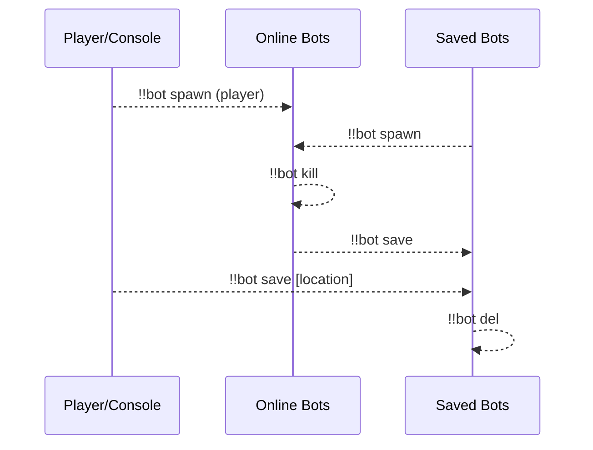
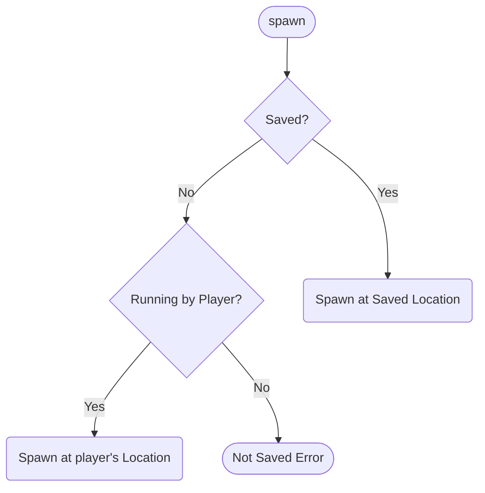
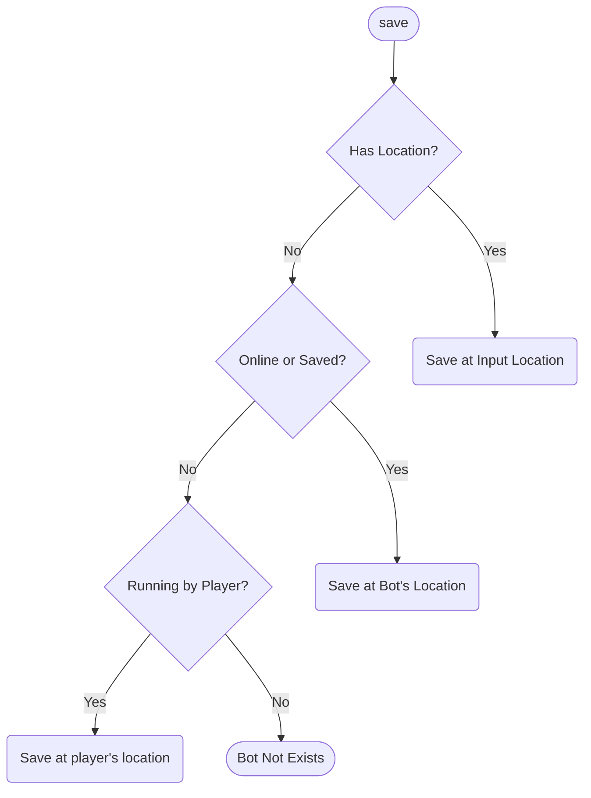
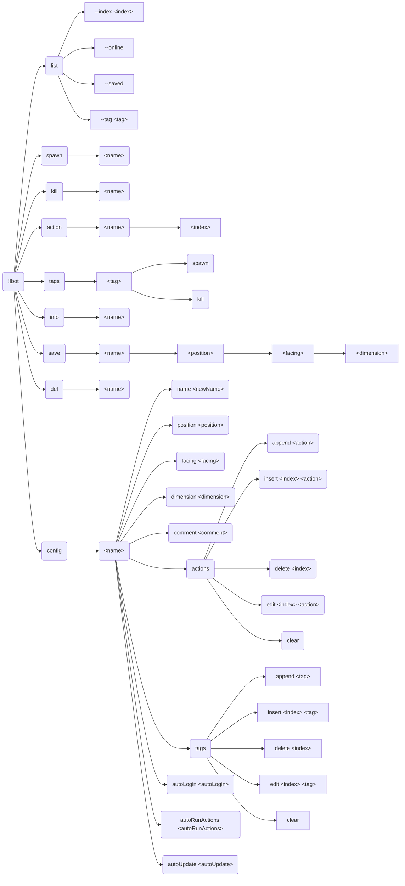
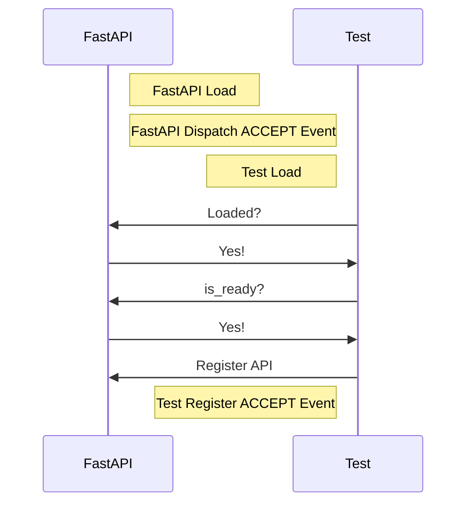
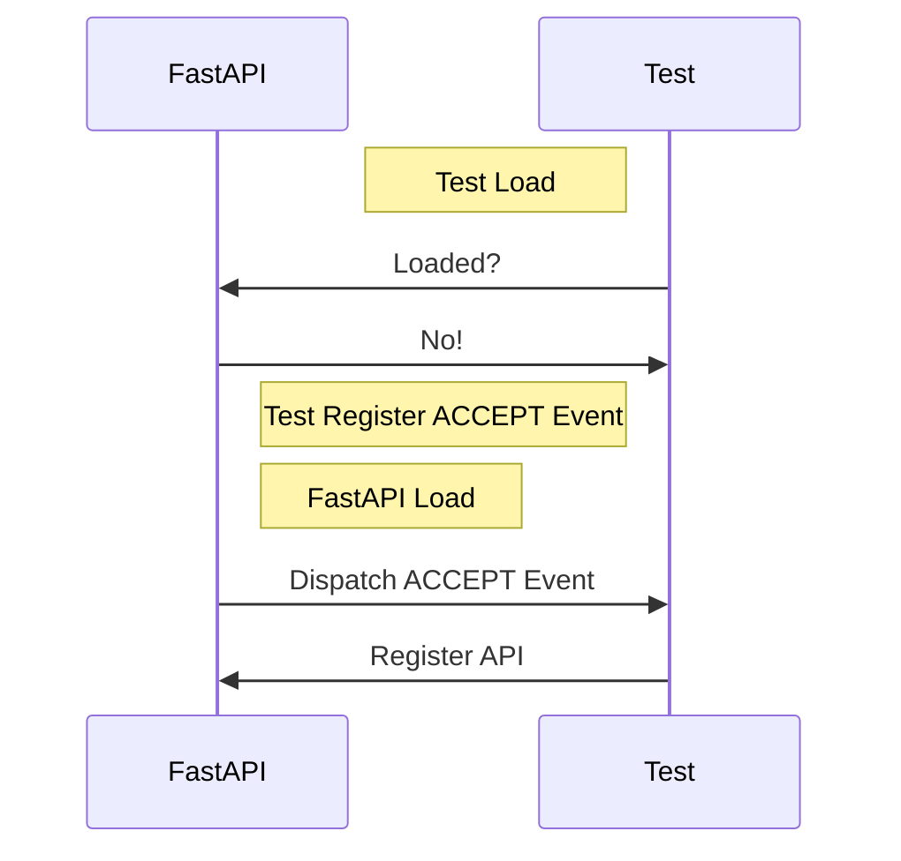
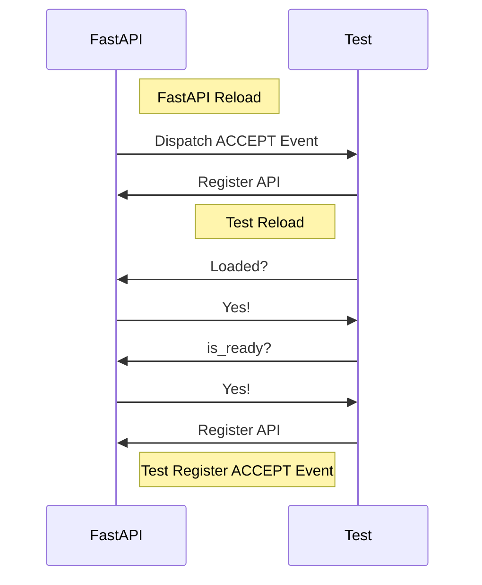
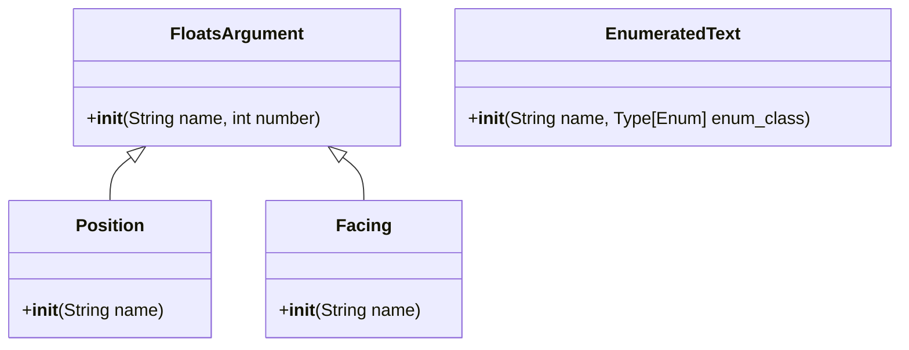

**English** | [中文](full-zh_cn.md)

\>\>\> [Back to index](/readme.md)

# Full Plugin Information Collection

Use `ctrl-f` to performance an in-page search, for what you are interested in

## advanced_calculator

### Basic Information

- Plugin ID: `advanced_calculator`
- Version: *Data fetching failed*
- Total downloads: N/A
- Authors: [Andy Zhang](https://github.com/AnzhiZhang)
- Repository: https://github.com/AnzhiZhang/MCDReforgedPlugins
- Repository plugin page: https://github.com/AnzhiZhang/MCDReforgedPlugins/tree/master/src/advanced_calculator
- Labels: [`Tool`](/labels/tool/readme.md)
- Description: *Data fetching failed*

### Dependencies

*Data fetching failed*

### Requirements

*Data fetching failed*

### Introduction

# AdvancedCalculator

> 提供游戏内多种便捷计算

## 使用

您可以使用 `=<expression>` 直接计算表达式，或使用 `==<count/expression>` 将物品数转换堆叠数。

| 指令 | 用途 | 示例 | 结果 |
| - | - | - | - |
| !!calc \<expression> | 计算表达式 | !!calc 1+1 | 1+1=2 |
| !!calc item \<count/expression> | 物品数转换堆叠数 | !!calc item 1794 | 1794个物品为1盒2组3个 |
| !!calc item \<box> \<stack> \<single> | 堆叠数转换物品数 | !!calc item 1 10 32 | 1盒10组32个为2400个物品 |
| !!calc color \<red> \<green> \<blue> | 10进制RGB转16进制 | !!calc color 255 0 255 | (255, 0, 255) -> #FF00FF |
| !!calc color \<#HEX> | 16十进制RGB转10进制 | !!calc color #00FF00 | #00FF00 -> (0, 255, 0) |

### Download

> [!IMPORTANT]
> Read the README file in plugin repository before using it.

*Data fetching failed*

## advanced_whitelist_r

### Basic Information

- Plugin ID: `advanced_whitelist_r`
- Version: *Data fetching failed*
- Total downloads: N/A
- Authors: [noionion](https://github.com/2X-ercha), [GamerNoTitle](https://github.com/GamerNoTitle)
- Repository: https://github.com/EMUnion/AdvancedWhitelistR
- Repository plugin page: https://github.com/EMUnion/AdvancedWhitelistR/tree/master
- Labels: [`Management`](/labels/management/readme.md)
- Description: *Data fetching failed*

### Dependencies

*Data fetching failed*

### Requirements

*Data fetching failed*

### Introduction

Offline server whitelist management

### Download

> [!IMPORTANT]
> Read the README file in plugin repository before using it.

*Data fetching failed*

## allow_suicide

### Basic Information

- Plugin ID: `allow_suicide`
- Version: *Data fetching failed*
- Total downloads: N/A
- Authors: [JAs0n](https://github.com/JAs0n319)
- Repository: https://github.com/JAs0n319/allow_suicide
- Repository plugin page: https://github.com/JAs0n319/allow_suicide/tree/master
- Labels: [`Tool`](/labels/tool/readme.md)
- Description: *Data fetching failed*

### Dependencies

*Data fetching failed*

### Requirements

*Data fetching failed*

### Introduction

Allow player suicide without op

### Download

> [!IMPORTANT]
> Read the README file in plugin repository before using it.

*Data fetching failed*

## auto_backup

### Basic Information

- Plugin ID: `auto_backup`
- Version: *Data fetching failed*
- Total downloads: N/A
- Authors: [Kongtu5i](https://github.com/Kongtu5i)
- Repository: https://github.com/Kongtu5i/AutoBackup
- Repository plugin page: https://github.com/Kongtu5i/AutoBackup/tree/main
- Labels: [`Management`](/labels/management/readme.md)
- Description: *Data fetching failed*

### Dependencies

*Data fetching failed*

### Requirements

*Data fetching failed*

### Introduction

Automatically making a backup when players in the list join minecraft server

### Download

> [!IMPORTANT]
> Read the README file in plugin repository before using it.

*Data fetching failed*

## auto_command

### Basic Information

- Plugin ID: `auto_command`
- Version: *Data fetching failed*
- Total downloads: N/A
- Authors: [bzyyyyyyyy](https://github.com/bzyyyyyyyy)
- Repository: https://github.com/bzyyyyyyyy/MCDR-AutoCommand
- Repository plugin page: https://github.com/bzyyyyyyyy/MCDR-AutoCommand/tree/master
- Labels: [`Tool`](/labels/tool/readme.md)
- Description: *Data fetching failed*

### Dependencies

*Data fetching failed*

### Requirements

*Data fetching failed*

### Introduction

Edit/send command stack & automatically send commands
### Download

> [!IMPORTANT]
> Read the README file in plugin repository before using it.

*Data fetching failed*

## auto_execute

### Basic Information

- Plugin ID: `auto_execute`
- Version: *Data fetching failed*
- Total downloads: N/A
- Authors: [FRUITS-CANDY](https://github.com/FRUITS-CANDY)
- Repository: https://github.com/Passion-Never-Dissipate/Auto-Execute
- Repository plugin page: https://github.com/Passion-Never-Dissipate/Auto-Execute/tree/master
- Labels: [`Tool`](/labels/tool/readme.md)
- Description: *Data fetching failed*

### Dependencies

*Data fetching failed*

### Requirements

*Data fetching failed*

### Introduction

An MCDR plugin that stores various instructions for multimodal execution based on scripts
### Download

> [!IMPORTANT]
> Read the README file in plugin repository before using it.

*Data fetching failed*

## auto_msg_title

### Basic Information

- Plugin ID: `auto_msg_title`
- Version: *Data fetching failed*
- Total downloads: N/A
- Authors: [zhongbai233](https://github.com/zhongbai2333)
- Repository: https://github.com/zhongbai2333/AutoMsgTitle
- Repository plugin page: https://github.com/zhongbai2333/AutoMsgTitle/tree/master
- Labels: [`Information`](/labels/information/readme.md)
- Description: *Data fetching failed*

### Dependencies

*Data fetching failed*

### Requirements

*Data fetching failed*

### Introduction

This plugin can automatically pop up titles or messages for players, just like the title after the plugin server enters the Lobby.

At the same time, this plugin can provide automatic instructions for a certain area, such as when the server is visited, visitors enter a certain area, the machine automatically pops up this area, the manufacturer, name, function of the machine, etc; Automatically pop up the machine manual for players when they enter a certain machine.

### Download

> [!IMPORTANT]
> Read the README file in plugin repository before using it.

*Data fetching failed*

## auto_plugin_reloader

### Basic Information

- Plugin ID: `auto_plugin_reloader`
- Version: *Data fetching failed*
- Total downloads: N/A
- Authors: [Fallen_Breath](https://github.com/Fallen-Breath)
- Repository: https://github.com/TISUnion/AutoPluginReloader
- Repository plugin page: https://github.com/TISUnion/AutoPluginReloader/tree/master
- Labels: [`Management`](/labels/management/readme.md)
- Description: *Data fetching failed*

### Dependencies

*Data fetching failed*

### Requirements

*Data fetching failed*

### Introduction

It's a plugin that automatically detects changes made in the MCDR plugin folders and triggers plugin reload

It's a savior for lazy people who are tired of having to manually perform plugin reloads after plugin file updates!

### Download

> [!IMPORTANT]
> Read the README file in plugin repository before using it.

*Data fetching failed*

## battery_saver

### Basic Information

- Plugin ID: `battery_saver`
- Version: *Data fetching failed*
- Total downloads: N/A
- Authors: [Mooling0602](https://github.com/Mooling0602)
- Repository: https://github.com/Mooling0602/BatterySaver-MCDR
- Repository plugin page: https://github.com/Mooling0602/BatterySaver-MCDR/tree/main
- Labels: [`Tool`](/labels/tool/readme.md), [`Information`](/labels/information/readme.md)
- Description: *Data fetching failed*

### Dependencies

*Data fetching failed*

### Requirements

*Data fetching failed*

### Introduction

Check battery of host machine and automatically stop server when it's low.

### Download

> [!IMPORTANT]
> Read the README file in plugin repository before using it.

*Data fetching failed*

## beep

### Basic Information

- Plugin ID: `beep`
- Version: *Data fetching failed*
- Total downloads: N/A
- Authors: [Fallen_Breath](https://github.com/Fallen-Breath), [LucunJi](https://github.com/LucunJi)
- Repository: https://github.com/TISUnion/Beep
- Repository plugin page: https://github.com/TISUnion/Beep/tree/master
- Labels: [`Tool`](/labels/tool/readme.md)
- Description: *Data fetching failed*

### Dependencies

*Data fetching failed*

### Requirements

*Data fetching failed*

### Introduction

*Data fetching failed*
### Download

> [!IMPORTANT]
> Read the README file in plugin repository before using it.

*Data fetching failed*

## better_backup

### Basic Information

- Plugin ID: `better_backup`
- Version: *Data fetching failed*
- Total downloads: N/A
- Authors: [z0z0r4](https://github.com/z0z0r4)
- Repository: https://github.com/z0z0r4/better_backup
- Repository plugin page: https://github.com/z0z0r4/better_backup/tree/master
- Labels: [`Management`](/labels/management/readme.md)
- Description: *Data fetching failed*

### Dependencies

*Data fetching failed*

### Requirements

*Data fetching failed*

### Introduction

⚠️ **ARCHIVED**: Use PrimeBackup instead

A plugin that supports efficient backup/rollback with file deduplication

Features:

- Annotated backup
- Keep only one copy of all files without duplication, saving hard disk space
- Backup size display, clear information
- Theoretically unlimited backup points, only depends on save changes

### Download

> [!IMPORTANT]
> Read the README file in plugin repository before using it.

*Data fetching failed*

## bili_live_helper

### Basic Information

- Plugin ID: `bili_live_helper`
- Version: *Data fetching failed*
- Total downloads: N/A
- Authors: [Aimerny](https://github.com/Aimerny)
- Repository: https://github.com/Aimerny/MCDRPlugins
- Repository plugin page: https://github.com/Aimerny/MCDRPlugins/tree/main/src/bili_live_helper
- Labels: [`Information`](/labels/information/readme.md)
- Description: *Data fetching failed*

### Dependencies

*Data fetching failed*

### Requirements

*Data fetching failed*

### Introduction

# BiliLiveHelper | B站直播助手-弹幕姬

---

支持将b站直播间的弹幕同步到mc中

> [!important]
> 此插件仅用于学习交流,请勿用于违法犯罪或其他不良用途.

# :sparkles: 功能

**BiliLiveHelper**是一款~~功能丰富的~~MCDR插件,能够实现将[bilibili](https://bilibili.com)(以下简称"B站)
直播间中的弹幕信息实时同步到MC聊天板中.

- [x] 全异步拉取B站弹幕
- [x] 支持多个玩家订阅各自的直播间,弹幕消息单独发送,互不干扰
- [x] 玩家可以随时启停弹幕姬
- [ ] 支持查询订阅的直播间的状态
- [ ] admin轻松管理所有玩家的订阅信息
- [ ] 游戏内通过直播姬账号发送弹幕,即时回应

# :robot: 指令
```
 ---------- BiliLiveHelper ----------
 >> !!blh [help] - | - 获取帮助
 >> !!blh bind <rid> - | - 绑定直播间id
 >> !!blh on - | - 启动直播弹幕姬
 >> !!blh off - | - 停止直播弹幕姬
 >> !!blh info - | - 查看我的直播间信息
 ------- Authored by Aimerny --------
```

# :pushpin: 依赖

| python依赖项           | 版本      |
| ------------------- | ------- |
| mcdreforged         | ^2.12.0 |
| bilibili-python-api | ^16.2.0 |

| mcdr依赖项     | 版本      |
| ----------- | ------- |
| mcdreforged | ^2.12.0 |

# :wrench: 配置
```json5
{
    "enable": true,
    "data_file_path": "data.json",
    "console_output": true,
    "account": {
        "uid": 3546688564234249,
        "sessdata": "",
        "bili_jct": "",
        "buvid3": "",
        "ac_time_value": ""
    }
}
```
## 配置说明

1. `data_file_path`: 数据文件的路径.持久化的信息会保存到这个文件
2. `console_output`: 是否将接收到的弹幕输出到服务器控制台,如果设为false则需要在debug模式才能看到
3. `account`: 使用此插件需要一个真实的B站账号.`account`中是一些鉴权信息
   1. `uid`: 你的B站账号UID
   2. 其他: 参考 [获取 Credential 类所需信息](https://nemo2011.github.io/bilibili-api/#/get-credential)

> [!note]
> B站的账号如果没有在其他地方登录基本不会过期,建议开一个小号做这件事情

# :art: 功能预览


### Download

> [!IMPORTANT]
> Read the README file in plugin repository before using it.

*Data fetching failed*

## bingo

### Basic Information

- Plugin ID: `bingo`
- Version: *Data fetching failed*
- Total downloads: N/A
- Authors: [Andy Zhang](https://github.com/AnzhiZhang)
- Repository: https://github.com/AnzhiZhang/MCDReforgedPlugins
- Repository plugin page: https://github.com/AnzhiZhang/MCDReforgedPlugins/tree/master/src/bingo
- Labels: [`Tool`](/labels/tool/readme.md)
- Description: *Data fetching failed*

### Dependencies

*Data fetching failed*

### Requirements

*Data fetching failed*

### Introduction

# Bingo

> [Bingo](https://www.flytre.net/bingo) 游戏实用工具

## 使用

| 指令 | 用途 |
| - | - |
| !!bingo team \<num> | 随机分组 |
| !!bingo end | 结束游戏 |

### Download

> [!IMPORTANT]
> Read the README file in plugin repository before using it.

*Data fetching failed*

## bot

### Basic Information

- Plugin ID: `bot`
- Version: *Data fetching failed*
- Total downloads: N/A
- Authors: [Andy Zhang](https://github.com/AnzhiZhang)
- Repository: https://github.com/AnzhiZhang/MCDReforgedPlugins
- Repository plugin page: https://github.com/AnzhiZhang/MCDReforgedPlugins/tree/master/src/bot
- Labels: [`Tool`](/labels/tool/readme.md), [`Management`](/labels/management/readme.md)
- Description: *Data fetching failed*

### Dependencies

*Data fetching failed*

### Requirements

*Data fetching failed*

### Introduction

# Bot

[简体中文](https://github.com/AnzhiZhang/MCDReforgedPlugins/tree/master/src/bot/readme_cn.md)

> The best carpet bot manager!

## Dependencies

- [MinecraftDataAPI](https://github.com/MCDReforged/MinecraftDataAPI)
- [MoreCommandNodes](https://github.com/AnzhiZhang/MCDReforgedPlugins/tree/master/src/bot/../more_command_nodes)

## Usage

`!!bot` View help

`!!bot list [--index <index>] [filters]` Show bot list

`!!bot spawn <name>` Spawn bot

`!!bot kill <name>` Kill bot

`!!bot action <name> [index]` Execute bot action(s)

`!!bot tags` View available tags

`!!bot tags <tag> spawn/kill` Spawn/kill bot(s) with tag

`!!bot info <name>` View bot info

`!!bot save <name> [position] [facing] [dimension]` Save bot

`!!bot del <name>` Delete saved bot

`!!bot config <name> <option> <value>` Config bot

### Workflow



### list

**--index \<index\>**: Page number, e.g. `--index 1`, default is 0

**--online**: Show online bots

**--saved**: Show saved bots

**--tag \<tag\>**: Filter by tag

### spawn

Spawn bot



### kill

Kill bot

### action

Execute bot action(s)

When `index` is specified, execute specific action(s) instead of all actions

### tags

View available tags and spawn/kill bot(s) with tag

`!!bot tags` View available tags

`!!bot tags <tag> spawn` Spawn bot(s) with tag

`!!bot tags <tag> kill` Kill bot(s) with tag

### info

View bot info

### save

Save bot



### del

Delete saved bot

### config

Config bot

### Full Command Tree



## Config

### gamemode

Default: `survival`

Game mode of bot

### force_gamemode

Default: `false`

Forcing all bots to use the game mode configured by `gamemode`, if `false`, only saved bots will use the game mode configured by `gamemode`.

### name_prefix

Default: `bot_`

Prefix of bot name

### name_suffix

Default: None

Suffix of bot name

### permissions

Minimum permission to use corresponding command

## FastAPI MCDR

The plugin supports the [FastAPI MCDR](https://github.com/AnzhiZhang/MCDReforgedPlugins/tree/master/src/bot/../fastapi_mcdr) plugin. After installing the FastAPI MCDR plugin, the plugin will automatically register endpoints. You can view the API definition through FastAPI.

Python packages required:

```text
pydantic>=2.0
```

You can use this feature to implement external control, such as a web page for managing bots:


### Download

> [!IMPORTANT]
> Read the README file in plugin repository before using it.

*Data fetching failed*

## bot_plugin

### Basic Information

- Plugin ID: `bot_plugin`
- Version: *Data fetching failed*
- Total downloads: N/A
- Authors: [DancingSnow0517](https://github.com/DancingSnow0517)
- Repository: https://github.com/DancingSnow0517/Bot_Manager
- Repository plugin page: https://github.com/DancingSnow0517/Bot_Manager/tree/master
- Labels: [`Management`](/labels/management/readme.md), [`Tool`](/labels/tool/readme.md)
- Description: *Data fetching failed*

### Dependencies

*Data fetching failed*

### Requirements

*Data fetching failed*

### Introduction

# A MCDR bot manager。

:warning: **Read README in repository before use!**

### Download

> [!IMPORTANT]
> Read the README file in plugin repository before using it.

*Data fetching failed*

## carpet_bot_manager

### Basic Information

- Plugin ID: `carpet_bot_manager`
- Version: *Data fetching failed*
- Total downloads: N/A
- Authors: [YehowahLiu](https://github.com/YehowahLiu)
- Repository: https://github.com/FAS-Server/CarpetBotManager
- Repository plugin page: https://github.com/FAS-Server/CarpetBotManager/tree/main
- Labels: [`Tool`](/labels/tool/readme.md)
- Description: *Data fetching failed*

### Dependencies

*Data fetching failed*

### Requirements

*Data fetching failed*

### Introduction

A carpet bot manage plugin, able to spawn bot and make it execute actions

### Download

> [!IMPORTANT]
> Read the README file in plugin repository before using it.

*Data fetching failed*

## carpet_tick

### Basic Information

- Plugin ID: `carpet_tick`
- Version: *Data fetching failed*
- Total downloads: N/A
- Authors: [Ivan1F](https://github.com/Ivan-1F)
- Repository: https://github.com/Ivan-1F/CarpetTick
- Repository plugin page: https://github.com/Ivan-1F/CarpetTick/tree/master
- Labels: [`Information`](/labels/information/readme.md)
- Description: *Data fetching failed*

### Dependencies

*Data fetching failed*

### Requirements

*Data fetching failed*

### Introduction

*Data fetching failed*
### Download

> [!IMPORTANT]
> Read the README file in plugin repository before using it.

*Data fetching failed*

## carpetbotlist

### Basic Information

- Plugin ID: `carpetbotlist`
- Version: *Data fetching failed*
- Total downloads: N/A
- Authors: [ZeroKelvin](https://github.com/BelowZeroKelvin)
- Repository: https://github.com/BelowZeroKelvin/MCDR-CarpetBotList
- Repository plugin page: https://github.com/BelowZeroKelvin/MCDR-CarpetBotList/tree/MCDR-2.x
- Labels: [`Tool`](/labels/tool/readme.md)
- Description: *Data fetching failed*

### Dependencies

*Data fetching failed*

### Requirements

*Data fetching failed*

### Introduction

Help you manage your carpet fake player

### Download

> [!IMPORTANT]
> Read the README file in plugin repository before using it.

*Data fetching failed*

## cato

### Basic Information

- Plugin ID: `cato`
- Version: *Data fetching failed*
- Total downloads: N/A
- Authors: [Harry-zklcdc](https://github.com/Harry-zklcdc)
- Repository: https://github.com/Harry-zklcdc/MCDR-Cato
- Repository plugin page: https://github.com/Harry-zklcdc/MCDR-Cato/tree/main
- Labels: [`Tool`](/labels/tool/readme.md)
- Description: *Data fetching failed*

### Dependencies

*Data fetching failed*

### Requirements

*Data fetching failed*

### Introduction

When the server starts, it automatically uses Cato (P2P connection tool) for port mapping, and supports the generation of HMCL Multiplayer code

# Features:

- Cato official support
- Non inductive P2P connection
- HMCL Multiplayer Support
- Cato crash / temporary ID expires restart automatically
- API interface to obtain Cato connection ID and HMCL Multiplayer code
- Cato token hot replacement
- Get Cato connection ID and HMCL Multiplayer code in the game

### Download

> [!IMPORTANT]
> Read the README file in plugin repository before using it.

*Data fetching failed*

## chatbridge

### Basic Information

- Plugin ID: `chatbridge`
- Version: *Data fetching failed*
- Total downloads: N/A
- Authors: [Fallen_Breath](https://github.com/Fallen-Breath)
- Repository: https://github.com/TISUnion/ChatBridge
- Repository plugin page: https://github.com/TISUnion/ChatBridge/tree/master
- Labels: [`Tool`](/labels/tool/readme.md)
- Description: *Data fetching failed*

### Dependencies

*Data fetching failed*

### Requirements

*Data fetching failed*

### Introduction

Chatbridge v2

### Download

> [!IMPORTANT]
> Read the README file in plugin repository before using it.

*Data fetching failed*

## chatbridgereforged_mc

### Basic Information

- Plugin ID: `chatbridgereforged_mc`
- Version: *Data fetching failed*
- Total downloads: N/A
- Authors: [Ricky](https://github.com/R1ckyH)
- Repository: https://github.com/R1ckyH/ChatBridgeReforged
- Repository plugin page: https://github.com/R1ckyH/ChatBridgeReforged/tree/master/./ChatBridgeReforged_MC
- Labels: [`Tool`](/labels/tool/readme.md)
- Description: *Data fetching failed*

### Dependencies

*Data fetching failed*

### Requirements

*Data fetching failed*

### Introduction

Reforged of ChatBridge, interaction with other clients(such as minecraft server, discord bot or other things).

### Download

> [!IMPORTANT]
> Read the README file in plugin repository before using it.

*Data fetching failed*

## colored_chat

### Basic Information

- Plugin ID: `colored_chat`
- Version: *Data fetching failed*
- Total downloads: N/A
- Authors: [Andy Zhang](https://github.com/AnzhiZhang)
- Repository: https://github.com/AnzhiZhang/MCDReforgedPlugins
- Repository plugin page: https://github.com/AnzhiZhang/MCDReforgedPlugins/tree/master/src/.archived/ColoredChat
- Labels: [`Tool`](/labels/tool/readme.md)
- Description: *Data fetching failed*

### Dependencies

*Data fetching failed*

### Requirements

*Data fetching failed*

### Introduction

# ColoredChat

> 支持原版显示 [格式化代码](https://minecraft.fandom.com/zh/wiki/%E6%A0%BC%E5%BC%8F%E5%8C%96%E4%BB%A3%E7%A0%81)

## 使用

与正常聊天没有区别, 需要格式化时使用 `&` 符号

## 配置

`force_refresh`

是否刷新聊天栏的所有内容, 某些无法被记录的信息可能会被覆盖

默认值: `True`

## API

可以使用 `append_msg(msg)` 方法来插件的广播消息

### Download

> [!IMPORTANT]
> Read the README file in plugin repository before using it.

*Data fetching failed*

## colorful_id

### Basic Information

- Plugin ID: `colorful_id`
- Version: *Data fetching failed*
- Total downloads: N/A
- Authors: [Apricityx_](https://github.com/Apricityx)
- Repository: https://github.com/Apricityx/ColorfulID
- Repository plugin page: https://github.com/Apricityx/ColorfulID/tree/master
- Labels: [`Tool`](/labels/tool/readme.md)
- Description: *Data fetching failed*

### Dependencies

*Data fetching failed*

### Requirements

*Data fetching failed*

### Introduction

### A simple plugin that makes players able to choose their own nickname color by commands below:

```
!!color <color>
```

## BEWARE: This plugin works by making players join different teams, please make sure your server doesn't rely on /team command.

## After enabling this plugin, you need to run the following command to initialize:
```
!!color install
```

This will create several teams for players to join and adjust their nickname color.

When you don't need this plugin anymore, run the following command to remove the teams:

```
!!color uninstall
```

### Download

> [!IMPORTANT]
> Read the README file in plugin repository before using it.

*Data fetching failed*

## command_aliases

### Basic Information

- Plugin ID: `command_aliases`
- Version: *Data fetching failed*
- Total downloads: N/A
- Authors: [Andy Zhang](https://github.com/AnzhiZhang)
- Repository: https://github.com/AnzhiZhang/MCDReforgedPlugins
- Repository plugin page: https://github.com/AnzhiZhang/MCDReforgedPlugins/tree/master/src/command_aliases
- Labels: [`Tool`](/labels/tool/readme.md)
- Description: *Data fetching failed*

### Dependencies

*Data fetching failed*

### Requirements

*Data fetching failed*

### Introduction

# Command Aliases

> Alias commands by config

## Usage

You need to add all commands you would like to alias in the config file, where keys are the alias and values are the original commands.

```json
{
  "alias": {
    "!!mcdr": "!!MCDR"
  }
}
```

Now you can use `!!mcdr` as an alias for `!!MCDR`.

> [!NOTE]
> There will be no completion for alias commands. If you want to use completion, you need to use original commands. It does not make sense if you need to use alias in an environment where you have completion.

### Download

> [!IMPORTANT]
> Read the README file in plugin repository before using it.

*Data fetching failed*

## command_exporter

### Basic Information

- Plugin ID: `command_exporter`
- Version: *Data fetching failed*
- Total downloads: N/A
- Authors: [DancingSnow](https://github.com/DancingSnow0517)
- Repository: https://github.com/DancingSnow0517/MCDR-Command-Exporter
- Repository plugin page: https://github.com/DancingSnow0517/MCDR-Command-Exporter/tree/master/command_exporter
- Labels: [`Tool`](/labels/tool/readme.md)
- Description: *Data fetching failed*

### Dependencies

*Data fetching failed*

### Requirements

*Data fetching failed*

### Introduction

English | [中文](https://github.com/DancingSnow0517/MCDR-Command-Exporter/tree/master/command_exporter/README-CN.MD)

# MCDR Command Exporter

A plugin is used to export the MCDR command tree.

Get client completion with mod [MCDR-Completion](https://github.com/DancingSnow0517/MCDR-Completion).

## Usage
1. Go to [release page](https://github.com/DancingSnow0517/MCDR-Command-Exporter/releases) download `MCDRCommandExporter-vX.X.X.mcdr` plugin

   Put it in the plugins folder and reload MCDR plugins.

2. Download fabric mod [MCDR-Completion](https://github.com/DancingSnow0517/MCDR-Completion/releases) and install it to `Server` and `Client`

   This mod requires [fabric-api](https://modrinth.com/mod/fabric-api)

3. Join the server and enjoy it!


### Download

> [!IMPORTANT]
> Read the README file in plugin repository before using it.

*Data fetching failed*

## cpu_temp

### Basic Information

- Plugin ID: `cpu_temp`
- Version: *Data fetching failed*
- Total downloads: N/A
- Authors: [Ricky](https://github.com/R1ckyH)
- Repository: https://github.com/R1ckyH/cpu_temp
- Repository plugin page: https://github.com/R1ckyH/cpu_temp/tree/master
- Labels: [`Information`](/labels/information/readme.md)
- Description: *Data fetching failed*

### Dependencies

*Data fetching failed*

### Requirements

*Data fetching failed*

### Introduction

A plugin to check cpu temp regularly.

### Download

> [!IMPORTANT]
> Read the README file in plugin repository before using it.

*Data fetching failed*

## cq_qq_api

### Basic Information

- Plugin ID: `cq_qq_api`
- Version: *Data fetching failed*
- Total downloads: N/A
- Authors: [XueK66](https://github.com/XueK66), [LoosePrince](https://github.com/LoosePrince)
- Repository: https://github.com/XueK66/PF-cq_qq_api
- Repository plugin page: https://github.com/XueK66/PF-cq_qq_api/tree/master/src
- Labels: [`API`](/labels/api/readme.md)
- Description: *Data fetching failed*

### Dependencies

*Data fetching failed*

### Requirements

*Data fetching failed*

### Introduction


# PF-cq_qq_api

[](https://github.com/XueK66/PF-cq_qq_api/tree/master/src//)
[](https://github.com/XueK66/PF-cq_qq_api/releases/latest/download/YourRepoName.mcdr)
[](https://github.com/XueK66/PF-cq_qq_api/issues)
[](https://github.com/XueK66/PF-cq_qq_api/issues?q=is%3Aissue+is%3Aclosed)
[](https://github.com/XueK66/PF-cq_qq_api/releases)
[](https://github.com/XueK66/PF-cq_qq_api/releases/latest)


> PFingan服务器MCDRQQ机器人插件
> 
> 基于CQ码的QQ连接机器人
> 
> 提供MCDR机器人插件接口，方便聊天类机器人的构建

技术支持：XueK__ [前往主页](https://github.com/XueK66)

使用方式：
* 将Release里面的cq_qq_api.mcdr放入`/plugins`
* 加载后，在`/config/cq_qq_api/config.yml`中配置机器人

## 依赖
#### Python
- [Python™](https://www.python.org/)
#### Python模块
- 已存储在插件对应的文件夹内的 [requirements.txt](https://github.com/XueK66/PF-cq_qq_api/tree/master/src/requirements.txt) 中, 可以使用 `pip install -r requirements.txt` 安装

基本功能：聊天互相转发

## 使用方式
#### 调用机器人
```
bot = server.get_plugin_instance("cq_qq_api").get_bot()
```

#### 调用例子 - 发送群聊消息
更多接口详情可查看`bot.py`或查看[Onebot_11_API_标准](https://github.com/botuniverse/onebot-11/blob/master/api/public.md)
```
bot = server.get_plugin_instance("cq_qq_api").get_bot()
bot.send_group_msg(group_id, message)
```


## 配置

#### 服务端配置 - Server
- config.json

> | 配置项 | 默认值 | 说明 |
> | - | - | - |
> | host | `127.0.0.1` | 接收数据上报的地址 |
> | port | `8080` | 对应数据上报的端口 | 
> | post_path | "" | 对应数据上报的终点名 |
> | token | "" | 对应数据上报的token，用于加密信息 |

```
{
    "host": "127.0.0.1",
    "port": 8080,
    "post_path": "",
    "token": ""
}
```

最终websocket url为：
```
ws://host:port/post_path/
```
#### QQ机器人配置
**以下为必要配置！**
> | 配置项 | 默认值 | 说明 |
> | - | - | - |
> | 正向websocket服务端口 | `8080` | 接收数据上报的端口 |
> | 消息上报格式 | CQ码 | 机器人基于CQ码进行解析 |

# 有BUG或是新的IDEA
如果需要更多联动或提交想法和问题请提交 [issues](https://github.com/LoosePrince/PF-GUGUBot/issues) 或 QQ [1377820366](http://wpa.qq.com/msgrd?v=3&uin=1377820366&site=qq&menu=yes) 提交！ <br />
视情况添加，请勿联系他人（开发者：[雪开](https://github.com/XueK66)）

### Download

> [!IMPORTANT]
> Read the README file in plugin repository before using it.

*Data fetching failed*

## crash_restart

### Basic Information

- Plugin ID: `crash_restart`
- Version: *Data fetching failed*
- Total downloads: N/A
- Authors: [Fallen_Breath](https://github.com/Fallen-Breath)
- Repository: https://github.com/TISUnion/CrashRestart
- Repository plugin page: https://github.com/TISUnion/CrashRestart/tree/master
- Labels: [`Tool`](/labels/tool/readme.md)
- Description: *Data fetching failed*

### Dependencies

*Data fetching failed*

### Requirements

*Data fetching failed*

### Introduction

*Data fetching failed*
### Download

> [!IMPORTANT]
> Read the README file in plugin repository before using it.

*Data fetching failed*

## database_api

### Basic Information

- Plugin ID: `database_api`
- Version: *Data fetching failed*
- Total downloads: N/A
- Authors: [Andy Zhang](https://github.com/AnzhiZhang)
- Repository: https://github.com/AnzhiZhang/MCDReforgedPlugins
- Repository plugin page: https://github.com/AnzhiZhang/MCDReforgedPlugins/tree/master/src/database_api
- Labels: [`API`](/labels/api/readme.md)
- Description: *Data fetching failed*

### Dependencies

*Data fetching failed*

### Requirements

*Data fetching failed*

### Introduction

# DatabaseAPI

> 数据库API
> 
> 提供了数据库操作的便捷API

## 环境要求

### Python包

- sqlalchemy

## 开发文档

查看 [Valut](https://github.com/AnzhiZhang/MCDReforgedPlugins/tree/master/src/database_api/../.archived/vault/vault.py) 参考使用方法

提供了以下两个类:

- TableBase
- DataManager

### TableBase

一个数据库表的基类, 写一个你的数据库表并继承这个类来创建一张表

### DataManager

使用本API需要自行实例化这个类

实例化: `__init__(self, file_path: str)`

#### get_session

获取一个数据库会话的上下文管理器, 更多信息请自行查找资料

### Download

> [!IMPORTANT]
> Read the README file in plugin repository before using it.

*Data fetching failed*

## daycount_nbt

### Basic Information

- Plugin ID: `daycount_nbt`
- Version: *Data fetching failed*
- Total downloads: N/A
- Authors: [Alex3236](https://github.com/alex3236)
- Repository: https://github.com/alex3236/daycount-NBT
- Repository plugin page: https://github.com/alex3236/daycount-NBT/tree/main/src
- Labels: [`Information`](/labels/information/readme.md), [`API`](/labels/api/readme.md)
- Description: *Data fetching failed*

### Dependencies

*Data fetching failed*

### Requirements

*Data fetching failed*

### Introduction

Get and export server opening times.

Feature:
- NBT Mode

:warning: **Read README in repository before use!**

### Download

> [!IMPORTANT]
> Read the README file in plugin repository before using it.

*Data fetching failed*

## daytime

### Basic Information

- Plugin ID: `daytime`
- Version: *Data fetching failed*
- Total downloads: N/A
- Authors: [ZeroKelvin](https://github.com/BelowZeroKelvin)
- Repository: https://github.com/BelowZeroKelvin/MCDR-Daytime
- Repository plugin page: https://github.com/BelowZeroKelvin/MCDR-Daytime/tree/MCDR-2.x
- Labels: [`Tool`](/labels/tool/readme.md)
- Description: *Data fetching failed*

### Dependencies

*Data fetching failed*

### Requirements

*Data fetching failed*

### Introduction

Show time in Minecraft

### Download

> [!IMPORTANT]
> Read the README file in plugin repository before using it.

*Data fetching failed*

## delayexe

### Basic Information

- Plugin ID: `delayexe`
- Version: *Data fetching failed*
- Total downloads: N/A
- Authors: [zyxkad](https://github.com/zyxkad)
- Repository: https://github.com/kmcsr/delayexe_mcdr
- Repository plugin page: https://github.com/kmcsr/delayexe_mcdr/tree/master
- Labels: [`Tool`](/labels/tool/readme.md), [`API`](/labels/api/readme.md)
- Description: *Data fetching failed*

### Dependencies

*Data fetching failed*

### Requirements

*Data fetching failed*

### Introduction

*Data fetching failed*
### Download

> [!IMPORTANT]
> Read the README file in plugin repository before using it.

*Data fetching failed*

## diamond_calc

### Basic Information

- Plugin ID: `diamond_calc`
- Version: *Data fetching failed*
- Total downloads: N/A
- Authors: [Huaji_MUR233](https://github.com/HuajiMUR233)
- Repository: https://github.com/HuajiMUR233/DiamondCalc
- Repository plugin page: https://github.com/HuajiMUR233/DiamondCalc/tree/master
- Labels: [`Tool`](/labels/tool/readme.md)
- Description: *Data fetching failed*

### Dependencies

*Data fetching failed*

### Requirements

*Data fetching failed*

### Introduction

*Data fetching failed*
### Download

> [!IMPORTANT]
> Read the README file in plugin repository before using it.

*Data fetching failed*

## dict_command_registration

### Basic Information

- Plugin ID: `dict_command_registration`
- Version: *Data fetching failed*
- Total downloads: N/A
- Authors: [Andy Zhang](https://github.com/AnzhiZhang)
- Repository: https://github.com/AnzhiZhang/MCDReforgedPlugins
- Repository plugin page: https://github.com/AnzhiZhang/MCDReforgedPlugins/tree/master/src/dict_command_registration
- Labels: [`API`](/labels/api/readme.md)
- Description: *Data fetching failed*

### Dependencies

*Data fetching failed*

### Requirements

*Data fetching failed*

### Introduction

# Dict Command Registration

> Register your command with a python dict.

MCDReforged implements a command system like [brigadier](https://github.com/Mojang/brigadier), but it is too difficult to use and not intuitive enough. When the tree becomes large, maintainability and readability become extremely poor. Then you have to split it into multiple child nodes, but when the child nodes become large you need to keep splitting them and end up in an infinite loop.

This plugin provides an API that allows you to register MCDR command trees with python dict, which is also a tree structure - a more intuitive structure, isn't it? It takes the python dict you provide, generates the MCDR Command Node, then register it. You do not have to bother with the huge code tree, just maintain your dict tree.

Incidentally, it can register the [help message](https://mcdreforged.readthedocs.io/en/latest/code_references/PluginServerInterface.html#mcdreforged.plugin.server_interface.PluginServerInterface.register_help_message) for you.

## Quick Start

Let's register this example command in MCDR doc:

```text
Literal('!!email'). \
then(Literal('list')). \
then(Literal('remove'). \
    then(Integer('email_id'))
). \
then(Literal('send'). \
    then(Text('player'). \
        then(GreedyText('message'))
    )
)
```

Write the command dict and call register method.

```python
from dict_command_registration import NodeType, register

command = {
    "name": "!!email",
    "children": [
        {
            "name": "list"
        },
        {
            "name": "remove",
            "children": [
                {
                    "name": "email_id",
                    "type": NodeType.INTEGER
                }
            ]
        },
        {
            "name": "send",
            "children": [
                {
                    "name": "player",
                    "type": NodeType.TEXT,
                    "children": [
                        {
                            "name": "email_id",
                            "type": NodeType.GREEDY_TEXT
                        }
                    ]
                }
            ]
        }
    ]
}

def on_load(server, prev_module):
    register(server, command)
```

All done!

If you want register help message together:

```python
register(server, command, "Email command")
```

## Concepts

### Node

In this plugin, `Node` means a dict which contains data of a MCDR
command node.

See also: [Node](#node-dict)

## API Reference

### Exceptions

#### MissingRequiredAttribute

Raise when missing required attribute in [Node](#node-dict).

### NodeType

MCDR Origin Command Nodes.

| Key | Class |
| - | - |
| LITERAL | [Literal](https://mcdreforged.readthedocs.io/en/latest/code_references/command.html#mcdreforged.command.builder.nodes.basic.Literal) |
| NUMBER | [Number](https://mcdreforged.readthedocs.io/en/latest/code_references/command.html#mcdreforged.command.builder.nodes.arguments.Number) |
| INTEGER | [Integer](https://mcdreforged.readthedocs.io/en/latest/code_references/command.html#mcdreforged.command.builder.nodes.arguments.Integer) |
| FLOAT | [Float](https://mcdreforged.readthedocs.io/en/latest/code_references/command.html#mcdreforged.command.builder.nodes.arguments.Float) |
| TEXT | [Text](https://mcdreforged.readthedocs.io/en/latest/code_references/command.html#mcdreforged.command.builder.nodes.arguments.Text) |
| QUOTABLE_TEXT | [QuotableText](https://mcdreforged.readthedocs.io/en/latest/code_references/command.html#mcdreforged.command.builder.nodes.arguments.QuotableText) |
| GREEDY_TEXT | [GreedyText](https://mcdreforged.readthedocs.io/en/latest/code_references/command.html#mcdreforged.command.builder.nodes.arguments.GreedyText) |
| BOOLEAN | [Boolean](https://mcdreforged.readthedocs.io/en/latest/code_references/command.html#mcdreforged.command.builder.nodes.arguments.Boolean) |
| ENUMERATION | [Enumeration](https://mcdreforged.readthedocs.io/en/latest/code_references/command.html#mcdreforged.command.builder.nodes.arguments.Enumeration) |

### Node (class)

Parse a [Node (dict)](#node-dict), and can cast to MCDR node.

#### __init__(data: Dict[str, Any])

Accept a dict.

#### literal: Union[str, Iterable[str]]

Get literal string or Iterable.

#### to_mcdr_node() -> Union[Literal, ArgumentNode]

To MCDR Node.

### Node (dict)

#### name

> Name of the node.

- Type: `str`

This value is required.

#### node

> MCDR node if you want use exist node.

- Type: [Literal](https://mcdreforged.readthedocs.io/en/latest/code_references/command.html#mcdreforged.command.builder.nodes.basic.Literal) or [ArgumentNode](https://mcdreforged.readthedocs.io/en/latest/code_references/command.html#mcdreforged.command.builder.nodes.basic.ArgumentNode)

#### literal

> Text of a literal node.

- Type: `str` or `Iterable[str]`
- Default: [name](#name) value

You have to set this value if you want use multiple literals (Iterable).

#### type

> Type of this node.

- Type: [NodeType](#nodetype) or [ArgumentNode](https://mcdreforged.readthedocs.io/en/latest/code_references/command.html#mcdreforged.command.builder.nodes.basic.ArgumentNode)
- Default: [NodeType.LITERAL](#literal)

#### enumeration

> Value of [Enumeration](https://mcdreforged.readthedocs.io/en/latest/code_references/command.html#mcdreforged.command.builder.nodes.arguments.Enumeration) node.

- Type: `Dict[str, Any]`
- Default: `[]`

#### args

> Args to create Node if using customize node.

- Type: `List[Any]`
- Default: `[]`

#### kwargs

> Kwargs to create Node if using customize node.

- Type: `Dict[str, Any]`
- Default: `{}`

#### runs

> Set the callback function of this node.

- Type: `Callable`

See also: [AbstractNode.runs()](https://mcdreforged.readthedocs.io/en/latest/code_references/command.html#mcdreforged.command.builder.nodes.basic.AbstractNode.runs).

#### requires

> Set the requirement tester callback of the node.

- Type: `Union[Callable, List[Callable]]`

See also: [AbstractNode.requires()](https://mcdreforged.readthedocs.io/en/latest/code_references/command.html#mcdreforged.command.builder.nodes.basic.AbstractNode.requires).

#### redirects

> Redirect all further child nodes command parsing to another given node.

- Type: [AbstractNode](https://mcdreforged.readthedocs.io/en/latest/code_references/command.html#mcdreforged.command.builder.nodes.basic.AbstractNode)

See also: [AbstractNode.redirects()](https://mcdreforged.readthedocs.io/en/latest/code_references/command.html#mcdreforged.command.builder.nodes.basic.AbstractNode.redirects).

#### suggests

> Set the provider for command suggestions of this node.

- Type: `Callable`

See also: [AbstractNode.suggests()](https://mcdreforged.readthedocs.io/en/latest/code_references/command.html#mcdreforged.command.builder.nodes.basic.AbstractNode.suggests).

#### on_error

> When a command error occurs, the given will invoke the given handler to handle with the error.

- Type: `Dict[str, Any]`

See also: [AbstractNode.on_error()](https://mcdreforged.readthedocs.io/en/latest/code_references/command.html#mcdreforged.command.builder.nodes.basic.AbstractNode.on_error).

Accept three keys in the dict, which are three arguments listed in the doc.

#### on_child_error

> Similar to `on_error()`, but it gets triggered only when the node receives a command error from one of the node’s direct or indirect child.

- Type: `Dict[str, Any]`

See also: [AbstractNode.on_child_error()](https://mcdreforged.readthedocs.io/en/latest/code_references/command.html#mcdreforged.command.builder.nodes.basic.AbstractNode.on_child_error).

Accept three keys in the dict, which are three arguments listed in the doc.

#### children

> Children of this node.

- Type: `List[Dict[str, Any]]`
- Default: `[]`

You can put node in the array to add a child node.

### register

Method to register command.

Params:

- PluginServerInterface server: the PluginServerInterface instance of your plugin, to ensure that this command is registered by your plugin.
- dict command: Command, please find more information in the document.
- str help_message: Provide a string value if you want register
- int help_message_permission: The minimum permission level to see this help message. See also in MCDReforged document.

### Download

> [!IMPORTANT]
> Read the README file in plugin repository before using it.

*Data fetching failed*

## easy_bot_manager

### Basic Information

- Plugin ID: `easy_bot_manager`
- Version: *Data fetching failed*
- Total downloads: N/A
- Authors: [LiuTed](https://github.com/LiuTed)
- Repository: https://github.com/LiuTed/EasyBotManager
- Repository plugin page: https://github.com/LiuTed/EasyBotManager/tree/main
- Labels: [`Tool`](/labels/tool/readme.md)
- Description: *Data fetching failed*

### Dependencies

*Data fetching failed*

### Requirements

*Data fetching failed*

### Introduction

*Data fetching failed*
### Download

> [!IMPORTANT]
> Read the README file in plugin repository before using it.

*Data fetching failed*

## eulagree

### Basic Information

- Plugin ID: `eulagree`
- Version: *Data fetching failed*
- Total downloads: N/A
- Authors: [Huaji_MUR233](https://github.com/HuajiMUR233)
- Repository: https://github.com/HuajiMURsMC/EULAgree
- Repository plugin page: https://github.com/HuajiMURsMC/EULAgree/tree/main
- Labels: [`Tool`](/labels/tool/readme.md)
- Description: *Data fetching failed*

### Dependencies

*Data fetching failed*

### Requirements

*Data fetching failed*

### Introduction

I always agree with EULA, don't ask me
### Download

> [!IMPORTANT]
> Read the README file in plugin repository before using it.

*Data fetching failed*

## fastapi_mcdr

### Basic Information

- Plugin ID: `fastapi_mcdr`
- Version: *Data fetching failed*
- Total downloads: N/A
- Authors: [Andy Zhang](https://github.com/AnzhiZhang)
- Repository: https://github.com/AnzhiZhang/MCDReforgedPlugins
- Repository plugin page: https://github.com/AnzhiZhang/MCDReforgedPlugins/tree/master/src/fastapi_mcdr
- Labels: [`API`](/labels/api/readme.md)
- Description: *Data fetching failed*

### Dependencies

*Data fetching failed*

### Requirements

*Data fetching failed*

### Introduction

# FastAPI

[简体中文](https://github.com/AnzhiZhang/MCDReforgedPlugins/tree/master/src/fastapi_mcdr/readme_cn.md)

> Provides HTTP API

## Quick Start

In general, there are two things you need to do in your plugin:

1. Check FastAPI's status when loading. If it's ready for registration, directly register the API.
2. Register a listener for the ACCEPT event to register the API when it becomes acceptable.

Specifically, you need to add the following code:

```python
def on_load(server, prev_module):
    # register if fastapi_mcdr is ready
    fastapi_mcdr = server.get_plugin_instance('fastapi_mcdr')
    if fastapi_mcdr is not None and fastapi_mcdr.is_ready():
        register_apis(server)

    # register event listener
    server.register_event_listener(
        "fastapi_mcdr.accept",
        register_apis
    )

def register_apis(server):
    # save plugin id and fastapi_mcdr instance
    id_ = server.get_self_metadata().id
    fastapi_mcdr = server.get_plugin_instance('fastapi_mcdr')

    # register api
    fastapi_mcdr.add_api_route(
        id_,
        path="/test",
        endpoint=test,
        response_model=Dict[str, str],
        methods=["GET"],
    )

async def test():
    return "Hello, world!"
```

Visit <http://localhost:8080/docs> to view the API documentation.

## Technical Details

### Loading

In theory, providing an HTTP API externally should be a soft dependency. That's why checking FastAPI's status and registering an ACCEPT event listener are necessary. The following diagram illustrates the process of loading FastAPI and custom plugins:

Load FastAPI first, then load custom plugins:



Load custom plugins first, then load FastAPI:



With this design, you can achieve soft plugin dependency without worrying about the order of plugin loading. The following diagram shows the scenario of any plugin being reloaded:



## Standards

### ACCEPT Event

Event name: `fastapi_mcdr.accept`

An instance of `PluginEvent` for this event is also exposed as `ACCEPT_EVENT`.

### Public Functions

#### is_ready

The plugin's status for accepting registration. If forcefully registered, it will raise a `RuntimeError`.

#### add_api_route

Accepts parameters almost identical to the `add_api_route` function of the fastapi library. However, the first parameter `plugin_id` should be the plugin id, so that the plugin id is used as a prefix when registering the path.

In other words, if the id parameter is `test` and the path parameter is `/test`, then the registered path is `/test/test`.

### Download

> [!IMPORTANT]
> Read the README file in plugin repository before using it.

*Data fetching failed*

## faster_transfer

### Basic Information

- Plugin ID: `faster_transfer`
- Version: *Data fetching failed*
- Total downloads: N/A
- Authors: [Alex3236](https://github.com/alex3236)
- Repository: https://github.com/alex3236/FasterTransfer
- Repository plugin page: https://github.com/alex3236/FasterTransfer/tree/master/src
- Labels: [`Tool`](/labels/tool/readme.md), [`API`](/labels/api/readme.md)
- Description: *Data fetching failed*

### Dependencies

*Data fetching failed*

### Requirements

*Data fetching failed*

### Introduction

Make file transfers faster!

:warning: **Read README in repository before use!**

### Download

> [!IMPORTANT]
> Read the README file in plugin repository before using it.

*Data fetching failed*

## fbs_plugin

### Basic Information

- Plugin ID: `fbs_plugin`
- Version: *Data fetching failed*
- Total downloads: N/A
- Authors: [WalkerTian](https://github.com/Walkersifolia)
- Repository: https://github.com/Walkersifolia/FastBotSpawn
- Repository plugin page: https://github.com/Walkersifolia/FastBotSpawn/tree/master
- Labels: [`Tool`](/labels/tool/readme.md)
- Description: *Data fetching failed*

### Dependencies

*Data fetching failed*

### Requirements

*Data fetching failed*

### Introduction

*Data fetching failed*
### Download

> [!IMPORTANT]
> Read the README file in plugin repository before using it.

*Data fetching failed*

## g15t

### Basic Information

- Plugin ID: `g15t`
- Version: *Data fetching failed*
- Total downloads: N/A
- Authors: [Jel1ySpot](https://github.com/Jel1ySpot)
- Repository: https://github.com/Jel1ySpot/MCDReforgedPlugins
- Repository plugin page: https://github.com/Jel1ySpot/MCDReforgedPlugins/tree/main/src/G15T
- Labels: [`Tool`](/labels/tool/readme.md)
- Description: *Data fetching failed*

### Dependencies

*Data fetching failed*

### Requirements

*Data fetching failed*

### Introduction

# Get Back on Your Feet!

> *從哪裏跌倒，就從那裏站起來*

## 前置插件

- [MinecraftDataAPI](https://github.com/MCDReforged/MinecraftDataAPI)

## 食用方法

### 指令

`!!getback/!!b` 返回死亡地點

### 權限

`user` 以上可用

### Download

> [!IMPORTANT]
> Read the README file in plugin repository before using it.

*Data fetching failed*

## gamemode

### Basic Information

- Plugin ID: `gamemode`
- Version: *Data fetching failed*
- Total downloads: N/A
- Authors: [Andy Zhang](https://github.com/AnzhiZhang)
- Repository: https://github.com/AnzhiZhang/MCDReforgedPlugins
- Repository plugin page: https://github.com/AnzhiZhang/MCDReforgedPlugins/tree/master/src/gamemode
- Labels: [`Tool`](/labels/tool/readme.md)
- Description: *Data fetching failed*

### Dependencies

*Data fetching failed*

### Requirements

*Data fetching failed*

### Introduction

# Gamemode

> 高级版灵魂出窍(切旁观, 切回生存传送回原位置)

感谢 [方块君](https://github.com/Squaregentleman) 的 [gamemode](https://github.com/Squaregentleman/MCDR-plugins) 插件

## 前置插件

- [MinecraftDataAPI](https://github.com/MCDReforged/MinecraftDataAPI)

## 使用

`!!spec` / `!s` 旁观/生存切换

`!!tp <dimension> [position]` 传送至指定地点

`!!back` 返回上个地点

## 配置

### short_command

默认值: `True`

是否启用短命令

### 其他数字配置是权限

`spec`

默认值: `1`

使用 `!!spec` 的最低权限

`spec_other`

默认值: `2`

使用 `!!spec <player` 的最低权限

`tp`

默认值: `1`

使用 `!!tp <dimension> [position]` 的最低权限

`back`

默认值: `1`

使用 `!!back` 的最低权限

### Download

> [!IMPORTANT]
> Read the README file in plugin repository before using it.

*Data fetching failed*

## gugubot

### Basic Information

- Plugin ID: `gugubot`
- Version: *Data fetching failed*
- Total downloads: N/A
- Authors: [雪开](https://github.com/XueK66), [树梢](https://github.com/LoosePrince)
- Repository: https://github.com/LoosePrince/PF-GUGUBot
- Repository plugin page: https://github.com/LoosePrince/PF-GUGUBot/tree/main/GUGUbot
- Labels: [`Information`](/labels/information/readme.md), [`Management`](/labels/management/readme.md)
- Description: *Data fetching failed*

### Dependencies

*Data fetching failed*

### Requirements

*Data fetching failed*

### Introduction

*Data fetching failed*
### Download

> [!IMPORTANT]
> Read the README file in plugin repository before using it.

*Data fetching failed*

## hat

### Basic Information

- Plugin ID: `hat`
- Version: *Data fetching failed*
- Total downloads: N/A
- Authors: [shuangshun](https://github.com/shuangshun)
- Repository: https://github.com/shuangshun/Hat
- Repository plugin page: https://github.com/shuangshun/Hat/tree/main
- Labels: [`Tool`](/labels/tool/readme.md)
- Description: *Data fetching failed*

### Dependencies

*Data fetching failed*

### Requirements

*Data fetching failed*

### Introduction

*Data fetching failed*
### Download

> [!IMPORTANT]
> Read the README file in plugin repository before using it.

*Data fetching failed*

## here

### Basic Information

- Plugin ID: `here`
- Version: *Data fetching failed*
- Total downloads: N/A
- Authors: [Fallen_Breath](https://github.com/Fallen-Breath), [nathan21hz](https://github.com/nathan21hz), [Ra1ny_Yuki](https://github.com/Ra1ny-Yuki)
- Repository: https://github.com/TISUnion/Here
- Repository plugin page: https://github.com/TISUnion/Here/tree/master
- Labels: [`Information`](/labels/information/readme.md)
- Description: *Data fetching failed*

### Dependencies

*Data fetching failed*

### Requirements

*Data fetching failed*

### Introduction

*Data fetching failed*
### Download

> [!IMPORTANT]
> Read the README file in plugin repository before using it.

*Data fetching failed*

## hibernate_r

### Basic Information

- Plugin ID: `hibernate_r`
- Version: *Data fetching failed*
- Total downloads: N/A
- Authors: [HIM049](https://github.com/HIM049), [sout_Nantang](https://github.com/sout233)
- Repository: https://github.com/HIM049/MCDR_HibernateR
- Repository plugin page: https://github.com/HIM049/MCDR_HibernateR/tree/master
- Labels: [`Management`](/labels/management/readme.md)
- Description: *Data fetching failed*

### Dependencies

*Data fetching failed*

### Requirements

*Data fetching failed*

### Introduction

*Data fetching failed*
### Download

> [!IMPORTANT]
> Read the README file in plugin repository before using it.

*Data fetching failed*

## homo_calculator

### Basic Information

- Plugin ID: `homo_calculator`
- Version: *Data fetching failed*
- Total downloads: N/A
- Authors: [meng877](https://github.com/meng877)
- Repository: https://github.com/meng877/homo_calculator
- Repository plugin page: https://github.com/meng877/homo_calculator/tree/master
- Labels: [`Tool`](/labels/tool/readme.md)
- Description: *Data fetching failed*

### Dependencies

*Data fetching failed*

### Requirements

*Data fetching failed*

### Introduction

*Data fetching failed*
### Download

> [!IMPORTANT]
> Read the README file in plugin repository before using it.

*Data fetching failed*

## hooks

### Basic Information

- Plugin ID: `hooks`
- Version: *Data fetching failed*
- Total downloads: N/A
- Authors: [OptiJava](https://github.com/OptiJava)
- Repository: https://github.com/OptiJava/hooks
- Repository plugin page: https://github.com/OptiJava/hooks/tree/master
- Labels: [`Management`](/labels/management/readme.md)
- Description: *Data fetching failed*

### Dependencies

*Data fetching failed*

### Requirements

*Data fetching failed*

### Introduction

Provides some triggers and interfaces for various scripts, allowing MCDR to automatically trigger scripts based on certain conditions, making it more convenient to use fully automated management scripts to do various things.

Pursuing full automation in server management and maintenance!

### Download

> [!IMPORTANT]
> Read the README file in plugin repository before using it.

*Data fetching failed*

## info

### Basic Information

- Plugin ID: `info`
- Version: *Data fetching failed*
- Total downloads: N/A
- Authors: [Andy Zhang](https://github.com/AnzhiZhang)
- Repository: https://github.com/AnzhiZhang/MCDReforgedPlugins
- Repository plugin page: https://github.com/AnzhiZhang/MCDReforgedPlugins/tree/master/src/info
- Labels: [`Information`](/labels/information/readme.md)
- Description: *Data fetching failed*

### Dependencies

*Data fetching failed*

### Requirements

*Data fetching failed*

### Introduction

# Info

获取服务器信息

## 支持功能

- 系统版本
- Python版本
- CPU利用率
- 内存使用量
- 存档大小

需要显示更多内容发 Issue

## 使用

使用 `!!info` 获取

## 配置

### world_names

参与存档大小计算的文件夹名

默认值:

```json
[
    "world"
]
```

### Download

> [!IMPORTANT]
> Read the README file in plugin repository before using it.

*Data fetching failed*

## ipanel_mcdreforged

### Basic Information

- Plugin ID: `ipanel_mcdreforged`
- Version: *Data fetching failed*
- Total downloads: N/A
- Authors: [Zaitonn](https://github.com/Zaitonn)
- Repository: https://github.com/iPanelDev/iPanel-MCDReforged
- Repository plugin page: https://github.com/iPanelDev/iPanel-MCDReforged/tree/master
- Labels: [`Management`](/labels/management/readme.md)
- Description: *Data fetching failed*

### Dependencies

*Data fetching failed*

### Requirements

*Data fetching failed*

### Introduction

*Data fetching failed*
### Download

> [!IMPORTANT]
> Read the README file in plugin repository before using it.

*Data fetching failed*

## join_motd

### Basic Information

- Plugin ID: `join_motd`
- Version: *Data fetching failed*
- Total downloads: N/A
- Authors: [Fallen_Breath](https://github.com/Fallen-Breath)
- Repository: https://github.com/TISUnion/joinMOTD
- Repository plugin page: https://github.com/TISUnion/joinMOTD/tree/master
- Labels: [`Information`](/labels/information/readme.md)
- Description: *Data fetching failed*

### Dependencies

*Data fetching failed*

### Requirements

*Data fetching failed*

### Introduction

*Data fetching failed*
### Download

> [!IMPORTANT]
> Read the README file in plugin repository before using it.

*Data fetching failed*

## join_motd_next

### Basic Information

- Plugin ID: `join_motd_next`
- Version: *Data fetching failed*
- Total downloads: N/A
- Authors: [JOZA_ORANGE](https://github.com/JOZA-ORANGE)
- Repository: https://github.com/JOZA-ORANGE/MCDR-joinMOTDnext
- Repository plugin page: https://github.com/JOZA-ORANGE/MCDR-joinMOTDnext/tree/master
- Labels: [`Information`](/labels/information/readme.md)
- Description: *Data fetching failed*

### Dependencies

*Data fetching failed*

### Requirements

*Data fetching failed*

### Introduction

*Data fetching failed*
### Download

> [!IMPORTANT]
> Read the README file in plugin repository before using it.

*Data fetching failed*

## joinmotd_reforged

### Basic Information

- Plugin ID: `joinmotd_reforged`
- Version: *Data fetching failed*
- Total downloads: N/A
- Authors: [iXOR Technology](https://github.com/iXORTech/), [Cubik65536](https://github.com/Cubik65536/)
- Repository: https://github.com/iXORTech/joinMOTD-Reforged
- Repository plugin page: https://github.com/iXORTech/joinMOTD-Reforged/tree/main
- Labels: [`Information`](/labels/information/readme.md)
- Description: *Data fetching failed*

### Dependencies

*Data fetching failed*

### Requirements

*Data fetching failed*

### Introduction

Yet another Join MOTD plugin for MCDR, built for MCDR 2.10+. Reforged from [joinMOTD++](https://github.com/alex3236/joinMOTD_Plus).

Features include:

- Customizable welcome message
- Get server day count from DayCount NBT plugin
- Command permission customization

### Download

> [!IMPORTANT]
> Read the README file in plugin repository before using it.

*Data fetching failed*

## jrrp

### Basic Information

- Plugin ID: `jrrp`
- Version: *Data fetching failed*
- Total downloads: N/A
- Authors: [Huaji_MUR233](https://github.com/HuajiMUR233)
- Repository: https://github.com/HuajiMURsMC/jrrp
- Repository plugin page: https://github.com/HuajiMURsMC/jrrp/tree/master
- Labels: [`Tool`](/labels/tool/readme.md)
- Description: *Data fetching failed*

### Dependencies

*Data fetching failed*

### Requirements

*Data fetching failed*

### Introduction

*Data fetching failed*
### Download

> [!IMPORTANT]
> Read the README file in plugin repository before using it.

*Data fetching failed*

## jrrps

### Basic Information

- Plugin ID: `jrrps`
- Version: *Data fetching failed*
- Total downloads: N/A
- Authors: [SkyDynamic](https://github.com/SkyDynamic)
- Repository: https://github.com/SkyDynamic/jrrps
- Repository plugin page: https://github.com/SkyDynamic/jrrps/tree/master
- Labels: [`Tool`](/labels/tool/readme.md)
- Description: *Data fetching failed*

### Dependencies

*Data fetching failed*

### Requirements

*Data fetching failed*

### Introduction

Today's horoscope based on `random.randint(0, 100)`

### Download

> [!IMPORTANT]
> Read the README file in plugin repository before using it.

*Data fetching failed*

## just_kill_it

### Basic Information

- Plugin ID: `just_kill_it`
- Version: *Data fetching failed*
- Total downloads: N/A
- Authors: [alex3236](https://github.com/alex3236)
- Repository: https://github.com/alex3236/just_kill_it
- Repository plugin page: https://github.com/alex3236/just_kill_it/tree/main
- Labels: [`Management`](/labels/management/readme.md)
- Description: *Data fetching failed*

### Dependencies

*Data fetching failed*

### Requirements

*Data fetching failed*

### Introduction

### Just Kill It
-----

Forces the server to stop when it fails to stop gracefully after a long period of time.

## Configuration

Configuration file: `config/just_kill_it/config.json`

```json5
{
    "stopping_pattern": "Stopping the server", // Regex (fullmatch) to determine if the server is stopping
    "save_timeout": 120, // Timeout before the server is forcibly stopped if saving has not completed
    "saved_pattern": ".*All dimensions are saved", // Regex (fullmatch) to determine if the server has finished saving
    "exit_timeout": 10 // Timeout after saving has completed before the server is forcibly stopped
}
```

### Download

> [!IMPORTANT]
> Read the README file in plugin repository before using it.

*Data fetching failed*

## kook_api

### Basic Information

- Plugin ID: `kook_api`
- Version: *Data fetching failed*
- Total downloads: N/A
- Authors: [Aimerny](https://github.com/Aimerny)
- Repository: https://github.com/Aimerny/MCDRPlugins
- Repository plugin page: https://github.com/Aimerny/MCDRPlugins/tree/main/src/kook_api
- Labels: [`API`](/labels/api/readme.md)
- Description: *Data fetching failed*

### Dependencies

*Data fetching failed*

### Requirements

*Data fetching failed*

### Introduction

# KookAPI
> 一个连接Kook和MCDR的API插件,通过Kook机器人事件代理服务将Kook服务器(频道)的事件接入MCDR

## 功能介绍
1. 实现了Kook文本事件的解析与转发.下游插件通过订阅该插件事件进行处理.(参考插件 -> [KookIn](https://github.com/Aimerny/KookIn))
2. 实现发送频道消息的api,进行MC与Kook双向通信

## 如何开始
1. 启动Kook机器人事件代理服务[Elix](https://github.com/Aimerny/Elix)
2. MCDR服务器启动并加载本插件
3. 修改配置文件以连接到Elix服务

## 配置项
`$MCDR/config/kook_api/conf.json`

| 配置项       | 配置说明            | 示例        |
| --------- | --------------- | --------- |
| kook_host | kook机器人代理地址     | 127.0.0.1 |
| kook_port | kook机器人代理ws端口   | 9000      |
| api_port  | kook机器人代理http端口 | 9001      |

## 接入方式
下游插件通过订阅 `kook_api.on_message`接收事件, 得到对应的 `message` 字面内容 + 完整的`event`数据


### 示例代码:
```python
def on_load(server: PluginServerInterface, old_plg):
    server.register_event_listener('kook_api.on_message', on_message)

def on_message(server: PluginServerInterface, raw_content: str, event: Event):
    server.logger.info(f"kook message event received: {raw_content}, event: {event}")
```

### Download

> [!IMPORTANT]
> Read the README file in plugin repository before using it.

*Data fetching failed*

## kookin

### Basic Information

- Plugin ID: `kookin`
- Version: *Data fetching failed*
- Total downloads: N/A
- Authors: [Aimerny](https://github.com/Aimerny)
- Repository: https://github.com/Aimerny/MCDRPlugins
- Repository plugin page: https://github.com/Aimerny/MCDRPlugins/tree/main/src/kookin
- Labels: [`Information`](/labels/information/readme.md), [`Management`](/labels/management/readme.md)
- Description: *Data fetching failed*

### Dependencies

*Data fetching failed*

### Requirements

*Data fetching failed*

### Introduction

# KookIn

使用[KookAPI](https://github.com/Aimerny/KookAPI)实现的MCDR服务器管理插件

> 该插件的功能移植自[QQ Chat](https://github.com/AnzhiZhang/MCDReforgedPlugins/tree/master/src/qq_chat)插件

## 功能介绍

### MCDR端

1. 发送消息到指定Kook频道组
2. 将所有MC的聊天消息同步到指定Kook频道组中

### Kook端

1. 查看MC服务器中在线玩家列表
2. 离线时向服务器中发送消息
3. ~~管理服务器白名单(可直接通过cmd进行管理)~~
4. 远程执行服务端指令(仅管理员可用)
5. 远程执行MCDR指令(仅管理员可用)

## 开始
由于Kook没有对频道的唯一ID显式提供, 我们需要经过一些准备工作才能拿到对应的频道ID
1. 启动MCDR服务器并加载插件
2. 调用`!!kkchans <关键字>`指令获取机器人加入的所有频道名称与频道ID
3. 根据频道ID配置插件频道信息,重新加载配置

## 配置项

`$MCDR/config/kookin/conf.json`

| 配置项               | 配置说明       | 类型                 | 示例               |
| ----------------- | ---------- | ------------------ | ---------------- |
| admin_channel     | 服务器管理频道    | Array[channelInfo] | -                |
| public_channel    | 服务器公共频道    | Array[channelInfo] | -                |
| sync_chat_channel | 服务器消息同步频道  | Array[channelInfo] | -                |
| channel_name      | 频道名称备注     | string             | 频道A              |
| channel_id        | 频道ID       | string             | 获取方式见上           |
| admins            | 管理员        | Array[string]      | ["Aimerny#0476"] |
| server_name       | Kook展示服务器名 | string             | Survival         |

> 1. 只有使用`!!kk` 指令的消息才会被发送到服务器公共频道中
> 2. 在服务器公共频道中的消息只有使用/mc指令的消息才会发送到服务器中
> 3. 所有游戏内消息都会被发送至消息同步频道中,在消息同步频道中发送任何消息也会同步到游戏中
> 4. 在admins列表中的管理员发送离线消息时,游戏内为绿色,普通用户为灰色

## 指令预览

### MCDR端指令

```
!!kk <msg> #发送消息到指定Kook服务器
!!kkchans <search_key> #搜索当前机器人加入的频道Id,search_key为名称过滤
```

```
# kkchans 返回格式说明
[${服务器名称}]=>[${频道名称}]=>[${频道id}]
```

### Kook端指令

```
/help      =>   查询指令
/bind      =>   成员绑定
/whitelist =>   白名单管理
/list      =>   在线玩家列表
```

#### 绑定相关

```
/bind <mc_id>         => 绑定MC
/bind clear @Kook成员 => 清除指定用户绑定信息(管理员可用)
/bind list            => 查看已绑定列表(管理员可用)
```

#### 离线消息

```
/mc <msg> => 发送消息到服务器(需要先绑定账号)
```

#### 执行服务器指令

```
/cmd <command> => 执行服务器指令(管理员可用) # 例如: /cmd ban Aimerny | /cmd whitelist add Aimerny
/mcdr <mcdr_cmd> => 执行mcdr指令(管理员可用) # 例如: /mcdr !!kk 这是通过kook令服务器发送的消息 | /mcdr !!pb make 存档
```

### Download

> [!IMPORTANT]
> Read the README file in plugin repository before using it.

*Data fetching failed*

## kpi

### Basic Information

- Plugin ID: `kpi`
- Version: *Data fetching failed*
- Total downloads: N/A
- Authors: [zyxkad](https://github.com/zyxkad)
- Repository: https://github.com/kmcsr/kpi_mcdr
- Repository plugin page: https://github.com/kmcsr/kpi_mcdr/tree/master
- Labels: [`API`](/labels/api/readme.md)
- Description: *Data fetching failed*

### Dependencies

*Data fetching failed*

### Requirements

*Data fetching failed*

### Introduction

*Data fetching failed*
### Download

> [!IMPORTANT]
> Read the README file in plugin repository before using it.

*Data fetching failed*

## lazybing_thb

### Basic Information

- Plugin ID: `lazybing_thb`
- Version: *Data fetching failed*
- Total downloads: N/A
- Authors: [Ra1ny_Yuki](https://github.com/Ra1ny-Yuki), [Sinbing](https://github.com/Sinbing)
- Repository: https://github.com/Lazy-Bing-Server/THB-MCDR
- Repository plugin page: https://github.com/Lazy-Bing-Server/THB-MCDR/tree/master
- Labels: [`Tool`](/labels/tool/readme.md)
- Description: *Data fetching failed*

### Dependencies

*Data fetching failed*

### Requirements

*Data fetching failed*

### Introduction

A plugin that allow you to teleport to your friends, or just back home

Features:

- Save & teleport to home
- Ask to teleport to a player
- Undo the teleport actions mentioned above

### Download

> [!IMPORTANT]
> Read the README file in plugin repository before using it.

*Data fetching failed*

## leader_reforged

### Basic Information

- Plugin ID: `leader_reforged`
- Version: *Data fetching failed*
- Total downloads: N/A
- Authors: [XavierWah](https://github.com/XavierWah)
- Repository: https://github.com/Minecraft-AMS/Leader-Reforged
- Repository plugin page: https://github.com/Minecraft-AMS/Leader-Reforged/tree/master
- Labels: [`Tool`](/labels/tool/readme.md)
- Description: *Data fetching failed*

### Dependencies

*Data fetching failed*

### Requirements

*Data fetching failed*

### Introduction

A simplified and reforged version for Leader, allowing to mark a leader.

### Download

> [!IMPORTANT]
> Read the README file in plugin repository before using it.

*Data fetching failed*

## ledger_cleaner

### Basic Information

- Plugin ID: `ledger_cleaner`
- Version: *Data fetching failed*
- Total downloads: N/A
- Authors: [UnknownBits](https://github.com/UnknownBits), [tanh_Heng](https://github.com/tanhHeng)
- Repository: https://github.com/UnknownBits/LedgerCleaner
- Repository plugin page: https://github.com/UnknownBits/LedgerCleaner/tree/master
- Labels: [`Management`](/labels/management/readme.md)
- Description: *Data fetching failed*

### Dependencies

*Data fetching failed*

### Requirements

*Data fetching failed*

### Introduction

*Data fetching failed*
### Download

> [!IMPORTANT]
> Read the README file in plugin repository before using it.

*Data fetching failed*

## let_me_click_and_send

### Basic Information

- Plugin ID: `let_me_click_and_send`
- Version: *Data fetching failed*
- Total downloads: N/A
- Authors: [Andy Zhang](https://github.com/AnzhiZhang)
- Repository: https://github.com/AnzhiZhang/MCDReforgedPlugins
- Repository plugin page: https://github.com/AnzhiZhang/MCDReforgedPlugins/tree/master/src/let_me_click_and_send
- Labels: [`Information`](/labels/information/readme.md)
- Description: *Data fetching failed*

### Dependencies

*Data fetching failed*

### Requirements

*Data fetching failed*

### Introduction

# Let Me Click and Send

帮助服主告知玩家如何允许在 1.19 后点击发送任意信息

Help server owners tell players how to allow click to send anything after 1.19

See also: [LetMeClickAndSend](https://github.com/Fallen-Breath/LetMeClickAndSend)

### Download

> [!IMPORTANT]
> Read the README file in plugin repository before using it.

*Data fetching failed*

## lite_file_manager

### Basic Information

- Plugin ID: `lite_file_manager`
- Version: *Data fetching failed*
- Total downloads: N/A
- Authors: [Fallen_Breath](https://github.com/Fallen-Breath)
- Repository: https://github.com/TISUnion/LiteFileManager
- Repository plugin page: https://github.com/TISUnion/LiteFileManager/tree/master
- Labels: [`Management`](/labels/management/readme.md)
- Description: *Data fetching failed*

### Dependencies

*Data fetching failed*

### Requirements

*Data fetching failed*

### Introduction

Browse / Import / Export files in the server in Minecraft!

### Download

> [!IMPORTANT]
> Read the README file in plugin repository before using it.

*Data fetching failed*

## location_marker

### Basic Information

- Plugin ID: `location_marker`
- Version: *Data fetching failed*
- Total downloads: N/A
- Authors: [Fallen_Breath](https://github.com/Fallen-Breath), [Van_Involution](https://github.com/Van-Nya)
- Repository: https://github.com/TISUnion/LocationMarker
- Repository plugin page: https://github.com/TISUnion/LocationMarker/tree/master
- Labels: [`Information`](/labels/information/readme.md)
- Description: *Data fetching failed*

### Dependencies

*Data fetching failed*

### Requirements

*Data fetching failed*

### Introduction

*Data fetching failed*
### Download

> [!IMPORTANT]
> Read the README file in plugin repository before using it.

*Data fetching failed*

## loginproxy

### Basic Information

- Plugin ID: `loginproxy`
- Version: *Data fetching failed*
- Total downloads: N/A
- Authors: [zyxkad](https://github.com/zyxkad)
- Repository: https://github.com/kmcsr/login_proxy_mcdr
- Repository plugin page: https://github.com/kmcsr/login_proxy_mcdr/tree/master
- Labels: [`Management`](/labels/management/readme.md), [`API`](/labels/api/readme.md)
- Description: *Data fetching failed*

### Dependencies

*Data fetching failed*

### Requirements

*Data fetching failed*

### Introduction

*Data fetching failed*
### Download

> [!IMPORTANT]
> Read the README file in plugin repository before using it.

*Data fetching failed*

## matrix_sync

### Basic Information

- Plugin ID: `matrix_sync`
- Version: *Data fetching failed*
- Total downloads: N/A
- Authors: [Mooling0602](https://github.com/Mooling0602)
- Repository: https://github.com/Mooling0602/MatrixSync-MCDR
- Repository plugin page: https://github.com/Mooling0602/MatrixSync-MCDR/tree/main
- Labels: [`Tool`](/labels/tool/readme.md), [`Information`](/labels/information/readme.md)
- Description: *Data fetching failed*

### Dependencies

*Data fetching failed*

### Requirements

*Data fetching failed*

### Introduction

A MCDR (full name "MCDReforged") plugin sync messages between online game and Matrix groups.

### Download

> [!IMPORTANT]
> Read the README file in plugin repository before using it.

*Data fetching failed*

## mc_uuid

### Basic Information

- Plugin ID: `mc_uuid`
- Version: *Data fetching failed*
- Total downloads: N/A
- Authors: [Huaji_MUR233](https://github.com/HuajiMUR233)
- Repository: https://github.com/HuajiMUR233/MCUUID
- Repository plugin page: https://github.com/HuajiMUR233/MCUUID/tree/master
- Labels: [`API`](/labels/api/readme.md)
- Description: *Data fetching failed*

### Dependencies

*Data fetching failed*

### Requirements

*Data fetching failed*

### Introduction

*Data fetching failed*
### Download

> [!IMPORTANT]
> Read the README file in plugin repository before using it.

*Data fetching failed*

## mcd_seen

### Basic Information

- Plugin ID: `mcd_seen`
- Version: *Data fetching failed*
- Total downloads: N/A
- Authors: [Pandaria](https://github.com/Pandaria98), [Fallen_Breath](https://github.com/Fallen-Breath), [Ra1ny_Yuki](https://github.com/Ra1ny-Yuki)
- Repository: https://github.com/TISUnion/Seen
- Repository plugin page: https://github.com/TISUnion/Seen/tree/master
- Labels: [`Tool`](/labels/tool/readme.md)
- Description: *Data fetching failed*

### Dependencies

*Data fetching failed*

### Requirements

*Data fetching failed*

### Introduction

Shows tasks of project in progress

### Download

> [!IMPORTANT]
> Read the README file in plugin repository before using it.

*Data fetching failed*

## mcd_task

### Basic Information

- Plugin ID: `mcd_task`
- Version: *Data fetching failed*
- Total downloads: N/A
- Authors: [Pandaria](https://github.com/Pandaria98), [Fallen_Breath](https://github.com/Fallen-Breath), [Ra1ny_Yuki](https://github.com/Ra1ny-Yuki)
- Repository: https://github.com/TISUnion/Task
- Repository plugin page: https://github.com/TISUnion/Task/tree/master
- Labels: [`Tool`](/labels/tool/readme.md)
- Description: *Data fetching failed*

### Dependencies

*Data fetching failed*

### Requirements

*Data fetching failed*

### Introduction

Shows tasks of project in progress

### Download

> [!IMPORTANT]
> Read the README file in plugin repository before using it.

*Data fetching failed*

## mcdr_announcements

### Basic Information

- Plugin ID: `mcdr_announcements`
- Version: *Data fetching failed*
- Total downloads: N/A
- Authors: [dodo939](https://github.com/yfy-dodo939)
- Repository: https://github.com/yfy-dodo939/mcdr_announcements
- Repository plugin page: https://github.com/yfy-dodo939/mcdr_announcements/tree/main/latest
- Labels: [`Information`](/labels/information/readme.md)
- Description: *Data fetching failed*

### Dependencies

*Data fetching failed*

### Requirements

*Data fetching failed*

### Introduction

A server announcement plug-in that supports colored text and multi-line text, as well as scheduled loop announcements.

### Download

> [!IMPORTANT]
> Read the README file in plugin repository before using it.

*Data fetching failed*

## mcdr_pycraft_bot

### Basic Information

- Plugin ID: `mcdr_pycraft_bot`
- Version: *Data fetching failed*
- Total downloads: N/A
- Authors: [Fallen_Breath](https://github.com/Fallen-Breath)
- Repository: https://github.com/TISUnion/MCDR-bot
- Repository plugin page: https://github.com/TISUnion/MCDR-bot/tree/master
- Labels: [`Tool`](/labels/tool/readme.md)
- Description: *Data fetching failed*

### Dependencies

*Data fetching failed*

### Requirements

*Data fetching failed*

### Introduction

MCDR Bot powered by [pyCraft](https://github.com/ammaraskar/pyCraft), works for offline servers

### Download

> [!IMPORTANT]
> Read the README file in plugin repository before using it.

*Data fetching failed*

## mcdreforged_plugin_manager

### Basic Information

- Plugin ID: `mcdreforged_plugin_manager`
- Version: *Data fetching failed*
- Total downloads: N/A
- Authors: [Ivan1F](https://github.com/Ivan-1F)
- Repository: https://github.com/Ivan-1F/MCDReforgedPluginManager
- Repository plugin page: https://github.com/Ivan-1F/MCDReforgedPluginManager/tree/master
- Labels: [`Management`](/labels/management/readme.md)
- Description: *Data fetching failed*

### Dependencies

*Data fetching failed*

### Requirements

*Data fetching failed*

### Introduction

*Data fetching failed*
### Download

> [!IMPORTANT]
> Read the README file in plugin repository before using it.

*Data fetching failed*

## mcdrpost

### Basic Information

- Plugin ID: `mcdrpost`
- Version: *Data fetching failed*
- Total downloads: N/A
- Authors: [Flyky](https://github.com/Flyky)
- Repository: https://github.com/Flyky/MCDRpost
- Repository plugin page: https://github.com/Flyky/MCDRpost/tree/master
- Labels: [`Tool`](/labels/tool/readme.md)
- Description: *Data fetching failed*

### Dependencies

*Data fetching failed*

### Requirements

*Data fetching failed*

### Introduction

A MCDR plugin for post/teleport items

### Download

> [!IMPORTANT]
> Read the README file in plugin repository before using it.

*Data fetching failed*

## minecraft_command_register

### Basic Information

- Plugin ID: `minecraft_command_register`
- Version: *Data fetching failed*
- Total downloads: N/A
- Authors: [Andy Zhang](https://github.com/AnzhiZhang), [ZhuRuoLing](https://github.com/ZhuRuoLing)
- Repository: https://github.com/AnzhiZhang/MCDReforgedPlugins
- Repository plugin page: https://github.com/AnzhiZhang/MCDReforgedPlugins/tree/master/src/minecraft_command_register
- Labels: [`API`](/labels/api/readme.md)
- Description: *Data fetching failed*

### Dependencies

*Data fetching failed*

### Requirements

*Data fetching failed*

### Introduction

# Minecraft Command Register

> 在 Minecraft 中注册 MCDReforged 指令

例：`!!MCDR` 将被注册为 `/!!MCDR`、`!!qb` 将被注册为 `/!!qb`

<https://user-images.githubusercontent.com/37402126/206166484-891245f2-d148-487d-b7be-1b79766144bd.mp4>

## MCDR 版本对照表

对于特定的 MCDR 版本，您应当使用对应的本插件版本

| MCDR 版本 | 插件版本   |
| ------- | ------ |
| 2.6.0   | 1.2.0  |
| 2.6.1   | 1.2.1  |
| 2.7.0   | 1.2.2  |
| 2.7.1   | 1.2.3  |
| 2.7.2   | 1.2.4  |
| 2.8.0   | None   |
| 2.8.1   | 1.3.0  |
| 2.8.2   | 1.3.1  |
| 2.8.3   | 1.3.2  |
| 2.8.4   | None   |
| 2.9.0   | 1.4.0  |
| 2.9.1   | 1.4.1  |
| 2.10.0  | 1.5.0  |
| 2.10.1  | 1.5.1  |
| 2.11.0  | 1.6.0  |
| 2.12.0  | 1.7.0  |
| 2.12.1  | 1.7.1  |
| 2.12.2  | 1.7.2  |
| 2.12.3  | 1.7.3  |
| 2.13.0  | 2.13.0 |
| 2.13.1  | 2.13.1 |

## 安装指南

### Fabric

安装此插件，并配合 [MCDR Command Fabric](https://modrinth.com/mod/mcdr-command-fabric) 模组使用。

### Forge

Comming soom...

### Bukkit

Comming soom...

### Download

> [!IMPORTANT]
> Read the README file in plugin repository before using it.

*Data fetching failed*

## minecraft_data_api

### Basic Information

- Plugin ID: `minecraft_data_api`
- Version: *Data fetching failed*
- Total downloads: N/A
- Authors: [Fallen_Breath](https://github.com/Fallen-Breath)
- Repository: https://github.com/Fallen-Breath/MinecraftDataAPI
- Repository plugin page: https://github.com/Fallen-Breath/MinecraftDataAPI/tree/next
- Labels: [`API`](/labels/api/readme.md)
- Description: *Data fetching failed*

### Dependencies

*Data fetching failed*

### Requirements

*Data fetching failed*

### Introduction

A MCDReforged api plugin to get player data information and more

### Download

> [!IMPORTANT]
> Read the README file in plugin repository before using it.

*Data fetching failed*

## minecraft_version_api

### Basic Information

- Plugin ID: `minecraft_version_api`
- Version: *Data fetching failed*
- Total downloads: N/A
- Authors: [Ivan1F](https://github.com/Ivan-1F)
- Repository: https://github.com/Ivan-1F/MinecraftVersionAPI
- Repository plugin page: https://github.com/Ivan-1F/MinecraftVersionAPI/tree/master
- Labels: [`API`](/labels/api/readme.md)
- Description: *Data fetching failed*

### Dependencies

*Data fetching failed*

### Requirements

*Data fetching failed*

### Introduction

*Data fetching failed*
### Download

> [!IMPORTANT]
> Read the README file in plugin repository before using it.

*Data fetching failed*

## mirror_archive_manager

### Basic Information

- Plugin ID: `mirror_archive_manager`
- Version: *Data fetching failed*
- Total downloads: N/A
- Authors: [Aimerny](https://github.com/Aimerny)
- Repository: https://github.com/Aimerny/MCDRPlugins
- Repository plugin page: https://github.com/Aimerny/MCDRPlugins/tree/main/src/mirror_archive_manager
- Labels: [`Management`](/labels/management/readme.md)
- Description: *Data fetching failed*

### Dependencies

*Data fetching failed*

### Requirements

*Data fetching failed*

### Introduction

# MirrorArchiveManager

一个基于Prime_Backup插件的支持管理多个镜像服务器的插件,支持存档同步,启停控制

# 功能
> [!IMPORTANT]
> 该插件不会帮助你自动配置镜像服,请确保你已经配好了可以正常游玩的镜像服再使用本插件.

**MirrorArchiveManager**插件借助[Prime Backup](https://github.com/TISUnion/PrimeBackup/tree/master)插件(以下简称"pb")强大的存档备份及回档机制,实现了以下功能
1. 支持将主服选择pb的存档直接回档到镜像服
2. 主服支持配置多个镜像服
3. 主服可以通过指令直接控制镜像服的启停

## 帮助指令

```
========== Mirror Archive Manager ==========
!!mam start <server_name> -- 启动镜像服 <server_name>
!!mam stop <server_name> -- 停止镜像服 <server_name>
!!mam sync <server_name> <id> -- 将 prime_backup 中的编号#<id>的存档同步到<server_name>
================ by Aimerny ================
```

## 依赖

| python依赖项 | 版本       |
| --------- | -------- |
| requests  | ^2.31.0  |
| fastapi   | ^0.111.1 |

| mcdr依赖项      | 版本      |
| ------------ | ------- |
| mcdreforged  | ^2.12.x |
| prime_backup | ^1.7.4  |

# 使用说明
在MirrorArchiveManager插件(以下简称`mam`)的视角里,服务器有两个角色,分别为`main`和`mirror`.
如果你需要将`main`服务器的pb备份同步到`mirror`服务器,则需要进行一些小小的配置

## 使用前配置

### main服务器配置(未展示的配置无需配置)
```json5
{
    // 需要设置为true
    "main": true,
    // 镜像服配置,可配置多个
    "mirrors": [
        {
            // 镜像服务器名
            "name": "mirror",
            // 镜像服务器地址
            "host": "127.0.0.1",
            // 镜像服务器配置的端口(如下配置中设置了30076)
            "port": 30076
        }
    ],
    // 指令的MCDR权限等级
    "perms": {
        "start": 3,
        "stop": 3,
        "sync": 3
    }
}
```

### mirror服务器配置(未展示的配置无需配置)
```json5
{
    // 需要设置为false
    "main": false,
    // 主服的相对路径或绝对路径
    "main_path": "../main",
    // 控制端口
    "port": 30076
}
```
### 启动主服+镜像服
启动后你会在主服看到如下日志:
```
[MCDR] [03:01:41] [TaskExecutor/INFO] [mirror_archive_manager]: MAM running with main role!
[MCDR] [03:01:41] [TaskExecutor/INFO] [mirror_archive_manager]: MirrorArchiveManager initialization completed!
```
在镜像服会看到如下日志:
```
[MCDR] [03:07:04] [TaskExecutor/INFO] [mirror_archive_manager]: MAM running with mirror role!
[MCDR] [03:07:04] [TaskExecutor/INFO] [mirror_archive_manager]: mirror http server started...
[MCDR] [03:07:04] [TaskExecutor/INFO] [mirror_archive_manager]: mirror process...
[MCDR] [03:07:04] [TaskExecutor/INFO] [mirror_archive_manager]: MirrorArchiveManager initialization completed!
```
此时插件便加载成功了.

## 启停镜像服
> [!IMPORTANT]
> 虽然该插件具有启停镜像服功能,但是要求镜像服处于MCDR进程启动的状态.换而言之,只有通过mam停止的镜像服才能再通过mam启动
### 停止
`!!mam stop <server_name>`: `server_name`非必填,如果没填会用第一个已配置的镜像服
### 启动
`!!mam start <server_name>`: `server_name`非必填,如果没填会用第一个已配置的镜像服

## 指定备份存档同步到镜像服
`!!mam sync <id> <server_name>`
1. `server_name`非必填,如果没填会用第一个已配置的镜像服
2. `id`为pb备份id,**必填**

# 配置详解
| 配置             | 说明                              | 示例                              |
| -------------- | ------------------------------- | ------------------------------- |
| main           | 是否是主服角色,必填                      | true                            |
| mirrors        | 镜像服配置,主服必填                      | []                              |
| mirrors[].name | 主服操作镜像时的名称,必填且唯一                | mirror                          |
| mirrors[].host | 主服连接镜像时的地址,必填                   | 127.0.0.1                       |
| mirrors[].port | 主服连接镜像时访问端口,必填                  | 30076                           |
| main_path      | 镜像服相对主服的文件夹的相对路径或者主服的绝对路径,镜像服必填 | ../main 或者 /Users/aim/mcdr/main |
| port           | 镜像服被主服访问的端口,镜像服必填               | 30076                           |
| perms          | 指令操作权限等级,使用MCDR的权限等级,主服必填       | 3                               |

### Download

> [!IMPORTANT]
> Read the README file in plugin repository before using it.

*Data fetching failed*

## mirror_control

### Basic Information

- Plugin ID: `mirror_control`
- Version: *Data fetching failed*
- Total downloads: N/A
- Authors: [Chara_SS](https://github.com/charassss/)
- Repository: https://github.com/charassss/Mirror-Control
- Repository plugin page: https://github.com/charassss/Mirror-Control/tree/master
- Labels: [`Management`](/labels/management/readme.md)
- Description: *Data fetching failed*

### Dependencies

*Data fetching failed*

### Requirements

*Data fetching failed*

### Introduction

## Mirror Control

## [中文版本](https://github.com/charassss/Mirror-Control/tree/master/./readme_zh-cn.md)

#### Usage

- `!!mirror` Displays help message and portable management
- `!!mirror start <server_name>` Start the mirror server (including sync operation)
- `!!mirror restart <server_name>` Restart the mirror server (including sync operation)
- `!!mirror stop <server_name>` Stop the mirror server
- `!!mirror sync <server_name>` Sync the mirror server

`server_name` should be similar to *default* in the configuration file

#### Configuration file structure

Please modify the configuration file before using this plugin *but after you first start

\* means items you need to modify

```

config.json
	|- permission (int 1->4)
	|		|- start
	|		|- sync
	|		|- stop
	|		|- restart
	|
    |- this_server (str dir)
    |    	|- work_directory *
    |
    |- server
    		|- default * (Change to whatever you want, just don't leave it as 'default'. It's ugly.) |       |
    		|		|- name * (Any server nickname you want)
    		|		|- location * (An absolute address)
    		|		|- target_server_location * (Its server directory location)
    		-		|- command * (Start command. Can simply be filled in with 'start.bat' or 'sh start.sh')   |
    		-		|- rcon
    		|			|- enable * (boolean true)
    		|			|- port * 
    		|			|- passwd *
    		|
    		|- ...
```

### Download

> [!IMPORTANT]
> Read the README file in plugin repository before using it.

*Data fetching failed*

## mirror_mcsmcdr

### Basic Information

- Plugin ID: `mirror_mcsmcdr`
- Version: *Data fetching failed*
- Total downloads: N/A
- Authors: [tanh_Heng](https://github.com/tanhHeng)
- Repository: https://github.com/LazyAlienServer/MirrorMcsmcdR
- Repository plugin page: https://github.com/LazyAlienServer/MirrorMcsmcdR/tree/main
- Labels: [`Management`](/labels/management/readme.md)
- Description: *Data fetching failed*

### Dependencies

*Data fetching failed*

### Requirements

*Data fetching failed*

### Introduction

# MirrorMcsmcdR

[中文](https://github.com/LazyAlienServer/MirrorMcsmcdR/tree/main/./README.md) | English

An **advance** plugin for [MCDR](https://github.com/Fallen-Breath/MCDReforged) that can control mirror servers and synchronize files in various ways.

## Features

- The plugin supports controlling mirror servers through [MCSManager](https://github.com/MCSManager/MCSManager), and can also control mirror servers directly through the terminal or RCON without relying on MCSM (`v1.3.0+`)
  + MCSM Control: Supports `MCSM-v9.9.0` `MCSM-v10.2.1+`
  + Terminal or RCON Control: Supports `Windows` `Linux` systems
- Comprehensive **multi-mirror server** control operations: obtaining running status, starting server, stoping server, force termination and synchronization
- Hash-based file synchronization, only synchronizes files that are different between the mirror server and the source server
- Highly customizable and friendly configuration file, only the changed values need to be written when configuring multiple mirror servers

**[Note]** This plugin does not provide server creation or management functionality. Please use this plugin after the mirror server is created and the MCSManager instance is created. Similarly, this plugin does not provide prompts for the successful start or stop of the mirror server, and it is recommended to use it in conjunction with plugins such as vchat.

## Dependencies

**Python**

`xxhash>=3`

**System**

When using the [terminal](#terminal-configuration-for-starting-the-mirror-server-terminal-through-the-command-line) to start the mirror server and the system is `Linux`: `screen` is required

## Commands

The default command prefix is `!!mirror`. When controlling multiple mirror servers, the command prefix will be used to distinguish, see [Configuration File](#mirror)

`!!mirror` Displays command help

`!!mirror help` Displays command help

`!!mirror status` Gets the running status of the mirror server instance, the status is unknown/stopped/stopping/starting/running

`!!mirror start` Starts the mirror server instance

`!!mirror stop` Stops the mirror server instance

`!!mirror kill` Forcefully terminates the mirror server instance

`!!mirror sync` Synchronizes files

`!!mirror confirm` Confirms the operation of a certain command

`!!mirror reload` Hot reloads the configuration file for the specified mirror server

## Configuration File

**This configuration file is quite long**. We recommend that you read the [Quick Start](https://github.com/LazyAlienServer/MirrorMcsmcdR/tree/main//docs/quickstart_en.md) to complete the preliminary configuration. If you need to find an explanation for a specific configuration item, you can read the following.

The configuration file supported hot reloading in `v1.1.0`, and at the same time added a more comprehensive attribute completion function. When a new version of the configuration file adds an option, the plugin will automatically fill in the default value in your old configuration file, without the need for manual addition.

```json
{
    "!!mirror": {
        "mcsm": {/* MCSManager configuration */},
        "terminal": {/* Configuration for starting the mirror server terminal through the command line */},
        "rcon": {/* RCON configuration */},
        "sync": {/* Save synchronization configuration */},
        "command": {
            "permission": {/* Command permission configuration */},
            "action": {/* Command behavior configuration */}
        },
        "display": {/* Display configuration */}
    }
}
```

### "!!mirror"
Under this parameter, all configurations for the mirror server are configured, and this parameter is also the command prefix for controlling the mirror server.

To add a new mirror server, such as controlling mirror server 2 through `!!mirror2`, simply add another `"!!mirror2"` in the configuration file.

The parameters set for the first mirror server in the configuration file will also be set as the default configuration. In the subsequent mirror server configuration files, only the changed parameter values need to be written.

**Example**

Mirror server 1 is `!!mirror`, which is also the default configuration file for other mirror servers, then put `!!mirror` in the first place in the configuration file.

Control mirror server 2 through `!!mirror2`, and set the instance id of `!!mirror2` to `abc123`, change the server name of `!!mirror2` to `Mirror2`
```json
{
    "!!mirror": {
        // ...
    },
    "!!mirror2": {
        "mcsm": {
            "uuid": "abc123"
        },
        "display": {
            "server_name": "Mirror2"
        }
    }
}
```
In it, the parameters not set in `!!mirror2` will automatically inherit from the first set `!!mirror`, for example, `!!mirror2` did not set the `url` of `mcsm`, then it will inherit from the `url` of `mcsm` in `!!mirror`, that is `"http://127.0.0.1:23333/"`

For a complete example, see [Multi-mirror Server Configuration File Example](#example-of-multi-mirror-server-configuration-file)

<br>

### mcsm: MCSManager Configuration
If you have any questions about this configuration section, please refer to the [MCSManager Documentation](https://docs.mcsmanager.com/#/zh-cn/apis/readme)
```json
"mcsm": {
    "enable": false,
    "url": "http://127.0.0.1:23333/", 
    "uuid": null,
    "remote_uuid": null,
    "apikey": null
}
```
After enabling MCSM, the terminal and RCON will be disabled.

**enable** `bool`
- Whether to enable MCSM. You need to set this option to `true` after completing the configuration of this section.

**url** `str`
- The access address of the MCSManager panel, that is, the address for requesting the API.

**uuid** `str`
- The ID of the server instance, that is, the UID displayed by the instance.

**remote_uuid** `str`
- The ID of the remote node, that is, the GID displayed by the instance.

**apikey** `str`
- The key required to call the API interface, which can usually be viewed in the user interface.

<br>

### terminal: Configuration for starting the mirror server terminal through the command line
```json
"terminal": {
    "enable": false,
    "launch_path": "./Mirror",
    "launch_command": "python -m mcdreforged",
    "port": null,
    "terminal_name": "Mirror",
    "regex_strict": false,
    "system": null
}
```
Under Windows system, the plugin will create a new terminal to run the mirror server; under Linux system, the plugin will create a new screen to run the mirror server. After the mirror server stops, the terminal or screen will be closed automatically.

If you cannot start the mirror server with this command, try the following steps for inspection. Among them, `terminal_name` `launch_command` are the values of the corresponding keys in the configuration file.
1. Execute `launch_command` under `launch_path` and confirm that it can start the mirror server successfully
2. Linux users check if `screen` is installed, Windows users check if `python` command can start Python successfully in the terminal
3. If the above two suggestions cannot be resolved, then execute the complete command corresponding to the system in the root directory of the current server's MCDR, and check the command echo
   - Linux `cd "{launch_path}"&&screen -dmS {terminal_name}&&screen -x -S {terminal_name} -p 0 -X stuff "{launch_command}&&exit\n"`
   - Windows `cd "{launch_path}"&&start cmd.exe cmd /C python -c "import os;os.system('title {terminal_name}');os.system('{launch_command}')"`

Note: Under Linux system, the plugin can close the mirror server through the screen. Under Windows system, you must set MCSM or RCON to close the mirror server through the plugin.

**enable** `bool`
- Whether to enable the terminal. when MCSM is not enabled and this option is `true`, the mirror server will be started through the terminal.

**launch_path** `str`
- The path where the startup command is executed, usually the directory where the mirror server is located.

**launch_command** `str`
- The startup command that needs to be executed, if a simple startup command cannot meet your requirements, you can create a `.bat` (or `.sh`) file and write the startup command in it, and then execute the file.

**port** `int`
- The port on which the mirror server runs, the plugin will check the running status of the mirror server by checking the port status.

**terminal_name** `str`
- The title of the new terminal or the name of the new screen, which is convenient for the operation and maintenance of the mirror server.

**regex_strict** `bool`
- Whether to continue to verify if the process name must be `java.exe` after finding the port when checking the running status of the mirror server. Generally, there is no need to turn it on. If different processes may run on the same port at different times, for example, during a certain period, Minecraft runs on port `port`, and during another period, another program runs on port `port` while Minecraft is not running, then to a certain extent this option can avoid misjudging other processes as java processes.

**system** `str`
- System type, if it is `null`, the system type will be automatically obtained. Optional: `Linux` `Windows` (the first letter should be capitalized)

<br>

### rcon: RCON Configuration
```json
"rcon": {
    "enable": false,
    "address": null,
    "port": null,
    "password": null
}
```
**enable** `bool`
- Whether to enable RCON. When MCSM is not enabled, the plugin will execute the `stop` command and obtain the status of the mirror server through RCON. If both RCON and the terminal are enabled at the same time, the plugin will first check the status of RCON to obtain the status of the mirror server. If RCON is not connected, it will check the status through the port. If the status of RCON does not match the status of the port, a prompt will be given.

**address** `bool`
- The connection address of RCON, does not include the port.

**port** `int`
- The connection port of RCON

**password** `str`
- The connection password of RCON

<br>

### sync: Configuration file related to file synchronization
```json
"sync": {
    "world": [
	"world"
    ],
    "source": "./server",
    "target": [
        "./Mirror/server"
    ],
    "ignore_inexistent_target_path": false,
    "concurrency": 4,
    "ignore_files": [
        "session.lock"
    ]
}
```

In `sync`, `./` refers to the `MCDReforged` root directory where the server is located.

```
mcdr_root (./)
 ├─ config
 ├─ logs
 ├─ plugins
 ├─ server (./server)
 |   └─ world
 └─ Mirror
     └─ server (./Mirror/server)
         └─ world
```

**world** `list`
- The directory that needs to be synchronized, it needs to be added when there are multiple world files in the archive.

**source** `str`
- The source server directory, which should usually be the [working directory](https://mcdreforged.readthedocs.io/en/latest/configuration.html#working-directory) of MCDR, that is, the default `server` directory. Files are synchronized from `source/world`  to `target/world`

**target** `str, list`
- The target server directory, you can only write a string if there is only one directory, and a list is needed for multiple directories. A copy of the source directory files will be synchronized for each target directory. By default, the MCDR working directory of the mirror server is located in the `Mirror` directory under the current MCDR root directory.

**ignore_inexistent_target_path** `bool`
- If a target server directory does not exist, it will be skipped when set to `false`. When set to `true`, the directory will be created and synchronization will continue.

**concurrency** `int`
- The number of threads performing hash calculations during synchronization.

**ignore_files** `list`
- Files that are not synchronized, if you use the `carpet` mod and the `plus-carpet-addition(PCA)` mod, it is recommended to add `"carpet.conf"` `"pca.conf"`

<br>

### command: Command Configuration

```json
"command": {
    "permission": {/* Command permission configuration */},
    "action": {/* Command behavior configuration */}
}
```

<br>

### permission: Command Permission Configuration
```json
"permission": {
    "status": 0,
    "start": 0,
    "stop": 2,
    "kill": 3,
    "sync": 2,
    "confirm": 0,
    "abort": 0
}
```
`int`
- The minimum MCDR permission level required to execute each command

<br>

### action: Command Behavior Configuration
```json
"action": {
    "status": {
        "require_confirm": false
    },
    "start": {
        "require_confirm": false
    },
    "stop": {
        "require_confirm": true
    },
    "kill": {
        "require_confirm": true
    },
    "sync": {
        "ensure_server_closed": true,
        "auto_server_restart": false,
        "check_status_interval": 5,
        "max_attempt_times": 3,
        "save_world": {/* Save world configuration */},
        "require_confirm": true
    },
    "confirm": {
        "timeout": 30,
        "cancel_anymsg": true
    },
    "abort": {
        "operator": "everyone"
    }
}
```

### General Configuration

**require_confirm** `bool`
- When this option is `true`, the command `!!mirror confirm` needs to be entered to confirm the operation after executing the command

### sync Configuration
**ensure_server_closed** `bool`
- When this option is `true`, synchronization will check whether the mirror server has stopped. When this option is `false`, synchronization will be carried out directly regardless of whether the mirror server has stopped or not.

**auto_server_restart** `bool`
- This option only takes effect when `ensure_server_closed` is `true`. When this option is `true`, if the mirror server is not stopped during synchronization, it will attempt to automatically stop the mirror server, perform synchronization, and automatically restart the mirror server after the synchronization is completed.

**check_status_interval** `int`
- This option only takes effect when `auto_server_restart` is in effect. After stopping the mirror server during synchronization, the plugin needs to confirm whether the mirror server has stopped. This option is the time interval for checking the status of the mirror server.

**max_attempt_times** `int`
- This option only takes effect when `auto_server_restart` is in effect. The number of attempts to check the status of the mirror server, after exceeding this number of attempts, it will no longer attempt to check the status of the mirror server, and output `automatic shutdown failed` and the current status information of the mirror server. Equivalent to the timeout time `timeout = check_status_interval * max_attempt_times`

**save_world** Save world configuration *Generally no need to change*
```json
"save_world": {
    "turn_off_auto_save": true,
    "commands": {
        "save_all_worlds": "save-all flush",
        "auto_save_off": "save-off",
        "auto_save_on": "save-on"
    },
    "saved_world_regex": "^Saved the game$",
    "save_world_max_wait_sec": 60
}
```
**turn_off_auto_save** `bool`
- Turn off auto save when saving the world

**commands** Related commands
- **save_all_worlds** `str`
  + Command to save the world
- **auto_save_off** `str`
  + Command to turn off auto save
- **auto_save_on** `str`
  + Command to turn on auto save

**saved_world_regex** `str`
- Regular expression to match the server "world saved" log

**save_world_max_wait_sec** `int`
- The maximum waiting time (seconds) for saving the world. After the timeout it will skip saving the world and perform synchronization

### confirm Configuration
Players can only confirm the commands they have executed

**timeout** `int`
- Command that needs confirmation will be canceled after the number of seconds. If the player has not taken any action after executing a command, the command will be canceled automatically.

**cancel_anymsg** `bool`
- If the player sends a message other than the `confirm` command after executing a command, the command operation will be canceled automatically. In addition, if the player executes another command corresponding to the mirror server after executing a command, the previously executed command will be canceled too.

### abort Configuration
~This feature is still under development~

<br>

### display: Display Configuration
```json
"display": {
    "server_name": "Mirror"
}
```
**server_name** `str`
- The name of the "mirror server", used to distinguish between different mirror servers in the display

<br>

### Example of Multi-mirror Server Configuration File

```json
{
    "!!mirror": {
        "mcsm": {
            "enable": true,
            "url": "http://127.0.0.1:23333/",
            "uuid": "71154??????????0a1a2f4dd90695609",
            "remote_uuid": "6e927??????????999f0e66bc404071b",
            "apikey": "b8f???????????????????????????ade"
        },
        "terminal": {
            "enable": false,
            "launch_path": "./Mirror",
            "launch_command": "python -m mcdreforged",
            "port": null,
            "terminal_name": "Mirror",
            "regex_strict": false,
            "system": null
        },
        "rcon": {
            "enable": false,
            "address": null,
            "port": null,
            "password": null
        },
        "sync": {
            "world": [
                "world"
            ],
            "source": "./server",
            "target": [
                "./Mirror/server"
            ],
            "ignore_inexistent_target_path": false,
            "concurrency": 4,
            "ignore_files": [
                "session.lock"
            ]
        },
        "command": {
            "permission": {
                "status": 0,
                "start": 0,
                "stop": 2,
                "kill": 3,
                "sync": 2,
                "confirm": 0,
                "abort": 0
            },
            "action": {
                "status": {
                    "require_confirm": false
                },
                "start": {
                    "require_confirm": false
                },
                "stop": {
                    "require_confirm": true
                },
                "kill": {
                    "require_confirm": true
                },
                "sync": {
                    "ensure_server_closed": true,
                    "auto_server_restart": true,
                    "check_status_interval": 5,
                    "max_attempt_times": 3,
                    "save_world": {
                        "turn_off_auto_save": true,
                        "commands": {
                            "save_all_worlds": "save-all flush",
                            "auto_save_off": "save-off",
                            "auto_save_on": "save-on"
                        },
                        "saved_world_regex": "^Saved the game$",
                        "save_world_max_wait_sec": 60
                    },
                    "require_confirm": true
                },
                "confirm": {
                    "timeout": 30,
                    "cancel_anymsg": true
                },
                "abort": {
                    "operator": "everyone"
                }
            }
        },
        "display": {
            "server_name": "Mirror"
        }
    },
    "!!mirror2": {
        "mcsm": {
            "uuid": "83011??????????49c1133fc08a41b80"
        },
        "sync": {
            "target": [
                "./Mirror2/server"
            ]
        },
        "display": {
            "server_name": "Mirror2"
        }
    },
    "!!mirror3": {
        "mcsm": {
            "enable": false
        },
        "sync": {
            "target": [
                "./Mirror3/server"
            ]
        },
        "terminal": {
            "enable": true,
            "launch_path": "./Mirror3",
            "port": 30002,
            "terminal_name": "Mirror3"
        },
        "rcon": {
            "enable": true,
            "address": "127.0.0.1",
            "port": 31002,
            "password": "p@ssw0rd"
        }
    }
}
```

## Acknowledgements

- Hash comparison idea / [better_backup](https://github.com/z0z0r4/better_backup)
- Configuration file permission configuration idea / [PrimeBackup](https://github.com/TISUnion/PrimeBackup)
- Save world idea / [QuickBackupM](https://github.com/TISUnion/QuickBackupM)

## ToDo

- [x] Command execution confirmation
- [ ] Command execution delay
- [ ] Prohibit synchronization `!!mirror sync enable/disable reason`
- [x] language file
- [ ] Command disable
- [x] RCON support
- [x] Start server through command line without MCSM
- [ ] Linux/Windows execute `kill` command through terminal
- [ ] Display history synchronization records

### Download

> [!IMPORTANT]
> Read the README file in plugin repository before using it.

*Data fetching failed*

## mirror_server_reforged

### Basic Information

- Plugin ID: `mirror_server_reforged`
- Version: *Data fetching failed*
- Total downloads: N/A
- Authors: [GamerNoTitle](https://github.com/GamerNoTitle)
- Repository: https://github.com/EMUnion/MirrorServerReforged
- Repository plugin page: https://github.com/EMUnion/MirrorServerReforged/tree/master
- Labels: [`Management`](/labels/management/readme.md)
- Description: *Data fetching failed*

### Dependencies

*Data fetching failed*

### Requirements

*Data fetching failed*

### Introduction

# MirrorServerReforged


A reforged version of [MCDR-Mirror-Server](https://github.com/GamerNoTitle/MCDR-Mirror-Server), which is a plugin for MCDR-Reforged 2.0+.

I'll simply introduce it.

## Getting Started

This plugin will initalize when the first run, it will do the following opeartions (the path can be changed in the config)
- Create `MirrorServerReforged.json` in your `config` folder and fill the default config in it
- Create`Mirror` folder to store your files of mirror server
- Create `./server/world/`/`./world` in `Mirror` folder (This depends on whether you use MCDR or not, use as default)

But these operations are not enough, what you need to do are as following (the path can be changed in the config)
- Put your server core and dependencies into `./Mirror/server` folder
- Edit start command and rcon information in file `config.yml` in the folder`./Mirror/`
- Edit the content in `./Mirror/server/server.properties`. What you need to pay attention to is the ports of the mirror server and rcon related information in order to avoid encountering to the main server

It's not essential for a mirror server to be a MCDR server, you can use the vanilla or something else.

## Config

If you want to change the config of this plugin, you can change the content of `MirrorServerReforged.json` in `config` folder

```json
{
  "world":[
    "world"
  ],
  "command":"python3 -m mcdreforged",
  "rcon":{
    "enable":false,
    "host":"localhost",
    "port":25565,
    "password":"password"
  },
  "source": "./server",
  "target': './Mirror/server"
}
```

Now, I'll introduce the content of the config file:
- `world` is a list include all your world's folders. For `Vanilla` type server, this can leave it as default. But for `Bukkit`/`Waterfall`/`Catserver` or other server cores like them that have more than one world folder, you need to input them in the list follow after `world`. E.G.: The `Bukkit` server has folders `world`, `world_nether`, `world_the_end`, then it should be filled with `['world','world_nether','world_the_end']`.
- `command` Start command. Here we use this command as you use MCDR in your mirror server as default. For `Vanilla` or `Bukkit-Like` server, you need to change it to the suitable one. E.G.: `java -Xmx16G -Xms1G -jar server.jar nogui`
- `rcon` will contain all the rcon-related config and this feature will only be used to turn off the mirror server remotely.
  - `enable` is the switch of rcon feature, it should be `true` or `false`. Rcon will not be able to use if this is set to `false`, especially the command `!!msr stop`
  - `host` is the address of your mirror server, change it as your need.
  - `port` is the port of your mirror server, change it as your need.
  - `password` is the password of the rcon feature on your mirror server, change it as your need.
- `source` is the save folder of you main server save.
- `target` is the save folder of your mirror server save.

## Command List

```
!!msr help - Display help message
!!msr sync - Sync the world to the mirror server
!!msr reload - Reload config
!!msr start - Start mirror server
!!msr stop - Stop mirror server (Rcon feature enable is needed)
!!msr init - Initalize mirror server (Use it only when you use MCDR in your mirror server)
!!msr status - Checkout the status of your mirror server
```

### Download

> [!IMPORTANT]
> Read the README file in plugin repository before using it.

*Data fetching failed*

## mirror_server_sync

### Basic Information

- Plugin ID: `mirror_server_sync`
- Version: *Data fetching failed*
- Total downloads: N/A
- Authors: [MRNOBODY-ZST](https://github.com/MRNOBODY-ZST), [Power-tile](https://github.com/Power-tile)
- Repository: https://github.com/VisualSpliter/MirrorServerSync
- Repository plugin page: https://github.com/VisualSpliter/MirrorServerSync/tree/master
- Labels: [`Management`](/labels/management/readme.md)
- Description: *Data fetching failed*

### Dependencies

*Data fetching failed*

### Requirements

*Data fetching failed*

### Introduction

*Data fetching failed*
### Download

> [!IMPORTANT]
> Read the README file in plugin repository before using it.

*Data fetching failed*

## mirror_sync_reforged

### Basic Information

- Plugin ID: `mirror_sync_reforged`
- Version: *Data fetching failed*
- Total downloads: N/A
- Authors: [Ivan1F](https://github.com/Ivan-1F)
- Repository: https://github.com/Ivan-1F/MirrorSyncReforged
- Repository plugin page: https://github.com/Ivan-1F/MirrorSyncReforged/tree/master
- Labels: [`Management`](/labels/management/readme.md)
- Description: *Data fetching failed*

### Dependencies

*Data fetching failed*

### Requirements

*Data fetching failed*

### Introduction

*Data fetching failed*
### Download

> [!IMPORTANT]
> Read the README file in plugin repository before using it.

*Data fetching failed*

## more_command_nodes

### Basic Information

- Plugin ID: `more_command_nodes`
- Version: *Data fetching failed*
- Total downloads: N/A
- Authors: [Andy Zhang](https://github.com/AnzhiZhang)
- Repository: https://github.com/AnzhiZhang/MCDReforgedPlugins
- Repository plugin page: https://github.com/AnzhiZhang/MCDReforgedPlugins/tree/master/src/more_command_nodes
- Labels: [`API`](/labels/api/readme.md)
- Description: *Data fetching failed*

### Dependencies

*Data fetching failed*

### Requirements

*Data fetching failed*

### Introduction

# MoreCommandNodes

> 更多指令节点

如果您想要添加更多自定义节点，欢迎提交 PR！

## 节点列表



### FloatsArgument

连续的多个浮点数节点。

### Position

坐标节点，连续的三个浮点数。

### Facing

朝向节点，连续的两个浮点数。

### EnumeratedText

与 MCDR 的 Enumeration 类似，但是使用 Enum 的值而不是名称作为节点文本。

### Download

> [!IMPORTANT]
> Read the README file in plugin repository before using it.

*Data fetching failed*

## mount

### Basic Information

- Plugin ID: `mount`
- Version: *Data fetching failed*
- Total downloads: N/A
- Authors: [YehowahLiu](https://github.com/YehowahLiu)
- Repository: https://github.com/FAS-Server/Mount
- Repository plugin page: https://github.com/FAS-Server/Mount/tree/main
- Labels: [`Management`](/labels/management/readme.md)
- Description: *Data fetching failed*

### Dependencies

*Data fetching failed*

### Requirements

*Data fetching failed*

### Introduction

A plugin that makes it able to mount multi minecraft server to one MCDR instance.

## Feature

- Mount different MC server to one MCDR instance

- Set different start_command, reset_path, handler, mcdr plugin for different MC Server

- Overwrite server.properties when mount, so it's possible that the mounted MC server will use same server port, etc

- For more detials, refer to (README)[https://github.com/FAS-Server/Mount/blob/main/README_en.md]

### Download

> [!IMPORTANT]
> Read the README file in plugin repository before using it.

*Data fetching failed*

## multi_rcon_api

### Basic Information

- Plugin ID: `multi_rcon_api`
- Version: *Data fetching failed*
- Total downloads: N/A
- Authors: [YehowahLiu](https://github.com/YehowahLiu)
- Repository: https://github.com/FAS-Server/MultiRconAPI
- Repository plugin page: https://github.com/FAS-Server/MultiRconAPI/tree/main
- Labels: [`Tool`](/labels/tool/readme.md), [`API`](/labels/api/readme.md)
- Description: *Data fetching failed*

### Dependencies

*Data fetching failed*

### Requirements

*Data fetching failed*

### Introduction

*Data fetching failed*
### Download

> [!IMPORTANT]
> Read the README file in plugin repository before using it.

*Data fetching failed*

## multi_whitelist

### Basic Information

- Plugin ID: `multi_whitelist`
- Version: *Data fetching failed*
- Total downloads: N/A
- Authors: [Ricky](https://github.com/R1ckyH)
- Repository: https://github.com/R1ckyH/multi_whitelist
- Repository plugin page: https://github.com/R1ckyH/multi_whitelist/tree/master
- Labels: [`Management`](/labels/management/readme.md)
- Description: *Data fetching failed*

### Dependencies

*Data fetching failed*

### Requirements

*Data fetching failed*

### Introduction

A whitelist plugin with multiple server

### Download

> [!IMPORTANT]
> Read the README file in plugin repository before using it.

*Data fetching failed*

## offline_whitelist

### Basic Information

- Plugin ID: `offline_whitelist`
- Version: *Data fetching failed*
- Total downloads: N/A
- Authors: [skuzow](https://github.com/skuzow)
- Repository: https://github.com/skuzow/offline-whitelist
- Repository plugin page: https://github.com/skuzow/offline-whitelist/tree/master
- Labels: [`Management`](/labels/management/readme.md)
- Description: *Data fetching failed*

### Dependencies

*Data fetching failed*

### Requirements

*Data fetching failed*

### Introduction

*Data fetching failed*
### Download

> [!IMPORTANT]
> Read the README file in plugin repository before using it.

*Data fetching failed*

## offline_whitelist_reforged

### Basic Information

- Plugin ID: `offline_whitelist_reforged`
- Version: *Data fetching failed*
- Total downloads: N/A
- Authors: [Aimerny](https://github.com/Aimerny)
- Repository: https://github.com/Aimerny/MCDRPlugins
- Repository plugin page: https://github.com/Aimerny/MCDRPlugins/tree/main/src/offline_whitelist_reforged
- Labels: [`Management`](/labels/management/readme.md)
- Description: *Data fetching failed*

### Dependencies

*Data fetching failed*

### Requirements

*Data fetching failed*

### Introduction

# OfflineWhiteListReforged

简单小巧的离线服白名单管理插件

## 使用方式
```
!!wr help - 显示帮助消息
!!wr list - 显示全部玩家的白名单
!!wr add <player> - 为<player>添加白名单
!!wr remove <player> - 移除<player>的白名单
!!wr on - 打开白名单
!!wr off - 关闭白名单
```

## 权限要求

使用MCDR的权限系统,权限要求由配置文件配置,默认如下
```json5
{
    "perms": {
        "on": 4, // owner
        "off": 4, // owner
        "list": 2, // helper
        "add": 3, // admin
        "remove": 3 //admin
    }
}
```
`help`: 无权限要求

`list`: helper及以上

`add`,`remove`: admin及以上

`off, on`: 仅owner(控制台权限等同于owner)

### Download

> [!IMPORTANT]
> Read the README file in plugin repository before using it.

*Data fetching failed*

## onebot_api

### Basic Information

- Plugin ID: `onebot_api`
- Version: *Data fetching failed*
- Total downloads: N/A
- Authors: [Huaji_MUR233](https://github.com/HuajiMUR233)
- Repository: https://github.com/HuajiMUR233/OneBotAPI
- Repository plugin page: https://github.com/HuajiMUR233/OneBotAPI/tree/master
- Labels: [`API`](/labels/api/readme.md)
- Description: *Data fetching failed*

### Dependencies

*Data fetching failed*

### Requirements

*Data fetching failed*

### Introduction

*Data fetching failed*
### Download

> [!IMPORTANT]
> Read the README file in plugin repository before using it.

*Data fetching failed*

## online

### Basic Information

- Plugin ID: `online`
- Version: *Data fetching failed*
- Total downloads: N/A
- Authors: [A-JiuA](https://github.com/A-JiuA), [Nineking](https://github.com/NineKing32649163), [YehowahLiu](https://github.com/YehowahLiu)
- Repository: https://github.com/FAS-Server/Online
- Repository plugin page: https://github.com/FAS-Server/Online/tree/master
- Labels: [`Information`](/labels/information/readme.md)
- Description: *Data fetching failed*

### Dependencies

*Data fetching failed*

### Requirements

*Data fetching failed*

### Introduction

Display the online players for Group server, with click event to quickly join every sub-server.

### Download

> [!IMPORTANT]
> Read the README file in plugin repository before using it.

*Data fetching failed*

## online_player_api

### Basic Information

- Plugin ID: `online_player_api`
- Version: *Data fetching failed*
- Total downloads: N/A
- Authors: [Andy Zhang](https://github.com/AnzhiZhang)
- Repository: https://github.com/AnzhiZhang/MCDReforgedPlugins
- Repository plugin page: https://github.com/AnzhiZhang/MCDReforgedPlugins/tree/master/src/online_player_api
- Labels: [`API`](/labels/api/readme.md)
- Description: *Data fetching failed*

### Dependencies

*Data fetching failed*

### Requirements

*Data fetching failed*

### Introduction

# OnlinePlayerAPI

> 在线玩家 API

## API

`check_online(player)`

如果玩家在线, 返回 `True`

如果玩家不在线, 返回 `False`

`get_player_list()`

返回一个在线玩家的 list

### Download

> [!IMPORTANT]
> Read the README file in plugin repository before using it.

*Data fetching failed*

## pcrc

### Basic Information

- Plugin ID: `pcrc`
- Version: *Data fetching failed*
- Total downloads: N/A
- Authors: [Fallen_Breath](https://github.com/Fallen-Breath)
- Repository: https://github.com/Fallen-Breath/PCRC
- Repository plugin page: https://github.com/Fallen-Breath/PCRC/tree/master
- Labels: [`Tool`](/labels/tool/readme.md)
- Description: *Data fetching failed*

### Dependencies

*Data fetching failed*

### Requirements

*Data fetching failed*

### Introduction

*Data fetching failed*
### Download

> [!IMPORTANT]
> Read the README file in plugin repository before using it.

*Data fetching failed*

## permanent_backup

### Basic Information

- Plugin ID: `permanent_backup`
- Version: *Data fetching failed*
- Total downloads: N/A
- Authors: [Fallen_Breath](https://github.com/Fallen-Breath)
- Repository: https://github.com/TISUnion/PermanentBackup
- Repository plugin page: https://github.com/TISUnion/PermanentBackup/tree/master
- Labels: [`Management`](/labels/management/readme.md)
- Description: *Data fetching failed*

### Dependencies

*Data fetching failed*

### Requirements

*Data fetching failed*

### Introduction

*Data fetching failed*
### Download

> [!IMPORTANT]
> Read the README file in plugin repository before using it.

*Data fetching failed*

## player_last_play

### Basic Information

- Plugin ID: `player_last_play`
- Version: *Data fetching failed*
- Total downloads: N/A
- Authors: [Aimerny](https://github.com/Aimerny)
- Repository: https://github.com/Aimerny/MCDRPlugins
- Repository plugin page: https://github.com/Aimerny/MCDRPlugins/tree/main/src/player_last_play
- Labels: [`Information`](/labels/information/readme.md)
- Description: *Data fetching failed*

### Dependencies

*Data fetching failed*

### Requirements

*Data fetching failed*

### Introduction

# PlayerLastPlay
统计玩家最后一次上线时间，方便查看玩家活跃度，清理僵尸（bushi

## 使用姿势

```
!!plp [help] #插件帮助
!!plp help #显示帮助消息
!!plp list <index> #获取指定页玩家列表
!!plp get <player> #获取玩家的最后游玩时间
!!plp clean <player> #清除玩家的信息
```
> 清除玩家信息权限需要玩家权限在`Admin`以上

## 配置说明
> 以下注释中的数字均为默认配置，可根据服务器状况自行配置。不同的颜色目前只做提示，并无其他功能

```json5
    {
  // 第一区间，7天内上线过或者当前在线，时间展示为绿色
  "active": 7,
  // 第二区间，介于7-14天之间上线过，时间展示为黄色
  "normal": 14,
  // 第三区间，介于14-21天内上线过，时间展示为红色
  "inactive": 21,
  // 第四区间，21天及以上没上线过，时间展示为灰色
  //plp list时的排序方向，如设为true，优先展示最近上线的玩家，否则优先展示最近没上过线的玩家
  "reverse": true,
  // 分页查询的每页大小,默认为10
  "pageSize": 10,
  // 忽略的玩家名称正则列表
  "ignorePlayerRegexes": [
    "^bot_.*$",
    "^Bot_.*$"
  ],
  //是否开启只统计白名单内玩家
  "only_whitelist_player": false
}
```
> [!note]
> 1. 如果在server/whitelist.json中没有玩家信息的情况下打开`only_whitelist_player`选项，则无法保存任何玩家的统计时间。即使你的服务器并没有开启白名单。
> 
> 3. 如果在之前未开启`only_whitelist_player`选项,已经存入了部分玩家信息，那么plp不会自动清除历史信息

部分Utils及代码风格来自于[离线白名单](https://github.com/EMUnion/AdvancedWhitelistR)以及[QQChat](https://github.com/Aimerny/MCDReforgedPlugins/tree/master/qq_chat)插件

### Download

> [!IMPORTANT]
> Read the README file in plugin repository before using it.

*Data fetching failed*

## player_manager

### Basic Information

- Plugin ID: `player_manager`
- Version: *Data fetching failed*
- Total downloads: N/A
- Authors: [hail122](https://github.com/linstar-fxt)
- Repository: https://github.com/PRcT-Server/MCDRPlugins
- Repository plugin page: https://github.com/PRcT-Server/MCDRPlugins/tree/master/PlayerManager
- Labels: [`Tool`](/labels/tool/readme.md), [`Management`](/labels/management/readme.md)
- Description: *Data fetching failed*

### Dependencies

*Data fetching failed*

### Requirements

*Data fetching failed*

### Introduction

Database-based Carpet fake player management
### Download

> [!IMPORTANT]
> Read the README file in plugin repository before using it.

*Data fetching failed*

## prime_backup

### Basic Information

- Plugin ID: `prime_backup`
- Version: *Data fetching failed*
- Total downloads: N/A
- Authors: [Fallen_Breath](https://github.com/Fallen-Breath)
- Repository: https://github.com/TISUnion/PrimeBackup
- Repository plugin page: https://github.com/TISUnion/PrimeBackup/tree/master
- Labels: [`Management`](/labels/management/readme.md)
- Description: *Data fetching failed*

### Dependencies

*Data fetching failed*

### Requirements

*Data fetching failed*

### Introduction

# Prime Backup

**English** | [中文](https://github.com/TISUnion/PrimeBackup/tree/master/README.zh.md)

A powerful backup plugin for MCDR, an advanced backup solution for your Minecraft world

Document: https://tisunion.github.io/PrimeBackup/

## Features

- Only stores files with changes with the hash-based file pool. Supports unlimited number of backup
- Comprehensive backup operations, including backup/restore, listing/delete, import/export, etc
- Smooth in-game interaction, with most operations achievable through mouse clicks
- Highly customizable backup pruning strategies, similar to the strategy use by [PBS](https://pbs.proxmox.com/docs/prune-simulator/)
- Crontab jobs, including automatic backup, automatic pruning, etc.
- Supports use as a command-line tool. Manage the backups without MCDR


## Requirements

[MCDReforged](https://github.com/Fallen-Breath/MCDReforged) requirement: `>=2.12.0`

Python package requirements: See [requirements.txt](https://github.com/TISUnion/PrimeBackup/tree/master/requirements.txt)

## Usages

See the document: https://tisunion.github.io/PrimeBackup/

## How it works

Prime Backup maintains a custom file pool to store the backup files. Every file in the pool is identified with the hash value of its content.
With that, Prime Backup can deduplicate files with same content, and only stores 1 copy of them, greatly reduced the burden on disk usage.

Besides that, Prime Backup also supports compression on the stored files, which reduces the disk usage further more

PrimeBackup is capable of storing various of common file types, including regular files, directories, and symbolic links. For these 3 types:

- Regular file: Prime Backup calculates its hash values first. If the hash does not exist in the file pool, 
  Prime backup will (compress and) store its content into a new blob in the file pool.
  The file status, including mode, uid, mtime etc., will be stored in the database
- Directory: Prime Backup will store its information in the database
- Symlink: Prime Backup will store the symlink itself, instead of the linked target

## Thanks

The idea for the hash-based file pool is inspired by https://github.com/z0z0r4/better_backup

### Download

> [!IMPORTANT]
> Read the README file in plugin repository before using it.

*Data fetching failed*

## qq_api

### Basic Information

- Plugin ID: `qq_api`
- Version: *Data fetching failed*
- Total downloads: N/A
- Authors: [Andy Zhang](https://github.com/AnzhiZhang)
- Repository: https://github.com/AnzhiZhang/MCDReforgedPlugins
- Repository plugin page: https://github.com/AnzhiZhang/MCDReforgedPlugins/tree/master/src/qq_api
- Labels: [`API`](/labels/api/readme.md)
- Description: *Data fetching failed*

### Dependencies

*Data fetching failed*

### Requirements

*Data fetching failed*

### Introduction

# QQAPI

> QQ bot development API.

## Usage

QQAPI supports [OneBot](https://onebot.dev/) protocol, choice of QQ Bot is up to you. You may search QQNT and OneBot to find one that works for you.

Regarding Tencent's official Bot, we have noticed they have an official Python SDK. However, group bots registered under an individual are not opened yet. We plan to support it in the future. If you really need it immediately, please open an issue.

### go-cqhttp Configuration

> [!NOTE]  
> [go-cqhttp](https://github.com/Mrs4s/go-cqhttp) has announced stop maintenance, this section is an arcive.

Set qq account and password in `account` field:

```yaml
account:
  uin: 1233456
  password: ''
```

We recommend to use WebSocket, please set `http` in config to `false` and `websocket` to `true`. Then set `ws-reverse` in `servers` field of go-cqhttp config (this example config should match the default config of QQAPI):

```yaml
servers:
  - ws-reverse:
      universal: ws://127.0.0.1:5700/ws/
      reconnect-interval: 3000
```

---

If you wish to use HTTP, set `http` in config to `true` and `websocket` to `false`. Then set `http` in `servers` field of go-cqhttp config (this example config should match the default config of QQAPI):

```yaml
servers:
  - http:
      address: 0.0.0.0:5700
      post:
      - url: http://127.0.0.1:5701/
```

## 配置文件

| 配置项 | 默认值 | 说明 |
| - | - | - |
| http.enable | `false` | 是否使用 HTTP |
| http.post_host | `127.0.0.1` | 接收数据上报的地址 |
| http.post_port | `5701` | 对应 go-cqhttp 的 HTTP 监听端口 |
| http.api_host | `127.0.0.1` | 对应 go-cqhttp 的地址 |
| http.api_port | `5700` | 对应 go-cqhttp `url` 配置的端口 |
| websocket.enable | `true` | 是否使用 WebSocket |
| websocket.host | `127.0.0.1` | 对应 go-cqhttp 的地址 |
| websocket.port | `5700` | 对应 go-cqhttp 的 WebSocket 监听端口 |

### 关于多服使用

`QQBridge` 是一个可以将机器人上报消息分发给多个服务器进行处理的应用。

安装依赖后直接运行 `QQBridge.py` 即可。

#### 指令

| 指令 | 功能 |
| - | - |
| stop | 关闭QQBridge |
| help | 获取帮助 |
| reload config | 重载配置文件 |
| debug thread | 查看线程列表 |

#### 配置

| 配置项 | 默认值 | 说明 |
| - | - | - |
| webscocket | `false` | 是否使用 WebSocket（为 true 则使用 HTTP） |
| host | `127.0.0.1` | 接收数据上报的地址 |
| port | `5700` | 对应 go-cqhttp 的 HTTP 监听端口 |
| server_list | 详见下文 | 需要转发的服务器列表 |
| debug_mode | `false` | 调试模式 |

`server_list`

需要转发的服务器列表, 参照以下格式填写

```yaml
example:
  host: 127.0.0.1
  port: 5701
```

> 你还需要修改 QQAPI 配置文件的 `post_host`, `post_port` 使其与 `server_list` 的内容对应
> 
> 建议从 `5701` 向上增加，如第一个服为 `5701` 第二个服为 `5702`

## 开发

示例模范插件：[QQChat](https://github.com/AnzhiZhang/MCDReforgedPlugins/tree/master/src/qq_api/../qq_chat)

### 事件

当从QQ接收到消息, 会触发以下各类事件

每个事件监听器需要使用 `register_event_listener` API 注册, 事件ID为 `qq_api.事件名`

- `server`：[PluginServerInterface](https://mcdreforged.readthedocs.io/zh_CN/latest/code_references/PluginServerInterface.html)
- `bot`：[CQHttp](https://aiocqhttp.nonebot.dev/module/aiocqhttp/index.html#aiocqhttp.CQHttp)
- `event`：[Event](https://aiocqhttp.nonebot.dev/module/aiocqhttp/index.html#aiocqhttp.Event)，其中 `on_message` 的参数为 `MessageEvent`，增加了 `content` 属性，为处理后的消息。

| 事件 | 参考 |
| - | - |
| on_message(server, bot, event) | [on_message](https://aiocqhttp.nonebot.dev/module/aiocqhttp/index.html#aiocqhttp.CQHttp.on_message) |
| on_notice(server, bot, event) | [on_notice](https://aiocqhttp.nonebot.dev/module/aiocqhttp/index.html#aiocqhttp.CQHttp.on_notice) |
| on_request(server, bot, event) | [on_request](https://aiocqhttp.nonebot.dev/module/aiocqhttp/index.html#aiocqhttp.CQHttp.on_request) |
| on_meta_event(server, bot, event) | [on_meta_event](https://aiocqhttp.nonebot.dev/module/aiocqhttp/index.html#aiocqhttp.CQHttp.on_meta_event) |

### API

#### get_event_loop()

用于获取 `asyncio` 的 `event_loop`。

#### get_bot()

用于获取 `CQHttp` 的实例。

### Download

> [!IMPORTANT]
> Read the README file in plugin repository before using it.

*Data fetching failed*

## qq_bot

### Basic Information

- Plugin ID: `qq_bot`
- Version: *Data fetching failed*
- Total downloads: N/A
- Authors: [Lonely-Sails](https://github.com/Lonely-Sails), [meng877](https://github.com/meng877)
- Repository: https://github.com/Minecraft-QQBot/Plugin.McdReforged
- Repository plugin page: https://github.com/Minecraft-QQBot/Plugin.McdReforged/tree/main
- Labels: [`Information`](/labels/information/readme.md), [`Management`](/labels/management/readme.md)
- Description: *Data fetching failed*

### Dependencies

*Data fetching failed*

### Requirements

*Data fetching failed*

### Introduction

# McdReforged

### [**文档**](https://qqbot.bugjump.xyz/文档/安装插件/McdReforged.html)

## 项目简介

**一款基于 Nonebot2 用多种方式与 Minecraft 交互的 Python QQ 机器人**。功能丰富，使用简单且可以自行配置，仅需简单配置即可使用。目前已实现的功能有：

- 多服互联，群服互通。
  - 在不同服务器之间转发消息。
  - 可在游戏内看到 QQ 群的消息。
  - 可使用指令在游戏内向 QQ 群发送消息。
  - 可播报服务器开启、关闭，玩家进入离开服务器以及死亡消息。
- 使用 WebUi 简单配置。
- 戳一戳机器人发送一言卡片。
- 可自行配置指令的开启或关闭。
- 对 QQ 群指令相应。目前已实现的指令有：
  - `luck` 查看今日幸运指数。
  - `list` 查询每个服务器的玩家在线情况。
  - `help` 查看帮助信息。
  - `server` 查看当前在线的服务器并显示对应编号，也可用于查看服务器占用。
  - `bound` 有关绑定白名单的指令。
  - `command` 发送指令到服务器。

更多功能还在探索中……

> [!WARNING]
> 本项目采用 GPL3 许可证，请勿商用！如若修改请务必开源并且注明出处。

本项目为与 [BotServer](https://github.com/Minecraft-QQBot/BotServer) 机器人进行对接的 MCDR 插件。

## 特色功能

- 可以使用 !!qq 发送 QQ 群消息。

> [!TIP]
> 请注意，本插件的玩家列表依赖于原版的 List 指令获取。如果你的 List 指令输出由于模组被篡改，请自行尝试修改代码解决，或是提交 Issues 向作者反馈，但我们并不保证接纳所有的 List 格式。

## 插件安装

你可以到 [Releases](https://github.com/Minecraft-QQBot/Plugin.McdReforged/releases) 下载最新版本 MCDR 服务器插件。

使用此插件前，你需要先安装 `Websocket-Client` 依赖。输入如下指令安装：

```bash
pip3 install websocket-client
```

将下载好的 `QQBot.mcdr` 文拷贝到 MCDR 的 插件文件夹 下，安装完成。

## 插件配置

编辑 配置文件夹 `qq_bot` 下的 `config.json` 文件。配置文件内容参考如下：

```json
{
  "uri": "ws://127.0.0.1:8000/",
  "name": "服务器名称",
  "token": "令牌",
  "reconnect_interval": 5
}
```

其中各个字段的含义如下：

|        字段名         | 类型  |                  含义                   |
| :----------------: | :-: | :-----------------------------------: |
|        uri         | 字符串 | WebSocket 连接的 Uri，格式为 ws://host:port/ |
|        name        | 字符串 |             服务器名称，中英文都可。              |
|       token        | 字符串 |      口令，和服务器配置文件下的 TOKEN 保持一致即可。      |
| reconnect_interval | 整数  |         重连间隔，单位为秒，通常来说不需要修改。          |

其中 Uri 的 host 和 port 就是你的主机名和机器人配置的端口号。

当你看到类似 `身份验证完毕，连接到机器人成功！` 的日志时，说明你的服务器已经成功连接到机器人服务器。若出现错误提示，请确保你的机器人服务器已经开启，或者配置文件的
Port 是否正确。你可以通过 `server` 指令查看服务器是否连接上机器人。

> [!TIP]
> 若插件遇到问题，或有更好的想法，可以加入 QQ 群 [`962802248`](https://qm.qq.com/q/B3kmvJl2xO) 或者提交 Issues
> 向作者反馈。若你有能力，欢迎为本项目提供代码贡献！

### Download

> [!IMPORTANT]
> Read the README file in plugin repository before using it.

*Data fetching failed*

## qq_chat

### Basic Information

- Plugin ID: `qq_chat`
- Version: *Data fetching failed*
- Total downloads: N/A
- Authors: [Andy Zhang](https://github.com/AnzhiZhang), [Aimerny](https://github.com/Aimerny)
- Repository: https://github.com/AnzhiZhang/MCDReforgedPlugins
- Repository plugin page: https://github.com/AnzhiZhang/MCDReforgedPlugins/tree/master/src/qq_chat
- Labels: [`Information`](/labels/information/readme.md), [`Management`](/labels/management/readme.md)
- Description: *Data fetching failed*

### Dependencies

*Data fetching failed*

### Requirements

*Data fetching failed*

### Introduction

<!-- markdownlint-disable-file MD033 -->
# QQChat

> 用于连接 `Minecraft` 和 `QQ` 的插件

## 功能说明

### 名词定义

| 名词 | 含义 | 备注 |
| - | - | - |
| **群成员** | QQ群聊中的玩家 | |
| **玩家** | MC服务器中的玩家 | |
| **管理** | 管理员（请勿与 MC 或 MCDR 权限混淆） | `admins` |
| **主群** | 服务器的主要交流群 | `main_group` 一般指服务器最大的群，包括所有人，最多一个，如配置多个群将取第一个 |
| **管理群** | 服务器管理群 | `manage_groups` 此群成员无论是否配置为管理，在此群中都具有管理的权限 |
| **同步群** | 服务器聊天同步群 | `message_sync_groups` 同步所有玩家的发言，在此群中发送非命令的消息也会同步到服务器 |

### 场景说明

1. 管理可以在任何场景下（包括群聊和私聊）都具有所有指令的权限。

2. 管理群中，所有人均获得管理权限，即使有的人没有在 `admins` 中。

3. MCDR指令的执行没有返回信息，不太适用于需要交互的场景（除非你知道MCDR会输出什么），请自行判断与使用，以下给出一些使用场景：

   - 场景1：无管理在线的时候紧急回档
   - 场景2：离线服务器为新玩家添加白名单（采用MCDR离线白名单插件时）

   > 注意：由于MCDR指令默认是通过控制台执行，**已配置的 admin 及服务器管理群中的所有成员将在 MCDR 层面拥有和 owner 等同的权限**

## 配置说明

| 配置项 | 含义 | 默认值 | 注意事项 |
| - | - | - | - |
| `main_group` | 主群 | `[123456]` | 最多填一个，多填取首个 |
| `manage_groups` | 管理群 | `[1234563, 1234564]` | 非必填 |
| `message_sync_groups` | 同步群 | `[1234567, 1234568]` | 非必填 |
| `server_name` | 服务器名 | `'survival'` | 发送到qq时会加上server_name的前缀 |
| `admins` | 管理列表 | `[1234565, 1234566]` | 理论上非必填（ |
| `sync_group_only_admin:` | 同步群是否只包含管理 | `true` | 如果关闭，成员权限同主群<br />如果打开。成员权限同管理群 |
| `whitelist_add_with_bound` | 群成员绑定游戏 id 时自动添加白名单 | `false` | 离线服使用大概率有问题 |
| `whitelist_remove_with_leave` | 玩家退群自动移除白名单 | `true` | 须防止冒名绑定游戏 id |
| `command` | 开启 `/command` 指令 | `true` | |
| `list` | 开启 `/list` 指令 | `true` | |
| `mc` | 开启 `/mc` 指令 | `true` | |
| `qq` | 开启 `/qq` 指令 | `true` | |
| `mcdr` | 开启 `/mcdr` 指令 | `false` | 仅建议紧急运维时使用，**没有返回信息** |
| `command_prefix` | 触发机器人指令的前缀 | `['/']` | 配置单字符如 `'/'` 或 `'#'` 时，指令格式为 `/list` 等<br />配置多字符如 `'mc'` 或 `'bot'` 时，指令格式为 `mc list`，需在前缀与指令之间添加空格 |
| `player_list_regex` | 使用 `/list` 指令时将玩家分组的正则表达式 | 略 | 请避免冲突，`其它` 为保留名 |

## 命令帮助

**注：以前缀为 `'/'` 为例，实际指令请参考配置文件**

> 普通玩家命令帮助如下

`/server` 查看当前连接到群组服中哪个子服

`/server <server_name>` 连接到群组服中的对应子服

`/list` 获取在线玩家列表

`/bound <ID>` 绑定你的游戏ID

`/mc <msg>` 向游戏内发送消息

`!!qq <msg>` 游戏内向主群发送消息

> 管理员命令帮助如下

`/bound` 查看绑定相关帮助

`/whitelist` 查看白名单相关帮助

`/command <command>` 执行任意指令

`/mc <msg>` 向游戏内发送消息

`/mcdr <mcdr command>` 执行mcdr指令（可不添加 `!!` 前缀，无回显，谨慎使用）

> bound 指令帮助

`/bound list` 查看绑定列表

`/bound check <qq number>` 查询绑定 ID

`/bound unbound <qq number>` 解除绑定

`/bound <qq number> <ID>` 绑定新 ID

> whitelist 指令帮助

`/whitelist add <target>` 添加白名单成员

`/whitelist list` 列出白名单成员

`/whitelist off` 关闭白名单

`/whitelist on` 开启白名单

`/whitelist reload` 重载白名单

`/whitelist remove <target>` 删除白名单成员

注: `<target>` 可以是玩家名/目标选择器/UUID

## 迁移说明

您自己想办法吧

### Download

> [!IMPORTANT]
> Read the README file in plugin repository before using it.

*Data fetching failed*

## quick_backup_multi

### Basic Information

- Plugin ID: `quick_backup_multi`
- Version: *Data fetching failed*
- Total downloads: N/A
- Authors: [Fallen_Breath](https://github.com/Fallen-Breath)
- Repository: https://github.com/TISUnion/QuickBackupM
- Repository plugin page: https://github.com/TISUnion/QuickBackupM/tree/master
- Labels: [`Management`](/labels/management/readme.md)
- Description: *Data fetching failed*

### Dependencies

*Data fetching failed*

### Requirements

*Data fetching failed*

### Introduction

A backup / restore plugin, with multiple backup slot

Features:

- Comment for backup
- Extra backup for removed world
- Time protection for slot
- Backup size display

### Download

> [!IMPORTANT]
> Read the README file in plugin repository before using it.

*Data fetching failed*

## quick_run_cmd

### Basic Information

- Plugin ID: `quick_run_cmd`
- Version: *Data fetching failed*
- Total downloads: N/A
- Authors: [Ricky](https://github.com/R1ckyH)
- Repository: https://github.com/R1ckyH/quick_run_cmd
- Repository plugin page: https://github.com/R1ckyH/quick_run_cmd/tree/master
- Labels: [`Tool`](/labels/tool/readme.md)
- Description: *Data fetching failed*

### Dependencies

*Data fetching failed*

### Requirements

*Data fetching failed*

### Introduction

A plugin for run command quickly

### Download

> [!IMPORTANT]
> Read the README file in plugin repository before using it.

*Data fetching failed*

## region_backup

### Basic Information

- Plugin ID: `region_backup`
- Version: *Data fetching failed*
- Total downloads: N/A
- Authors: [FRUITS-CANDY](https://github.com/FRUITS-CANDY)
- Repository: https://github.com/Passion-Never-Dissipate/Region_BackUp
- Repository plugin page: https://github.com/Passion-Never-Dissipate/Region_BackUp/tree/master
- Labels: [`Management`](/labels/management/readme.md)
- Description: *Data fetching failed*

### Dependencies

*Data fetching failed*

### Requirements

*Data fetching failed*

### Introduction

An MCDR plugin that backs up or archives on a regional basis
### Download

> [!IMPORTANT]
> Read the README file in plugin repository before using it.

*Data fetching failed*

## region_file_manager

### Basic Information

- Plugin ID: `region_file_manager`
- Version: *Data fetching failed*
- Total downloads: N/A
- Authors: [judamar](https://github.com/judamar)
- Repository: https://github.com/judamar/RegionFileManager
- Repository plugin page: https://github.com/judamar/RegionFileManager/tree/master
- Labels: [`Management`](/labels/management/readme.md)
- Description: *Data fetching failed*

### Dependencies

*Data fetching failed*

### Requirements

*Data fetching failed*

### Introduction

*Data fetching failed*
### Download

> [!IMPORTANT]
> Read the README file in plugin repository before using it.

*Data fetching failed*

## region_file_updater

### Basic Information

- Plugin ID: `region_file_updater`
- Version: *Data fetching failed*
- Total downloads: N/A
- Authors: [Fallen_Breath](https://github.com/Fallen-Breath)
- Repository: https://github.com/TISUnion/RegionFileUpdater
- Repository plugin page: https://github.com/TISUnion/RegionFileUpdater/tree/master
- Labels: [`Management`](/labels/management/readme.md)
- Description: *Data fetching failed*

### Dependencies

*Data fetching failed*

### Requirements

*Data fetching failed*

### Introduction

*Data fetching failed*
### Download

> [!IMPORTANT]
> Read the README file in plugin repository before using it.

*Data fetching failed*

## region_file_updater_multi

### Basic Information

- Plugin ID: `region_file_updater_multi`
- Version: *Data fetching failed*
- Total downloads: N/A
- Authors: [Ra1ny_Yuki](https://github.com/Ra1ny-Yuki)
- Repository: https://github.com/Lazy-Bing-Server/RegionFileUpdaterMulti-MCDR
- Repository plugin page: https://github.com/Lazy-Bing-Server/RegionFileUpdaterMulti-MCDR/tree/master
- Labels: [`Management`](/labels/management/readme.md)
- Description: *Data fetching failed*

### Dependencies

*Data fetching failed*

### Requirements

*Data fetching failed*

### Introduction

A plugin to update region files from other upstreams in game

Features:

- Update from multiple upstreams
- Using world save and [PrimeBackup](https://github.com/TISUnion/PrimeBackup) as upstream
- Add or del regions to update in group
- Protect regions in group from updating

### Download

> [!IMPORTANT]
> Read the README file in plugin repository before using it.

*Data fetching failed*

## renewability

### Basic Information

- Plugin ID: `renewability`
- Version: *Data fetching failed*
- Total downloads: N/A
- Authors: [Fidel Yin](https://github.com/Fidelxyz)
- Repository: https://github.com/Fidelxyz/MCDR-Renewability
- Repository plugin page: https://github.com/Fidelxyz/MCDR-Renewability/tree/main
- Labels: [`Tool`](/labels/tool/readme.md)
- Description: *Data fetching failed*

### Dependencies

*Data fetching failed*

### Requirements

*Data fetching failed*

### Introduction

Allow players to clone non-renewable items.
### Download

> [!IMPORTANT]
> Read the README file in plugin repository before using it.

*Data fetching failed*

## requirements

### Basic Information

- Plugin ID: `requirements`
- Version: *Data fetching failed*
- Total downloads: N/A
- Authors: [awaBlack](https://github.com/Hi-awaBlack)
- Repository: https://github.com/Hi-awaBlack/Requirements-MCDR
- Repository plugin page: https://github.com/Hi-awaBlack/Requirements-MCDR/tree/main
- Labels: [`API`](/labels/api/readme.md)
- Description: *Data fetching failed*

### Dependencies

*Data fetching failed*

### Requirements

*Data fetching failed*

### Introduction

Requirements
--------

[`简体中文`](https://github.com/Hi-awaBlack/Requirements-MCDR/tree/main/README-zh_CN.md) | **English**

Make your MCDReforged plugin free of the need for users to manually install Python packages!

## Features

- Automatically install missing packages
- Mutable PyPI sources
- Simple adaptation

## Adaptation

Adaptation is very easy! All it takes is a slight change to your plugin.

### Import

#### Dependency form

If the Requirements plugin exists in the form of a MCDReforged plugin, it can be imported using the following method:

```python
# Recommend
import requirements

# Not recommended
requirements = server.get_plugin_instance('requirements')
```

Please be careful to declare dependencies in your plugin's [metadata](https://docs.mcdreforged.com/zh-cn/latest/plugin_dev/metadata.html)!

#### Embedded form

You can also extract the `/requirement/__init__.py` file in this plugin and insert it into your plug-in to import it in the normal way.

### Use

The installation of Python packages should be performed in the [`on_load`](https://docs.mcdreforged.com/zh-cn/latest/plugin_dev/event.html#plugin-loaded) event!

The `install_module` function can install a software package alone and will return a Boolean value representing the installation result, like this:

```python
def on_load(server, prev):
     success = requirements.install_module(server=server, module_name='requests', pypi_source=requirements.PYPI_OFFICIAL_SOURCE)
     # >                                                                          ^^^^^^^^^^^^^^^^^^^^^^^^^^^^^^^^^^^^^^^^^^
     # >                                                                          This part is not required as the same default values exist as in this example. Here's a demonstration of how to customize a PyPI source.
     if not success:
         # Try changing the PyPI source and try again
         # Or throw an exception to exit the program
         ...

     import requests
     ...
```

The `install_modules` function can install many packages at once and will return a Boolean value representing the installation result, like this:

```python
def on_load(server, prev):
     success = requirements.install_modules(server=server, modules_list=['requests', 'sqlalchemy'])
     if not success:
         ...

     import requests
     import sqlalchemy
     ...
```

The `install_modules_from_file` function allows installing packages via `requirements.txt` and will return a Boolean value representing the installation result, like this:

```python
def on_load(server, prev):
     success = requirements.install_modules_from_file(server=server, file_path='https://raw.githubusercontent.com/MCDReforged/MCDR-bot/master/requirements.txt')
     # >                                                             ^^^^^^^^^^^^^^^^^^^^^^^^^^^^^^^^^^^^^^^^^^^^^^^^^^^^^^^^^^^^^^^^^^^^^^^^^^^^^^^^^^^^^^^^^^^
     # >                                                             Yes, it can be installed directly over the network. You can also use local files, but you need to make sure the path is correct, beware of relative paths!
     if not success:
         ...

     import requests
     import sqlalchemy
     ...
```

## Precautions

- The MCDReforged main thread will be blocked during the installation process

## Reference source code

```python
from mcdreforged.api.types import PluginServerInterface

PYPI_OFFICIAL_SOURCE = "https://pypi.org/simple/"


def install_module(
     server: PluginServerInterface,
     module_name: str,
     pypi_source: str = PYPI_OFFICIAL_SOURCE,
) -> bool:
     ...


def install_modules(
     server: PluginServerInterface,
     modules_list: list,
     pypi_source: str = PYPI_OFFICIAL_SOURCE,
) -> bool:
     ...


def install_modules_from_file(
     server: PluginServerInterface,
     file_path: str,
     pypi_source: str = PYPI_OFFICIAL_SOURCE,
) -> bool:
     ...
```

### Download

> [!IMPORTANT]
> Read the README file in plugin repository before using it.

*Data fetching failed*

## restartserver

### Basic Information

- Plugin ID: `restartserver`
- Version: *Data fetching failed*
- Total downloads: N/A
- Authors: [Crystal0404](https://github.com/Crystal0404)
- Repository: https://github.com/Crystal0404/RestartServer
- Repository plugin page: https://github.com/Crystal0404/RestartServer/tree/main
- Labels: [`Tool`](/labels/tool/readme.md)
- Description: *Data fetching failed*

### Dependencies

*Data fetching failed*

### Requirements

*Data fetching failed*

### Introduction

Start your crashed server from another server!

For more detials, refer to [README](https://github.com/Crystal0404/RestartServer/blob/main/README.md)
### Download

> [!IMPORTANT]
> Read the README file in plugin repository before using it.

*Data fetching failed*

## run_some_commands

### Basic Information

- Plugin ID: `run_some_commands`
- Version: *Data fetching failed*
- Total downloads: N/A
- Authors: [FlyingShuriken](https://github.com/FlyingShuriken)
- Repository: https://github.com/FlyingShuriken/MCDR-plugins
- Repository plugin page: https://github.com/FlyingShuriken/MCDR-plugins/tree/main
- Labels: [`Tool`](/labels/tool/readme.md)
- Description: *Data fetching failed*

### Dependencies

*Data fetching failed*

### Requirements

*Data fetching failed*

### Introduction

Let player run whitelisted vanilla command
### Download

> [!IMPORTANT]
> Read the README file in plugin repository before using it.

*Data fetching failed*

## seed

### Basic Information

- Plugin ID: `seed`
- Version: *Data fetching failed*
- Total downloads: N/A
- Authors: [OptiJava](https://github.com/OptiJava)
- Repository: https://github.com/OptiJava/Seed
- Repository plugin page: https://github.com/OptiJava/Seed/tree/master
- Labels: [`Information`](/labels/information/readme.md)
- Description: *Data fetching failed*

### Dependencies

*Data fetching failed*

### Requirements

*Data fetching failed*

### Introduction

!!seed to get world seed.
\
You don't need to manually specify the seed in the configuration file, the plugin can obtain it automatically.


### Download

> [!IMPORTANT]
> Read the README file in plugin repository before using it.

*Data fetching failed*

## server_redirect

### Basic Information

- Plugin ID: `server_redirect`
- Version: *Data fetching failed*
- Total downloads: N/A
- Authors: [Cmmmmmm](https://github.com/CmmmmmmLau)
- Repository: https://github.com/CmmmmmmLau/ServerRedirect
- Repository plugin page: https://github.com/CmmmmmmLau/ServerRedirect/tree/master
- Labels: [`Tool`](/labels/tool/readme.md)
- Description: *Data fetching failed*

### Dependencies

*Data fetching failed*

### Requirements

*Data fetching failed*

### Introduction

Another lightweight solution for used to build a high version(>1.12.2) of Modded Minecraft server group

### Download

> [!IMPORTANT]
> Read the README file in plugin repository before using it.

*Data fetching failed*

## showshowway

### Basic Information

- Plugin ID: `showshowway`
- Version: *Data fetching failed*
- Total downloads: N/A
- Authors: [WhiteXero](https://github.com/WhiteXero)
- Repository: https://github.com/WhiteXero/ShowIt
- Repository plugin page: https://github.com/WhiteXero/ShowIt/tree/main
- Labels: [`Tool`](/labels/tool/readme.md)
- Description: *Data fetching failed*

### Dependencies

*Data fetching failed*

### Requirements

*Data fetching failed*

### Introduction

*Data fetching failed*
### Download

> [!IMPORTANT]
> Read the README file in plugin repository before using it.

*Data fetching failed*

## simple_calculator

### Basic Information

- Plugin ID: `simple_calculator`
- Version: *Data fetching failed*
- Total downloads: N/A
- Authors: [Fallen_Breath](https://github.com/Fallen-Breath)
- Repository: https://github.com/TISUnion/Calculator
- Repository plugin page: https://github.com/TISUnion/Calculator/tree/master
- Labels: [`Tool`](/labels/tool/readme.md)
- Description: *Data fetching failed*

### Dependencies

*Data fetching failed*

### Requirements

*Data fetching failed*

### Introduction

*Data fetching failed*
### Download

> [!IMPORTANT]
> Read the README file in plugin repository before using it.

*Data fetching failed*

## simple_op

### Basic Information

- Plugin ID: `simple_op`
- Version: *Data fetching failed*
- Total downloads: N/A
- Authors: [Fallen_Breath](https://github.com/Fallen-Breath)
- Repository: https://github.com/TISUnion/SimpleOP
- Repository plugin page: https://github.com/TISUnion/SimpleOP/tree/master
- Labels: [`Tool`](/labels/tool/readme.md)
- Description: *Data fetching failed*

### Dependencies

*Data fetching failed*

### Requirements

*Data fetching failed*

### Introduction

*Data fetching failed*
### Download

> [!IMPORTANT]
> Read the README file in plugin repository before using it.

*Data fetching failed*

## simple_test

### Basic Information

- Plugin ID: `simple_test`
- Version: *Data fetching failed*
- Total downloads: N/A
- Authors: [Ricky](https://github.com/R1ckyH)
- Repository: https://github.com/R1ckyH/simple_test
- Repository plugin page: https://github.com/R1ckyH/simple_test/tree/master
- Labels: [`Information`](/labels/information/readme.md)
- Description: *Data fetching failed*

### Dependencies

*Data fetching failed*

### Requirements

*Data fetching failed*

### Introduction

testing basic server problem.

### Download

> [!IMPORTANT]
> Read the README file in plugin repository before using it.

*Data fetching failed*

## simple_translator

### Basic Information

- Plugin ID: `simple_translator`
- Version: *Data fetching failed*
- Total downloads: N/A
- Authors: [skuzow](https://github.com/skuzow)
- Repository: https://github.com/skuzow/simple-translator
- Repository plugin page: https://github.com/skuzow/simple-translator/tree/master
- Labels: [`Tool`](/labels/tool/readme.md)
- Description: *Data fetching failed*

### Dependencies

*Data fetching failed*

### Requirements

*Data fetching failed*

### Introduction

*Data fetching failed*
### Download

> [!IMPORTANT]
> Read the README file in plugin repository before using it.

*Data fetching failed*

## smart_backup

### Basic Information

- Plugin ID: `smart_backup`
- Version: *Data fetching failed*
- Total downloads: N/A
- Authors: [zyxkad](https://github.com/zyxkad)
- Repository: https://github.com/kmcsr/smart_backup_mcdr
- Repository plugin page: https://github.com/kmcsr/smart_backup_mcdr/tree/master
- Labels: [`Management`](/labels/management/readme.md)
- Description: *Data fetching failed*

### Dependencies

*Data fetching failed*

### Requirements

*Data fetching failed*

### Introduction

*Data fetching failed*
### Download

> [!IMPORTANT]
> Read the README file in plugin repository before using it.

*Data fetching failed*

## smart_servertime

### Basic Information

- Plugin ID: `smart_servertime`
- Version: *Data fetching failed*
- Total downloads: N/A
- Authors: [zyxkad](https://github.com/zyxkad)
- Repository: https://github.com/kmcsr/smart_servertime_mcdr
- Repository plugin page: https://github.com/kmcsr/smart_servertime_mcdr/tree/master
- Labels: [`Management`](/labels/management/readme.md)
- Description: *Data fetching failed*

### Dependencies

*Data fetching failed*

### Requirements

*Data fetching failed*

### Introduction

*Data fetching failed*
### Download

> [!IMPORTANT]
> Read the README file in plugin repository before using it.

*Data fetching failed*

## stats_helper

### Basic Information

- Plugin ID: `stats_helper`
- Version: *Data fetching failed*
- Total downloads: N/A
- Authors: [Fallen_Breath](https://github.com/Fallen-Breath)
- Repository: https://github.com/TISUnion/StatsHelper
- Repository plugin page: https://github.com/TISUnion/StatsHelper/tree/master
- Labels: [`Tool`](/labels/tool/readme.md), [`Information`](/labels/information/readme.md)
- Description: *Data fetching failed*

### Dependencies

*Data fetching failed*

### Requirements

*Data fetching failed*

### Introduction

Use `!!stats` to see the value / rank, or build a scoreboard from given statistic type and name

### Download

> [!IMPORTANT]
> Read the README file in plugin repository before using it.

*Data fetching failed*

## the_offline_ops

### Basic Information

- Plugin ID: `the_offline_ops`
- Version: *Data fetching failed*
- Total downloads: N/A
- Authors: [ltBerryshdo](https://github.com/ltBerryshdo)
- Repository: https://github.com/ltBerryshdo/the_offline_ops
- Repository plugin page: https://github.com/ltBerryshdo/the_offline_ops/tree/main
- Labels: [`Management`](/labels/management/readme.md)
- Description: *Data fetching failed*

### Dependencies

*Data fetching failed*

### Requirements

*Data fetching failed*

### Introduction

## :page_facing_up: Description
Check the player's IP to prevent impersonation of logging into the <strong><em>offline</em></strong> server<br>
检测玩家IP以防止冒名登陆<strong><em>离线</em></strong>服务器<br>
## :telescope: How the plugin work
This plugin will check player's IP when a player join the server. If the IP is NOT match the record, then kick the player and broadcast in server.<br>
这个插件会在玩家进入服务器时检查玩家的IP地址，如果与记录不符，则将玩家踢出并全服广播<br>
## :balloon: Lightweight, plug and play
Simpler, lightweight, plug and play<br>
更简单、轻量化，即插即用<br>
## :exclamation: Warning
Only matches the IP address received by the server and player name, and the player original IP cannot be obtained for similar proxy connections. More details in README file<br>
插件只匹配服务器接收到的的IP地址和玩家名，对类似代理的方式连接则没法获取玩家源IP，详见README文件<br>
## :snake: Commands
**All the commands need MCDR permissions at least level 2**<br>
**所有命令都需要MCDR 2级权限**<br>

| command                                      | description                                          |
| -------------------------------------------- | ---------------------------------------------------- |
| `!!offlineops`                               | view the commands list  查看命令列表                       |
| `!!offlineops` `notOpsPlayerProtect`/ `nopp` | nomal player protect options  非管理员玩家保护开关             |
| `!!offlineops` `protectPlayer`/ `pp`         | add protected player  添加受保护的玩家                       |
| `!!offlineops` `allPlayerProtect`/ `app`     | all players protect options  全体玩家保护开关                |
| `!!offlineops` `multi-ip`                    | get a chance to append new IP 获得追加新IP的机会             |
| `!!offlineops` `delIP`                       | delete player's or all the IP record  清除对应或全部玩家的IP记录 |

### Download

> [!IMPORTANT]
> Read the README file in plugin repository before using it.

*Data fetching failed*

## timed_quick_backup_multi

### Basic Information

- Plugin ID: `timed_quick_backup_multi`
- Version: *Data fetching failed*
- Total downloads: N/A
- Authors: [Fallen_Breath](https://github.com/Fallen-Breath)
- Repository: https://github.com/TISUnion/TimedQBM
- Repository plugin page: https://github.com/TISUnion/TimedQBM/tree/master
- Labels: [`Management`](/labels/management/readme.md)
- Description: *Data fetching failed*

### Dependencies

*Data fetching failed*

### Requirements

*Data fetching failed*

### Introduction

Worried about infrequent backups leading to serious progress losses due to the world being restored? Try this timed backup plugin now!

### Download

> [!IMPORTANT]
> Read the README file in plugin repository before using it.

*Data fetching failed*

## todolist

### Basic Information

- Plugin ID: `todolist`
- Version: *Data fetching failed*
- Total downloads: N/A
- Authors: [Flash-Z](https://github.com/Flash-Z)
- Repository: https://github.com/Flash-Z/MCDReforgedPlugins
- Repository plugin page: https://github.com/Flash-Z/MCDReforgedPlugins/tree/master/ToDoList
- Labels: [`Tool`](/labels/tool/readme.md), [`Information`](/labels/information/readme.md)
- Description: *Data fetching failed*

### Dependencies

*Data fetching failed*

### Requirements

*Data fetching failed*

### Introduction

# MCDR-ToDoList
适用于[MCDR](https://github.com/Fallen-Breath/MCDReforged)的ToDoList插件，可查看项目名称、描述、进度及创建者等
## 展示:


## 操作:
| 指令 | 用途 |
| - | - |
| !!td | 展示帮助界面 |
| !!td list | 展示ToDo列表 |
| !!td add \<name> (\<detail> \<progress>) | 添加项目,后两项为可选参数 |
| !!td del \<name> | 删除名为\<name>的项目 |
| !!td reload | 重载配置文件 |
| !!td tag | 列出所有tag |
| !!td tag \<tag> | 列出\<tag>下的项目 |
| !!td tag add \<name> \<tag> | 为\<name>项目添加\<tag> |
| !!td tag del \<name> \<tag> | 为\<name>项目删除\<tag> |
注：指令第二项也可只输入首字母，如 !!td list->!!td l

## ToDo:
1. 分页功能
2. 更加便捷的tag操作（思路不多）

### Download

> [!IMPORTANT]
> Read the README file in plugin repository before using it.

*Data fetching failed*

## tpm

### Basic Information

- Plugin ID: `tpm`
- Version: *Data fetching failed*
- Total downloads: N/A
- Authors: [zyxkad](https://github.com/zyxkad)
- Repository: https://github.com/kmcsr/tpmanager_mcdr
- Repository plugin page: https://github.com/kmcsr/tpmanager_mcdr/tree/master
- Labels: [`Tool`](/labels/tool/readme.md)
- Description: *Data fetching failed*

### Dependencies

*Data fetching failed*

### Requirements

*Data fetching failed*

### Introduction

*Data fetching failed*
### Download

> [!IMPORTANT]
> Read the README file in plugin repository before using it.

*Data fetching failed*

## uuid_api

### Basic Information

- Plugin ID: `uuid_api`
- Version: *Data fetching failed*
- Total downloads: N/A
- Authors: [Andy Zhang](https://github.com/AnzhiZhang)
- Repository: https://github.com/AnzhiZhang/MCDReforgedPlugins
- Repository plugin page: https://github.com/AnzhiZhang/MCDReforgedPlugins/tree/master/src/uuid_api
- Labels: [`API`](/labels/api/readme.md)
- Description: *Data fetching failed*

### Dependencies

*Data fetching failed*

### Requirements

*Data fetching failed*

### Introduction

# UUIDAPI

> 玩家UUIDAPI

## 依赖的Python模块

- requests

## 使用方法

使用 `get_uuid(name: str)` 获取玩家UUID, 未查到返回 `None`

你不需要考虑服务器正盗版问题, 会自己判断

如果使用了 `BungeeCord` 并开启了正版验证, 或实际的UUID与 `server.properties` 中的 `online-mode` 并不匹配

将插件的 `manual_mode` 手动模式设置为一个布尔值即可覆盖 `server.properties` 的在线模式

### Download

> [!IMPORTANT]
> Read the README file in plugin repository before using it.

*Data fetching failed*

## vault_bot

### Basic Information

- Plugin ID: `vault_bot`
- Version: *Data fetching failed*
- Total downloads: N/A
- Authors: [meng877](https://github.com/meng877)
- Repository: https://github.com/meng877/Vault_Bot
- Repository plugin page: https://github.com/meng877/Vault_Bot/tree/main
- Labels: [`Tool`](/labels/tool/readme.md)
- Description: *Data fetching failed*

### Dependencies

*Data fetching failed*

### Requirements

*Data fetching failed*

### Introduction

*Data fetching failed*
### Download

> [!IMPORTANT]
> Read the README file in plugin repository before using it.

*Data fetching failed*

## welcome_msg

### Basic Information

- Plugin ID: `welcome_msg`
- Version: *Data fetching failed*
- Total downloads: N/A
- Authors: [JAs0n](https://github.com/JAs0n319)
- Repository: https://github.com/JAs0n319/Welcome_MSG
- Repository plugin page: https://github.com/JAs0n319/Welcome_MSG/tree/master
- Labels: [`Information`](/labels/information/readme.md)
- Description: *Data fetching failed*

### Dependencies

*Data fetching failed*

### Requirements

*Data fetching failed*

### Introduction

Send welcome message

### Download

> [!IMPORTANT]
> Read the README file in plugin repository before using it.

*Data fetching failed*

## where2go

### Basic Information

- Plugin ID: `where2go`
- Version: *Data fetching failed*
- Total downloads: N/A
- Authors: [tanh_Heng](https://github.com/tanhHeng)
- Repository: https://github.com/LazyAlienServer/Where2go
- Repository plugin page: https://github.com/LazyAlienServer/Where2go/tree/main
- Labels: [`Information`](/labels/information/readme.md)
- Description: *Data fetching failed*

### Dependencies

*Data fetching failed*

### Requirements

*Data fetching failed*

### Introduction

*Data fetching failed*
### Download

> [!IMPORTANT]
> Read the README file in plugin repository before using it.

*Data fetching failed*

## where_is

### Basic Information

- Plugin ID: `where_is`
- Version: *Data fetching failed*
- Total downloads: N/A
- Authors: [Ra1ny_Yuki](https://github.com/Ra1ny-Yuki)
- Repository: https://github.com/Lazy-Bing-Server/WhereIs-MCDR
- Repository plugin page: https://github.com/Lazy-Bing-Server/WhereIs-MCDR/tree/master
- Labels: [`Information`](/labels/information/readme.md)
- Description: *Data fetching failed*

### Dependencies

*Data fetching failed*

### Requirements

*Data fetching failed*

### Introduction

*Data fetching failed*
### Download

> [!IMPORTANT]
> Read the README file in plugin repository before using it.

*Data fetching failed*

## whisper

### Basic Information

- Plugin ID: `whisper`
- Version: *Data fetching failed*
- Total downloads: N/A
- Authors: [ltBerryshdo](https://github.com/ltBerryshdo)
- Repository: https://github.com/ltBerryshdo/Whisper
- Repository plugin page: https://github.com/ltBerryshdo/Whisper/tree/main
- Labels: [`Tool`](/labels/tool/readme.md)
- Description: *Data fetching failed*

### Dependencies

*Data fetching failed*

### Requirements

*Data fetching failed*

### Introduction

# Whisper
[中文](https://github.com/ltBerryshdo/Whisper/tree/main/./README.md)<br>
A **[MCDReforged](https://github.com/Fallen-Breath/MCDReforged) plugin**<br>
More plugins click *[here](https://github.com/MCDReforged/PluginCatalogue)*

[](https://github.com/ltBerryshdo/Whisper/issues)
[]()
## Description
Send some private message to others at same time in easier way.<br>
Use triggers (default<strong>'**'</strong>) to send private messages to everyone the player specifies.
## How to use
1. Use `!!whisper <player>` command add player(s) can receive private message
2. Prepare a writable_book and rename it to "MCDRwhisper" and place it in the hotbar
3. Write your whispered words in writable_book~, be careful not to break lines
4. Then enter the default trigger ** in the chat bar
5. They should be able to hear from you~
6. Before whispering the next time, remember to empty the contents of the writable_book ~~（I originally wanted to clear it automatically, but I won't use /data command）~~
7. Just that, you can avoid using commands such as /tell to send messages to different people one by one
## Attention
- The message to be sent needs to be written in a writable_book called <strong>"MCDRwhisper"</strong> in the hotbar
- Make sure there is no <strong>LINE BREAKS</strong> in the message to be sent
- Before whispering the next time, remember to <strong>EMPTY</strong> the contents of the writable_book
## Dependencies
| Plugin ID                                                                                                                | Requirement |
| ------------------------------------------------------------------------------------------------------------------------ | ----------- |
| [minecraft_data_api](https://github.com/MCDReforged/PluginCatalogue/blob/catalogue/plugins/minecraft_data_api/readme.md) | *           |
## Command
| command                         | description                                                                       |
| ------------------------------- | --------------------------------------------------------------------------------- |
| `!!whisper`                     | Display this message                                                              |
| `!!whisper` `<player>`          | Add target players to receive private message(Multiple parameters are acceptable) |
| `!!whisper` `list`              | Display all the player in the list                                                |
| `!!whisper` `clear`             | Delete the list                                                                   |
| `!!whisper` `delmum` `<player>` | Delete player(Multiple parameters are acceptable)                                 |
| `!!whisper` `cp` `<name>`       | Copy someone's contacts                                                           |

### Download

> [!IMPORTANT]
> Read the README file in plugin repository before using it.

*Data fetching failed*

## wiki_request

### Basic Information

- Plugin ID: `wiki_request`
- Version: *Data fetching failed*
- Total downloads: N/A
- Authors: [DrLee_lihr](https://github.com/DrLee-lihr)
- Repository: https://github.com/DrLee-lihr/WikiRequest
- Repository plugin page: https://github.com/DrLee-lihr/WikiRequest/tree/master
- Labels: [`Information`](/labels/information/readme.md)
- Description: *Data fetching failed*

### Dependencies

*Data fetching failed*

### Requirements

*Data fetching failed*

### Introduction

It's a plugin to look up any MediaWiki (such as Minecraft Wiki,and so on) and return the links and extracts.

### Download

> [!IMPORTANT]
> Read the README file in plugin repository before using it.

*Data fetching failed*

## world_copier

### Basic Information

- Plugin ID: `world_copier`
- Version: *Data fetching failed*
- Total downloads: N/A
- Authors: [Alex3236](https://github.com/alex3236)
- Repository: https://github.com/MCDReforged/WorldCopier
- Repository plugin page: https://github.com/MCDReforged/WorldCopier/tree/main/src
- Labels: [`Management`](/labels/management/readme.md)
- Description: *Data fetching failed*

### Dependencies

*Data fetching failed*

### Requirements

*Data fetching failed*

### Introduction

🔄 Sync mirror server with main server.

### Download

> [!IMPORTANT]
> Read the README file in plugin repository before using it.

*Data fetching failed*

## world_eater_manage

### Basic Information

- Plugin ID: `world_eater_manage`
- Version: *Data fetching failed*
- Total downloads: N/A
- Authors: [FRUITS_CANDY](https://github.com/FRUITS-CANDY), [Bexerlmao](https://github.com/Bexerlmao)
- Repository: https://github.com/Passion-Never-Dissipate/World_Eater_Manage
- Repository plugin page: https://github.com/Passion-Never-Dissipate/World_Eater_Manage/tree/master
- Labels: [`Tool`](/labels/tool/readme.md), [`Management`](/labels/management/readme.md)
- Description: *Data fetching failed*

### Dependencies

*Data fetching failed*

### Requirements

*Data fetching failed*

### Introduction

A plugin designed for managing the World Eater on the vanilla server
### Download

> [!IMPORTANT]
> Read the README file in plugin repository before using it.

*Data fetching failed*

## xevents

### Basic Information

- Plugin ID: `xevents`
- Version: *Data fetching failed*
- Total downloads: N/A
- Authors: [Jel1ySpot](https://github.com/Jel1ySpot)
- Repository: https://github.com/Jel1ySpot/MCDReforgedPlugins
- Repository plugin page: https://github.com/Jel1ySpot/MCDReforgedPlugins/tree/main/src/xEvents
- Labels: [`API`](/labels/api/readme.md)
- Description: *Data fetching failed*

### Dependencies

*Data fetching failed*

### Requirements

*Data fetching failed*

### Introduction

# xEvents

> 提供了更多的事件

## 前置插件

- [MinecraftDataAPI](https://github.com/MCDReforged/MinecraftDataAPI)

## 事件

### 玩家死亡

| 事件 ID | 回調參數 |
|-|-|
| `xevents.player_death` | `server: PluginServerInterface`, `info: Info` |

### 獲得成就

| 事件 ID | 回調參數 |
|-|-|
| `xevents.get_advancement` | `player: str`, `advancement: str` |


## TODO

- [x] MCDR `0.x` 版本事件復活
- [ ] （？）想到再寫

### Download

> [!IMPORTANT]
> Read the README file in plugin repository before using it.

*Data fetching failed*

## ye_announcement

### Basic Information

- Plugin ID: `ye_announcement`
- Version: *Data fetching failed*
- Total downloads: N/A
- Authors: [XiaoYeYa](https://github.com/XiaoYeYa)
- Repository: https://github.com/XiaoYeYa/ye_announcement
- Repository plugin page: https://github.com/XiaoYeYa/ye_announcement/tree/master
- Labels: [`Tool`](/labels/tool/readme.md)
- Description: *Data fetching failed*

### Dependencies

*Data fetching failed*

### Requirements

*Data fetching failed*

### Introduction

*Data fetching failed*
### Download

> [!IMPORTANT]
> Read the README file in plugin repository before using it.

*Data fetching failed*

