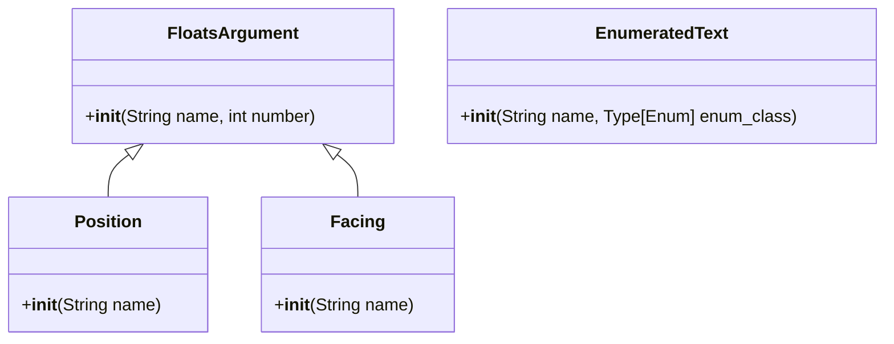

[English](readme.md) | **中文**

\>\>\> [回到索引](/readme-zh_cn.md)

## more_command_nodes

### 基本信息

- 插件 ID: `more_command_nodes`
- 版本: *数据拉取失败*
- 总下载量: N/A
- 作者: [Andy Zhang](https://github.com/AnzhiZhang)
- 仓库: https://github.com/AnzhiZhang/MCDReforgedPlugins
- 仓库插件页: https://github.com/AnzhiZhang/MCDReforgedPlugins/tree/master/src/more_command_nodes
- 标签: [`API`](/labels/api/readme-zh_cn.md)
- 描述: *数据拉取失败*

### 插件依赖

*数据拉取失败*

### 包依赖

*数据拉取失败*

### 介绍

# MoreCommandNodes

> 更多指令节点

如果您想要添加更多自定义节点，欢迎提交 PR！

## 节点列表

### FloatsArgument

连续的多个浮点数节点。

### Position

坐标节点，连续的三个浮点数。

### Facing

朝向节点，连续的两个浮点数。

### EnumeratedText

与 MCDR 的 Enumeration 类似，但是使用 Enum 的值而不是名称作为节点文本。

### 下载

> [!IMPORTANT]
> 使用插件之前，先阅读仓库中的 README。

*数据拉取失败*

