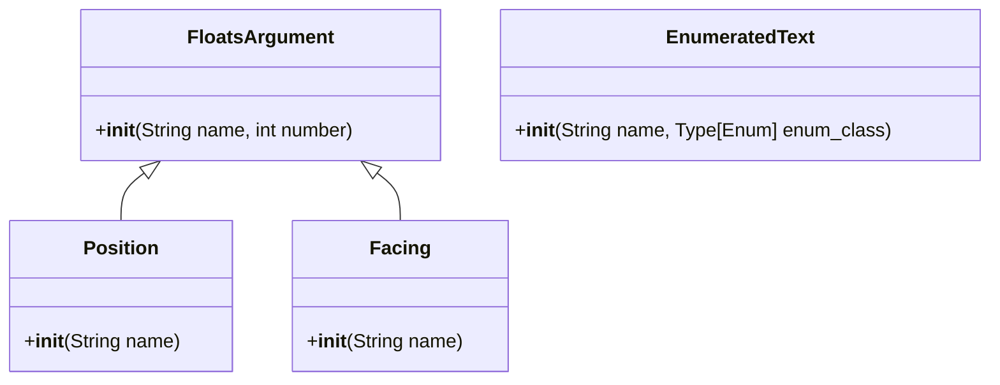

**English** | [中文](readme-zh_cn.md)

\>\>\> [Back to index](/readme.md)

## more_command_nodes

### Basic Information

- Plugin ID: `more_command_nodes`
- Version: *Data fetching failed*
- Total downloads: N/A
- Authors: [Andy Zhang](https://github.com/AnzhiZhang)
- Repository: https://github.com/AnzhiZhang/MCDReforgedPlugins
- Repository plugin page: https://github.com/AnzhiZhang/MCDReforgedPlugins/tree/master/src/more_command_nodes
- Labels: [`API`](/labels/api/readme.md)
- Description: *Data fetching failed*

### Dependencies

*Data fetching failed*

### Requirements

*Data fetching failed*

### Introduction

# MoreCommandNodes

> 更多指令节点

如果您想要添加更多自定义节点，欢迎提交 PR！

## 节点列表

### FloatsArgument

连续的多个浮点数节点。

### Position

坐标节点，连续的三个浮点数。

### Facing

朝向节点，连续的两个浮点数。

### EnumeratedText

与 MCDR 的 Enumeration 类似，但是使用 Enum 的值而不是名称作为节点文本。

### Download

> [!IMPORTANT]
> Read the README file in plugin repository before using it.

*Data fetching failed*

